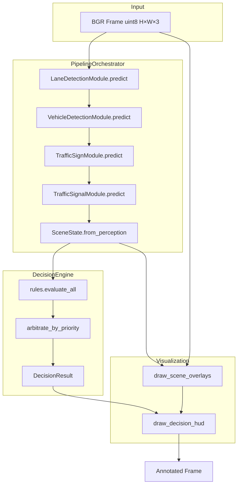
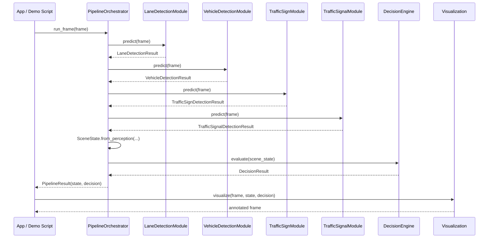
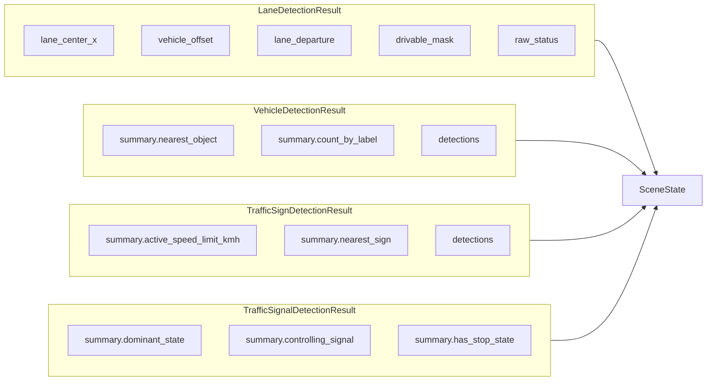
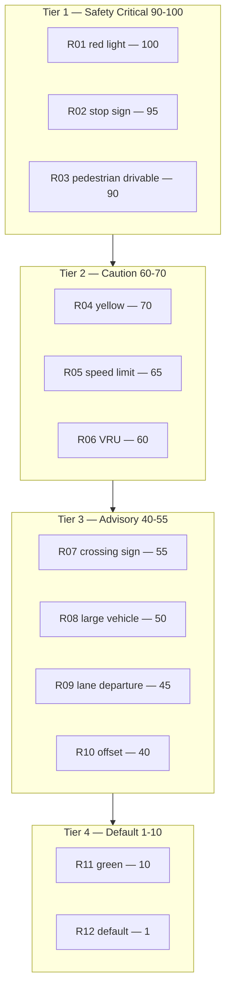
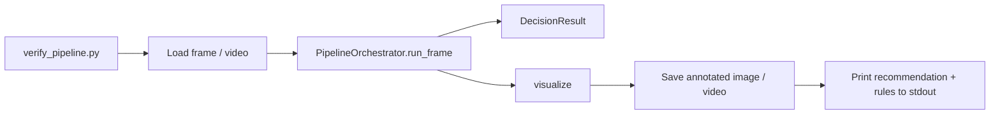
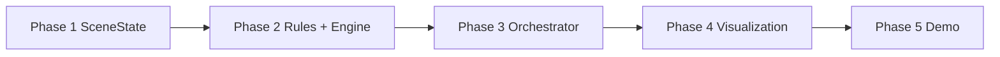

# Decision Engine & Pipeline Orchestration — Design Document

**Repository:** Autonomous Driving Car  
**Date:** June 18, 2026  
**Status:** Design complete — no implementation in this document  
**Inputs reviewed:** `lane_detection.py`, `vehicle_detection.py`, `traffic_sign.py`, `traffic_signal.py`, `orchestrator.py`, `src/decision/*`, all four `*DetectionResult` schemas, `overlays.py`, module design docs

---

## Table of Contents

1. [Executive Summary](#1-executive-summary)
2. [Architecture Overview](#2-architecture-overview)
3. [SceneState Dataclass](#3-scenestate-dataclass)
4. [Perception Output Aggregation](#4-perception-output-aggregation)
5. [Pipeline Orchestrator](#5-pipeline-orchestrator)
6. [Decision Layer](#6-decision-layer)
7. [ADAS Recommendations](#7-adas-recommendations)
8. [Rule Priorities](#8-rule-priorities)
9. [Conflict Resolution](#9-conflict-resolution)
10. [Visualization Requirements](#10-visualization-requirements)
11. [Integration Tests](#11-integration-tests)
12. [End-to-End Demo Workflow](#12-end-to-end-demo-workflow)
13. [Configuration](#13-configuration)
14. [Implementation Plan](#14-implementation-plan)
15. [File Manifest](#15-file-manifest)

---

## 1. Executive Summary

This design closes the **integration gap** between four implemented perception modules and a runnable ADAS decision-support layer. It specifies:

| Component | File | Responsibility |
|-----------|------|----------------|
| **Pipeline orchestrator** | `src/pipeline/orchestrator.py` | Run modules in reference order; build `SceneState` per frame |
| **Scene state** | `src/decision/scene_state.py` | Typed aggregation of perception outputs + frame metadata |
| **Rules** | `src/decision/rules.py` | Pure rule functions mapping `SceneState` → rule hits |
| **Decision engine** | `src/decision/decision_engine.py` | Priority arbitration, conflict resolution, final recommendation |

**v1 scope:** Lane → Vehicle → Sign → Signal → Decision. **Semantic segmentation is excluded** from the orchestrator call chain until `SegmentationModule` is implemented; `SceneState.segmentation` is reserved as `None`.

**Design principles:**

- **Conservative safety:** When signals conflict, prefer STOP over PROCEED.
- **Type-safe aggregation:** Store full result dataclasses, not only `to_prediction_dict()` blobs.
- **Injectable dependencies:** Orchestrator and decision engine accept stub modules (same pattern as perception tests).
- **Fail-soft perception, fail-loud integration:** A failed module returns `.empty()`; orchestrator records status and continues; decision rules gate on confidence and `raw_status`.

---

## 2. Architecture Overview

### 2.1 Layered data flow



### 2.2 Package layout (target)

```
src/
├── pipeline/
│   ├── __init__.py              # export PipelineOrchestrator, PipelineResult
│   └── orchestrator.py
├── decision/
│   ├── __init__.py              # export SceneState, DecisionEngine, ADASRecommendation
│   ├── scene_state.py
│   ├── rules.py
│   ├── decision_engine.py
│   └── types.py                 # enums + DecisionResult
└── visualization/
    ├── overlays.py              # add draw_scene_overlays()
    └── hud.py                   # implement draw_decision_hud()
```

### 2.3 Sequence diagram (single frame)



---

## 3. SceneState Dataclass

**File:** `src/decision/scene_state.py`

### 3.1 Primary dataclass

```python
from __future__ import annotations

from dataclasses import dataclass, field
from typing import Any

import numpy as np

from src.modules.yolop.output_schema import LaneDetectionResult
from src.modules.yolov8.output_schema import VehicleDetectionResult
from src.modules.yolov8_sign.output_schema import TrafficSignDetectionResult
from src.modules.yolov8_signal.output_schema import TrafficSignalDetectionResult

Frame = np.ndarray


@dataclass
class ModuleStatus:
    """Per-module health for a single frame."""

    module_name: str
    raw_status: str
    ok: bool
    inference_time_ms: float | None = None
    error_message: str | None = None


@dataclass
class SceneState:
    """Unified scene snapshot aggregating all perception outputs for one frame."""

    # --- Frame metadata ---
    frame_index: int = 0
    frame_shape: tuple[int, int] | None = None  # (height, width)
    timestamp_ms: float | None = None

    # --- Perception results (full dataclasses) ---
    lane: LaneDetectionResult | None = None
    vehicles: VehicleDetectionResult | None = None
    signs: TrafficSignDetectionResult | None = None
    signals: TrafficSignalDetectionResult | None = None
    segmentation: Any | None = None  # reserved; SegmentationModule not in v1 pipeline

    # --- Module health ---
    module_statuses: list[ModuleStatus] = field(default_factory=list)

    # --- Derived convenience (computed in from_perception, read-only for rules) ---
    lane_ok: bool = False
    vehicles_ok: bool = False
    signs_ok: bool = False
    signals_ok: bool = False

    @classmethod
    def from_perception(
        cls,
        *,
        frame_index: int,
        frame_shape: tuple[int, int],
        timestamp_ms: float | None,
        lane: LaneDetectionResult | None,
        vehicles: VehicleDetectionResult | None,
        signs: TrafficSignDetectionResult | None,
        signals: TrafficSignalDetectionResult | None,
        segmentation: Any | None = None,
    ) -> SceneState:
        """Build SceneState and derive module health flags."""

    def to_dict(self) -> dict[str, Any]:
        """JSON-serializable snapshot for Gradio / logging (masks omitted or as shapes)."""

    def perception_dict(self) -> dict[str, Any]:
        """Orchestrator-facing dict using each module's to_prediction_dict()."""
```

### 3.2 Module health (`ok`) definition

A module is **`ok`** when:

| Module | `ok = True` when |
|--------|------------------|
| Lane | `raw_status` in `{"parsed", "stub_segmentation", "stub"}` **and** (`lane_center_x` is not None **or** `lane_mask` is not None) |
| Vehicle | `raw_status` in `{"parsed", "stub"}` |
| Sign | `raw_status` in `{"parsed", "stub"}` |
| Signal | `raw_status` in `{"parsed", "stub"}` |

Statuses like `init_failed`, `pipeline_error`, `inference_not_ready`, `empty` → `ok = False`. Rules that depend on a failed module **do not fire** (conservative: absence of evidence is not evidence of safety, except default PROCEED — see §9).

### 3.3 Fields intentionally excluded from SceneState

| Excluded | Reason |
|----------|--------|
| Raw `lane_mask` / `drivable_mask` in `to_dict()` | Large arrays; include `lane_mask_shape` only |
| `preprocessed_edges` | Debug-only; not needed for decisions |
| Full detection lists duplication | Already inside result dataclasses |

Rules that need masks (e.g. pedestrian-on-drivable) access `scene.lane.drivable_mask` directly in-process.

---

## 4. Perception Output Aggregation

### 4.1 Aggregation strategy

The orchestrator passes **typed result objects** into `SceneState.from_perception()`. No re-parsing or field renaming. Decision rules read **summary fields first**, then detection lists for spatial rules.



### 4.2 Field mapping reference

#### LaneDetectionResult → decision inputs

| Source field | Decision use |
|--------------|--------------|
| `lane_departure` | WARNING, KEEP_LANE |
| `vehicle_offset` | KEEP_LANE severity (offset magnitude) |
| `lane_center_x`, `vehicle_center_x` | Lane keeping context |
| `drivable_mask` | Cross-module: object overlap with drivable area |
| `raw_status` | Module health gating |

#### VehicleDetectionResult → decision inputs

| Source field | Decision use |
|--------------|--------------|
| `summary.nearest_object` | Proximity rules (label, bbox, confidence) |
| `summary.count_by_label` | Crowd / multi-object warnings |
| `detections[].label` | `person`, `bicycle` → SLOW_DOWN / WARNING |
| `detections[].bbox.center_y` | Distance proxy (lower = closer) |
| `detections[].bbox.area` | Large vehicle WARNING |

#### TrafficSignDetectionResult → decision inputs

| Source field | Decision use |
|--------------|--------------|
| `summary.active_speed_limit_kmh` | SLOW_DOWN (informational v1) |
| `summary.nearest_sign` | STOP (`stop`), WARNING (`pedestrian_crossing`) |
| `detections[].sign_label` | Regulatory vs warning classification |
| `detections[].is_regulatory` | STOP gating |
| `detections[].confidence` | Rule confidence threshold |

#### TrafficSignalDetectionResult → decision inputs

| Source field | Decision use |
|--------------|--------------|
| `summary.dominant_state` | Primary STOP / SLOW_DOWN / PROCEED |
| `summary.controlling_signal` | Spatial + confidence gating |
| `summary.has_stop_state` | Hard STOP trigger |
| `summary.has_proceed_state` | PROCEED release (with conflict checks) |
| `summary.nearest_signal` | Distance proxy |

### 4.3 `perception_dict()` contract

For Gradio JSON output and logging:

```python
{
    "frame_index": 42,
    "frame_shape": [720, 1280],
    "lane": { ... LaneDetectionResult.to_prediction_dict() ... },
    "vehicles": { ... },
    "signs": { ... },
    "signals": { ... },
    "module_statuses": [ ... ],
}
```

Mask arrays in lane dict may be replaced with `{"shape": [H, W], "present": true}` in `to_dict()` to keep payloads small.

---

## 5. Pipeline Orchestrator

**File:** `src/pipeline/orchestrator.py`

### 5.1 Public types

```python
@dataclass
class PipelineConfig:
    """Orchestrator runtime options."""

    run_lane: bool = True
    run_vehicles: bool = True
    run_signs: bool = True
    run_signals: bool = True
  run_segmentation: bool = False  # disabled until SegmentationModule implemented
    auto_initialize: bool = True
    collect_timing: bool = True


@dataclass
class PipelineResult:
    """Return value of a single orchestrated frame pass."""

    scene_state: SceneState
    decision: DecisionResult
    total_time_ms: float | None = None
```

### 5.2 `PipelineOrchestrator` class

```python
class PipelineOrchestrator:
    """Runs perception modules in reference order and evaluates decisions."""

    REFERENCE_ORDER = (
        "lane_detection",
        "vehicle_detection",
        "traffic_sign",
        "traffic_signal",
    )

    def __init__(
        self,
        *,
        lane_module: LaneDetectionModule | None = None,
        vehicle_module: VehicleDetectionModule | None = None,
        sign_module: TrafficSignModule | None = None,
        signal_module: TrafficSignalModule | None = None,
        decision_engine: DecisionEngine | None = None,
        config: PipelineConfig | None = None,
    ) -> None: ...

    def initialize(self) -> None:
        """Initialize all enabled modules (respects PipelineConfig flags)."""

    def run_frame(
        self,
        frame: Frame,
        *,
        frame_index: int = 0,
        timestamp_ms: float | None = None,
    ) -> PipelineResult:
        """Execute full perception + decision pipeline on one frame."""

    def visualize(
        self,
        frame: Frame,
        result: PipelineResult,
        *,
        show_hud: bool = True,
        show_lane: bool = True,
        show_vehicles: bool = True,
        show_signs: bool = True,
        show_signals: bool = True,
    ) -> Frame:
        """Composite visualization using module overlays + decision HUD."""

    def cleanup(self) -> None:
        """Release all module resources."""
```

### 5.3 `run_frame()` algorithm

```
1. Validate frame (H, W, 3), uint8 preferred
2. If auto_initialize and not all modules initialized → initialize()
3. t0 = now()
4. lane_result    = lane_module.predict(frame)     if run_lane     else None
5. vehicle_result = vehicle_module.predict(frame)  if run_vehicles else None
6. sign_result    = sign_module.predict(frame)      if run_signs    else None
7. signal_result  = signal_module.predict(frame)   if run_signals  else None
8. scene_state = SceneState.from_perception(
       frame_index, frame.shape[:2], timestamp_ms,
       lane_result, vehicle_result, sign_result, signal_result,
   )
9. decision = decision_engine.evaluate(scene_state)
10. return PipelineResult(scene_state, decision, total_time_ms=now()-t0)
```

### 5.4 Design decisions

| Decision | Choice | Rationale |
|----------|--------|-----------|
| Module order | Lane → Vehicle → Sign → Signal | Matches `orchestrator.py` comment; modules are frame-independent in v1 |
| Parallel inference | **Not in v1** | Simpler debugging; GPU batching is a v2 optimization |
| Shared frame copy | Modules receive same `frame` reference | Each `visualize()` copies internally |
| Segmentation slot | Config flag default `False` | Stub returns `{}`; would pollute SceneState |
| Error handling | Never raise on module predict failure | Modules already return `.empty()`; orchestrator records status |

### 5.5 Factory helper

```python
def create_default_orchestrator(
    device: str = "cpu",
    config: PipelineConfig | None = None,
) -> PipelineOrchestrator:
    """Construct orchestrator with default module instances from config."""
```

Used by `src/app.py` and `scripts/verify_pipeline.py` (new gate script).

---

## 6. Decision Layer

### 6.1 Types — `src/decision/types.py`

```python
from enum import Enum

class ADASRecommendation(str, Enum):
    PROCEED = "PROCEED"
    STOP = "STOP"
    SLOW_DOWN = "SLOW_DOWN"
    KEEP_LANE = "KEEP_LANE"
    WARNING = "WARNING"


@dataclass
class RuleHit:
    """Single fired rule contributing to the final decision."""

    rule_id: str
    recommendation: ADASRecommendation
    priority: int
    message: str
    source_module: str
    confidence: float = 1.0


@dataclass
class DecisionResult:
    """Final ADAS recommendation for one frame."""

    recommendation: ADASRecommendation
    priority: int
    rule_hits: list[RuleHit] = field(default_factory=list)
    primary_message: str = ""
    explanation: str = ""  # human-readable multi-line for HUD

    def to_dict(self) -> dict[str, Any]: ...
```

### 6.2 Rules — `src/decision/rules.py`

Pure functions; no I/O. Each returns `RuleHit | None`.

```python
# Rule registry — evaluated every frame
RULE_REGISTRY: list[Callable[[SceneState, DecisionConfig], RuleHit | None]]

def evaluate_all(scene: SceneState, config: DecisionConfig) -> list[RuleHit]:
    """Run all rules; return only non-None hits."""
```

#### Rule catalog (v1)

| `rule_id` | Recommendation | Priority | Trigger (summary) |
|-----------|----------------|----------|-------------------|
| `R01_red_light_stop` | STOP | 100 | `signals_ok` and `dominant_state == "red_light"` and `controlling_signal.confidence >= threshold` |
| `R02_stop_sign` | STOP | 95 | `signs_ok` and nearest/highest `stop` sign with `confidence >= threshold` in lower 60% of frame |
| `R03_pedestrian_on_drivable` | STOP | 90 | `lane_ok` and `vehicles_ok` and `person` detection overlaps `drivable_mask` |
| `R04_yellow_light_caution` | SLOW_DOWN | 70 | `signals_ok` and `dominant_state == "yellow_light"` |
| `R05_active_speed_limit` | SLOW_DOWN | 65 | `signs_ok` and `active_speed_limit_kmh` is not None |
| `R06_vulnerable_road_user` | SLOW_DOWN | 60 | `vehicles_ok` and `person` or `bicycle` in lower third with `confidence >= 0.6` |
| `R07_pedestrian_crossing_sign` | WARNING | 55 | `signs_ok` and `pedestrian_crossing` detected |
| `R08_large_vehicle_proximity` | WARNING | 50 | `vehicles_ok` and nearest is `truck` or `bus` with bbox area ratio > 8% of frame |
| `R09_lane_departure` | WARNING | 45 | `lane_ok` and `lane_departure is True` |
| `R10_lane_offset_correct` | KEEP_LANE | 40 | `lane_ok` and `abs(vehicle_offset) > offset_warn_px` but not `lane_departure` |
| `R11_green_proceed` | PROCEED | 10 | `signals_ok` and `dominant_state == "green_light"` and no STOP-class hits |
| `R12_default_proceed` | PROCEED | 1 | No higher-priority rule fired |

#### Spatial helpers (in `rules.py`)

```python
def bbox_lower_fraction(bbox, frame_height: int) -> float:
    """Return normalized center_y (0=top, 1=bottom)."""

def bbox_area_ratio(bbox, frame_shape: tuple[int, int]) -> float:
    """Detection area / frame area."""

def overlaps_drivable_mask(bbox, drivable_mask: np.ndarray, min_overlap: float = 0.15) -> bool:
    """True if >= min_overlap fraction of bbox interior lies on drivable pixels."""
```

### 6.3 Decision engine — `src/decision/decision_engine.py`

```python
@dataclass
class DecisionConfig:
    """Thresholds loaded from config/default.yaml decision section."""

    red_light_confidence: float = 0.70
    stop_sign_confidence: float = 0.70
    stop_sign_lower_frame_fraction: float = 0.40
    vulnerable_user_confidence: float = 0.60
    large_vehicle_area_ratio: float = 0.08
    lane_offset_warn_px: float = 35.0
    drivable_overlap_threshold: float = 0.15


class DecisionEngine:
    """Evaluates rules and arbitrates a single ADAS recommendation."""

    def __init__(self, config: DecisionConfig | None = None) -> None: ...

    def evaluate(self, scene: SceneState) -> DecisionResult:
        """
        1. hits = evaluate_all(scene, config)
        2. resolved = arbitrate(hits)
        3. return DecisionResult with explanation string
        """

    @staticmethod
    def arbitrate(hits: list[RuleHit]) -> DecisionResult:
        """Apply conflict resolution (§9)."""
```

---

## 7. ADAS Recommendations

### 7.1 Enum definitions

| Value | Meaning | Typical driver action |
|-------|---------|----------------------|
| `PROCEED` | Path appears clear; no regulatory stop | Continue at current speed |
| `STOP` | Regulatory or safety-critical stop required | Brake to stop |
| `SLOW_DOWN` | Reduce speed; caution state | Decelerate |
| `KEEP_LANE` | Correct lateral position | Steer toward lane center |
| `WARNING` | Alert without mandatory stop/slow | Increase attention |

### 7.2 HUD display strings

| Enum | HUD primary text | Color (BGR) |
|------|------------------|-------------|
| `PROCEED` | PROCEED | `(0, 200, 0)` green |
| `STOP` | STOP | `(0, 0, 220)` red |
| `SLOW_DOWN` | SLOW DOWN | `(0, 165, 255)` orange |
| `KEEP_LANE` | KEEP LANE | `(255, 200, 0)` cyan-gold |
| `WARNING` | WARNING | `(0, 140, 255)` amber |

### 7.3 Mapping from legacy stub comments

| Old stub name (`rules.py` TODO) | New enum |
|---------------------------------|----------|
| Continue Driving | `PROCEED` |
| Stop | `STOP` |
| Slow Down | `SLOW_DOWN` |
| Maintain Lane | `KEEP_LANE` |
| Warning Alert | `WARNING` |

---

## 8. Rule Priorities

Numeric priority: **higher number wins**. Multiple rules may fire; arbitration selects the highest priority, with tie-breaking in §9.



### Priority table (complete)

| Priority | Recommendation | Rules |
|----------|----------------|-------|
| 100 | STOP | R01 |
| 95 | STOP | R02 |
| 90 | STOP | R03 |
| 70 | SLOW_DOWN | R04 |
| 65 | SLOW_DOWN | R05 |
| 60 | SLOW_DOWN | R06 |
| 55 | WARNING | R07 |
| 50 | WARNING | R08 |
| 45 | WARNING | R09 |
| 40 | KEEP_LANE | R10 |
| 10 | PROCEED | R11 |
| 1 | PROCEED | R12 (default) |

**Note:** `KEEP_LANE` (40) is below `WARNING` (45) so severe lane departure surfaces as WARNING first. Offset-only drift triggers KEEP_LANE.

---

## 9. Conflict Resolution

### 9.1 Intra-signal conflicts (red + green detected)

**Policy:** Align with `yolov8_signal/output_parser.py` — `state_priority`: red (3) > yellow (2) > green (1).

| Condition | Resolution |
|-----------|------------|
| `has_stop_state` and `has_proceed_state` | `dominant_state` from `controlling_signal`; if absent, max `state_priority` |
| R01 fires (red) and R11 fires (green) | **R01 wins** (priority 100 > 10) |
| Signal module `ok=False` | Signal rules skipped; sign/lane/vehicle rules still apply |

### 9.2 Signal vs sign conflicts

| Scenario | Resolution |
|----------|------------|
| Red light + stop sign | Both fire STOP; highest priority wins (R01=100 vs R02=95) → **red light message primary** |
| Green light + stop sign | **R02 STOP wins** over R11 PROCEED — stop sign is regulatory until passed |
| Yellow light + speed limit | Both SLOW_DOWN; higher priority (R04=70) message leads; both in `rule_hits` |
| Turn sign + lane departure | WARNING (R09) + informational turn — turn does not override safety |

### 9.3 Cross-module STOP stacking

When R01, R02, and R03 all fire:

```python
winning_hit = max(hits, key=lambda h: (h.priority, h.confidence))
recommendation = winning_hit.recommendation
explanation = "\n".join(h.message for h in sorted(hits, key=lambda h: -h.priority))
```

All contributing hits preserved in `DecisionResult.rule_hits` for HUD and debugging.

### 9.4 Module failure / missing evidence

| Situation | Behavior |
|-----------|----------|
| All modules failed | R12 `default_proceed` fires — **log WARNING** in orchestrator |
| Signal failed, sign OK | Sign rules apply; no signal-based PROCEED from R11 |
| Lane failed | R09, R10, R03 skipped; vehicle/sign/signal rules still run |

### 9.5 Confidence gating

Rules do not fire when source detection confidence is below configured threshold. No imputation from low-confidence detections.

### 9.6 Temporal conflicts (v2 — documented, not v1)

| Mechanism | Purpose |
|-----------|---------|
| `deque` of last N recommendations | Hysteresis |
| Minimum STOP hold frames | Prevent green flash after red |
| Signal `track_id` | Per-light smoothing |

v1 is **strictly per-frame**.

---

## 10. Visualization Requirements

### 10.1 Layer order (bottom → top)

```
1. Original frame
2. Lane masks (semi-transparent drivable + lane, alpha=0.35)  — if show_lane
3. Lane lines / center / offset markers                       — draw_lane_results()
4. Vehicle bounding boxes                                     — draw_vehicle_detections()
5. Sign bounding boxes                                        — draw_traffic_signs()
6. Signal bounding boxes                                      — draw_traffic_signals()
7. Decision HUD panel                                         — draw_decision_hud()
```

### 10.2 New functions

#### `src/visualization/overlays.py`

```python
def draw_scene_overlays(
    frame: Frame,
    scene: SceneState,
    *,
    show_lane: bool = True,
    show_vehicles: bool = True,
    show_signs: bool = True,
    show_signals: bool = True,
) -> Frame:
    """Apply all enabled module overlays in standard z-order."""
```

Implementation: call each module's `visualize()` or underlying draw functions. **Wire `LaneDetectionModule.visualize()`** to `draw_lane_results()` as part of this work.

#### `src/visualization/hud.py`

```python
def draw_decision_hud(
    frame: Frame,
    decision: DecisionResult,
    *,
    show_rule_list: bool = True,
    panel_position: str = "top-left",
) -> Frame:
    """
    Render recommendation banner + primary_message + optional rule_hits list.
    Respect config output.display_hud.
    """
```

### 10.3 HUD layout spec

| Element | Position | Content |
|---------|----------|---------|
| Banner | Top, full width | `decision.recommendation` text, colored background |
| Primary message | Below banner | `decision.primary_message` (winning rule) |
| Rule list | Bottom-left (optional) | Up to 3 contributing `rule_hits` messages |
| Module status strip | Bottom-right | Green/red dots for lane/veh/sign/sig ok |

### 10.4 Orchestrator `visualize()` contract

```python
annotated = draw_scene_overlays(frame, result.scene_state, ...)
if show_hud:
    annotated = draw_decision_hud(annotated, result.decision)
return annotated
```

---

## 11. Integration Tests

### 11.1 New test files

| File | Scope |
|------|-------|
| `tests/test_scene_state.py` | `from_perception()`, `ok` flags, `to_dict()` |
| `tests/test_decision_rules.py` | Each rule in isolation with synthetic `SceneState` |
| `tests/test_decision_engine.py` | Arbitration, conflict cases, default proceed |
| `tests/test_pipeline_orchestrator.py` | End-to-end with stub modules |

### 11.2 `tests/conftest.py` additions

```python
@pytest.fixture
def stub_scene_state() -> SceneState: ...

@pytest.fixture
def pipeline_orchestrator(
    lane_detection_module,
    vehicle_detection_module,
    traffic_sign_module,
    traffic_signal_module,
) -> PipelineOrchestrator:
    """Orchestrator wired to existing stub perception fixtures."""
```

### 11.3 Test cases — decision rules (`test_decision_rules.py`)

| Test | Setup | Expected |
|------|-------|----------|
| `test_r01_red_light_stop` | `dominant_state=red_light`, conf=0.9 | STOP, rule R01 |
| `test_r01_below_confidence` | red conf=0.5 | No R01 |
| `test_r02_stop_sign` | nearest `stop` in lower half | STOP, R02 |
| `test_r04_yellow_slow_down` | `yellow_light` | SLOW_DOWN |
| `test_r09_lane_departure_warning` | `lane_departure=True` | WARNING |
| `test_r11_green_proceed` | green only | PROCEED via R11 |
| `test_conflict_red_beats_green` | red + green hits | STOP, R01 |

### 11.4 Test cases — orchestrator (`test_pipeline_orchestrator.py`)

| Test | Assertion |
|------|-----------|
| `test_initialize_all_modules` | All four `is_initialized` |
| `test_run_frame_returns_pipeline_result` | `PipelineResult` with populated `SceneState` |
| `test_run_frame_module_order` | Call log / status list order matches REFERENCE_ORDER |
| `test_run_frame_with_stubs_produces_decision` | `decision.recommendation` is valid enum |
| `test_visualize_returns_bgr_frame` | Output shape matches input, dtype uint8 |
| `test_failed_lane_skips_lane_rules` | Lane `init_failed` → no R09/R10; pipeline completes |
| `test_cleanup_releases_modules` | All modules `is_initialized=False` |

### 11.5 Gate script

**New:** `scripts/verify_pipeline.py`

```
python scripts/verify_pipeline.py           # stub modules, synthetic frame
python scripts/verify_pipeline.py --image tests/fixtures/road_sample.jpg
python scripts/verify_pipeline.py --real    # real weights where available
```

Exit 0 when pipeline runs, decision emitted, visualization saved to `data/processed/pipeline_preview.jpg`.

### 11.6 Coverage target

| Area | Minimum tests |
|------|---------------|
| SceneState | 5 |
| Rules | 12 (one per rule + gating) |
| DecisionEngine | 6 |
| Orchestrator | 7 |
| **New total** | **~30** (repo grows from 29 → ~59) |

---

## 12. End-to-End Demo Workflow

### 12.1 CLI demo (pre-Gradio)



**Command:**

```bash
python scripts/verify_pipeline.py \
  --image tests/fixtures/road_sample.jpg \
  --output data/processed/demo_frame.jpg \
  --verbose
```

**Expected stdout:**

```
frame=0 recommendation=PROCEED priority=1 rules=[R12_default_proceed]
lane=ok vehicles=ok signs=ok signals=ok total_ms=142.3
```

### 12.2 Video workflow

```
1. Open video with cv2.VideoCapture
2. orchestrator.initialize()
3. For each frame:
     result = orchestrator.run_frame(frame, frame_index=i)
     annotated = orchestrator.visualize(frame, result)
     writer.write(annotated)
4. orchestrator.cleanup()
```

### 12.3 Gradio app workflow (`src/app.py` — follow-on)

| UI element | Backend |
|------------|---------|
| Image / video upload | `run_frame` per frame or batch |
| Webcam stream | `run_frame` in loop |
| Recommendation panel | `result.decision.to_dict()` |
| Perception JSON accordion | `result.scene_state.perception_dict()` |
| Toggle overlays | `visualize(..., show_lane=..., show_hud=...)` |

### 12.4 Colab workflow

```
1. Mount Drive → data_root from config/default.yaml
2. Download / verify weights (yolop, yolov8, sign, signal)
3. create_default_orchestrator(device="cuda")
4. Process sample video from data_root/videos/
5. Display annotated frames inline
```

---

## 13. Configuration

Add to `config/default.yaml`:

```yaml
decision:
  red_light_confidence: 0.70
  stop_sign_confidence: 0.70
  stop_sign_lower_frame_fraction: 0.40
  vulnerable_user_confidence: 0.60
  large_vehicle_area_ratio: 0.08
  lane_offset_warn_px: 35.0
  drivable_overlap_threshold: 0.15

pipeline:
  run_lane: true
  run_vehicles: true
  run_signs: true
  run_signals: true
  run_segmentation: false
```

Add `get_decision_config()` and `get_pipeline_config()` to `src/utils/model_paths.py`.

---

## 14. Implementation Plan

### Phase 1 — Decision types & scene state (1 day)

| Task | File |
|------|------|
| Add `ADASRecommendation`, `RuleHit`, `DecisionResult` | `src/decision/types.py` |
| Implement `SceneState`, `ModuleStatus`, `from_perception` | `src/decision/scene_state.py` |
| Package exports | `src/decision/__init__.py` |
| Unit tests | `tests/test_scene_state.py` |

### Phase 2 — Rules & engine (2 days)

| Task | File |
|------|------|
| Spatial helpers | `src/decision/rules.py` |
| R01–R12 rule functions + registry | `src/decision/rules.py` |
| `DecisionEngine.evaluate` + `arbitrate` | `src/decision/decision_engine.py` |
| Config wiring | `config/default.yaml`, `model_paths.py` |
| Unit tests | `tests/test_decision_rules.py`, `tests/test_decision_engine.py` |

### Phase 3 — Orchestrator (2 days)

| Task | File |
|------|------|
| `PipelineOrchestrator`, `PipelineResult`, `PipelineConfig` | `src/pipeline/orchestrator.py` |
| `create_default_orchestrator` | `src/pipeline/orchestrator.py` |
| Package exports | `src/pipeline/__init__.py` |
| Integration tests | `tests/test_pipeline_orchestrator.py` |
| Gate script | `scripts/verify_pipeline.py` |

### Phase 4 — Visualization (1 day)

| Task | File |
|------|------|
| Wire lane `visualize()` → `draw_lane_results` | `src/modules/lane_detection.py` |
| `draw_scene_overlays` | `src/visualization/overlays.py` |
| `draw_decision_hud` | `src/visualization/hud.py` |
| Orchestrator `visualize()` integration | `src/pipeline/orchestrator.py` |

### Phase 5 — Demo & docs (0.5 day)

| Task | File |
|------|------|
| Update `docs/project_status_report.md` | docs |
| Optional Gradio stub wiring | `src/app.py` |

### Effort summary

| Phase | Days |
|-------|------|
| 1 SceneState | 1 |
| 2 Decision | 2 |
| 3 Orchestrator | 2 |
| 4 Visualization | 1 |
| 5 Demo/docs | 0.5 |
| **Total** | **~6.5 developer days** |

### Dependency graph



---

## 15. File Manifest

### Files to create

| Path | Purpose |
|------|---------|
| `src/decision/types.py` | Enums and `DecisionResult` |
| `src/decision/__init__.py` | Public exports |
| `src/pipeline/__init__.py` | Public exports |
| `tests/test_scene_state.py` | SceneState tests |
| `tests/test_decision_rules.py` | Rule tests |
| `tests/test_decision_engine.py` | Engine tests |
| `tests/test_pipeline_orchestrator.py` | E2E tests |
| `scripts/verify_pipeline.py` | Gate script |

### Files to implement (replace stubs)

| Path | Purpose |
|------|---------|
| `src/decision/scene_state.py` | `SceneState` dataclass |
| `src/decision/rules.py` | Rule registry R01–R12 |
| `src/decision/decision_engine.py` | `DecisionEngine` class |
| `src/pipeline/orchestrator.py` | `PipelineOrchestrator` class |
| `src/visualization/hud.py` | Decision HUD |
| `src/modules/lane_detection.py` | Wire `visualize()` only |

### Files to extend

| Path | Change |
|------|--------|
| `src/visualization/overlays.py` | Add `draw_scene_overlays()` |
| `config/default.yaml` | `decision` + `pipeline` sections |
| `src/utils/model_paths.py` | Config loaders |
| `tests/conftest.py` | Orchestrator fixtures |

### Files unchanged in v1

| Path | Reason |
|------|--------|
| All four perception modules (except lane visualize) | Already integration-ready |
| `src/modules/segmentation.py` | Remains stub; not in pipeline |
| `src/app.py` | Gradio follow-on after pipeline gate passes |

---

## Design Completeness Checklist

| # | Requirement | Section | Status |
|---|-------------|---------|--------|
| 1 | `SceneState` dataclass | §3 | ✅ Defined |
| 2 | Output aggregation from four result types | §4 | ✅ Defined |
| 3 | `orchestrator.py` design | §5 | ✅ Defined |
| 4 | `scene_state.py`, `rules.py`, `decision_engine.py` | §3, §6 | ✅ Defined |
| 5 | ADAS recommendations (5 enums) | §7 | ✅ Defined |
| 6 | Rule priorities | §8 | ✅ Defined |
| 7 | Conflict resolution | §9 | ✅ Defined |
| 8 | Visualization requirements | §10 | ✅ Defined |
| 9 | Integration tests | §11 | ✅ Defined |
| 10 | End-to-end demo workflow | §12 | ✅ Defined |
| — | Architecture diagrams | §2, §8, §12, §14 | ✅ Included |
| — | Implementation plan | §14 | ✅ Included |

---

# READY FOR IMPLEMENTATION

This design is **complete**. All ten requirements are specified with typed contracts, rule catalog, priority arbitration, conflict policies, visualization layer order, test matrix, and phased implementation plan. Implementation may proceed in the order of §14 without further architectural decisions.
