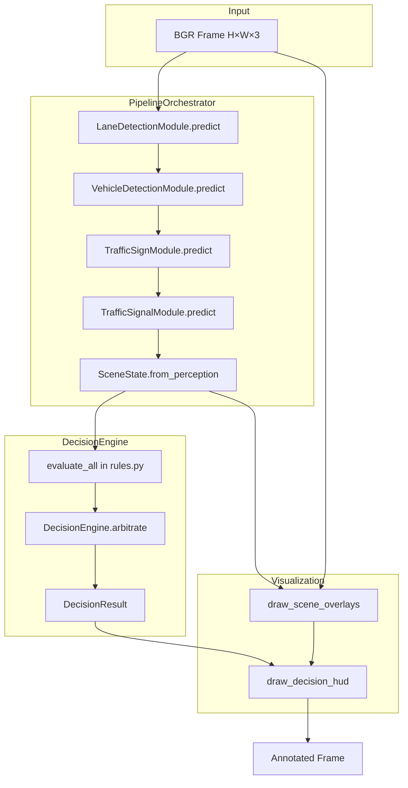
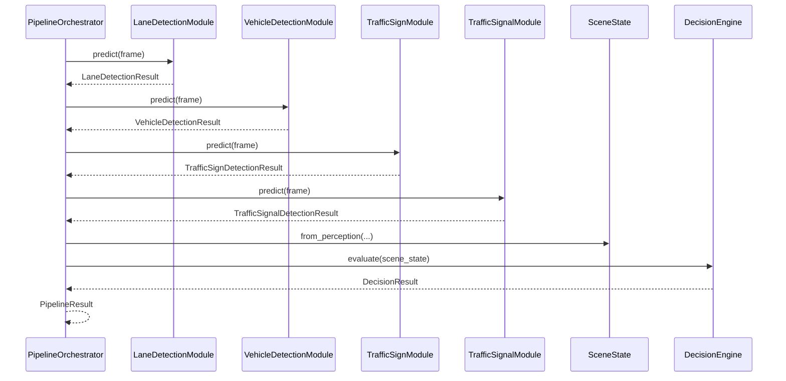

# Decision Engine & Pipeline Orchestration — Implementation Report

**Date:** June 2026  
**Design reference:** `docs/decision_engine_design.md`  
**Status:** Implemented and verified (pytest)

---

## 1. Summary

The ADAS decision layer and pipeline orchestrator are implemented. A single frame now flows through four perception modules, aggregates into `SceneState`, evaluates twelve rule functions via `DecisionEngine`, and can be visualized with composite overlays plus a decision HUD.

| Verification item | Result |
|-------------------|--------|
| Decision package imports | **PASS** |
| Pipeline package imports | **PASS** |
| SceneState aggregation | **PASS** (5 tests) |
| Decision rules R01–R12 | **PASS** (10 tests) |
| DecisionEngine arbitration | **PASS** (6 tests) |
| PipelineOrchestrator E2E (stub modules) | **PASS** (8 tests) |
| Full test suite | **PASS** — **58/58** (`python -m pytest tests/ -q`) |
| Gate script `scripts/verify_pipeline.py` | **NOT IMPLEMENTED** |

**Stub pipeline outcome:** `PipelineOrchestrator.run_frame()` on the synthetic road fixture returns `ADASRecommendation.STOP` via rule `R01_red_light_stop` (stub red-light detection at confidence 0.90).

---

## 2. Files Created

| File | Purpose |
|------|---------|
| `src/decision/types.py` | `ADASRecommendation`, `RuleHit`, `DecisionResult` |
| `src/decision/decision_engine.py` | `DecisionEngine` — `evaluate()`, `arbitrate()` |
| `src/decision/__init__.py` | Public exports for decision package |
| `src/pipeline/__init__.py` | Public exports for pipeline package |
| `tests/test_scene_state.py` | `SceneState` / `ModuleStatus` unit tests (5) |
| `tests/test_decision_rules.py` | Rule + spatial helper tests (10) |
| `tests/test_decision_engine.py` | `DecisionEngine` arbitration tests (6) |
| `tests/test_pipeline_orchestrator.py` | End-to-end orchestrator tests (8) |

---

## 3. Files Modified

| File | Change |
|------|--------|
| `src/decision/scene_state.py` | Replaced TODO stub with `ModuleStatus`, `SceneState`, `from_perception()`, `to_dict()`, `perception_dict()` |
| `src/decision/rules.py` | Replaced TODO stub with `DecisionConfig`, `RULE_REGISTRY`, rules R01–R12, spatial helpers |
| `src/pipeline/orchestrator.py` | Replaced comment stub with `PipelineConfig`, `PipelineResult`, `PipelineOrchestrator`, `create_default_orchestrator()` |
| `src/visualization/hud.py` | Replaced TODO stub with `draw_decision_hud()`, `_draw_module_status_strip()` |
| `src/visualization/overlays.py` | Added `draw_scene_overlays()`; `draw_lane_center()` accepts scalar `lane_center` (float/int) |
| `src/modules/lane_detection.py` | `visualize()` wired to `draw_lane_results()` (only perception-module change) |
| `config/default.yaml` | Added `decision:` and `pipeline:` sections |
| `src/utils/model_paths.py` | Added `get_decision_config()`, `get_pipeline_config()` |
| `tests/conftest.py` | Added `pipeline_orchestrator` fixture |

**Not modified:** `traffic_sign.py`, `traffic_signal.py`, `vehicle_detection.py` (per implementation constraint).

---

## 4. Architecture Implemented



### Package layout (as implemented)

```
src/
├── decision/
│   ├── __init__.py
│   ├── types.py
│   ├── scene_state.py
│   ├── rules.py
│   └── decision_engine.py
├── pipeline/
│   ├── __init__.py
│   └── orchestrator.py
└── visualization/
    ├── overlays.py      # draw_scene_overlays()
    └── hud.py           # draw_decision_hud()
```

### Per-frame sequence



---

## 5. SceneState Implementation

**File:** `src/decision/scene_state.py`

### Classes

| Class | Role |
|-------|------|
| `ModuleStatus` | Per-module `module_name`, `raw_status`, `ok`, optional `inference_time_ms`, `error_message`; `to_dict()` |
| `SceneState` | Aggregates four `*DetectionResult` dataclasses + frame metadata |

### `SceneState` fields

| Field | Type |
|-------|------|
| `frame_index` | `int` |
| `frame_shape` | `tuple[int, int] \| None` |
| `timestamp_ms` | `float \| None` |
| `lane` | `LaneDetectionResult \| None` |
| `vehicles` | `VehicleDetectionResult \| None` |
| `signs` | `TrafficSignDetectionResult \| None` |
| `signals` | `TrafficSignalDetectionResult \| None` |
| `segmentation` | `Any \| None` (reserved; always `None` in orchestrator) |
| `module_statuses` | `list[ModuleStatus]` |
| `lane_ok`, `vehicles_ok`, `signs_ok`, `signals_ok` | `bool` |

### Factory and serializers

| Method | Behavior |
|--------|----------|
| `SceneState.from_perception(...)` | Builds state; derives `*_ok` flags and `module_statuses` |
| `to_dict()` | JSON-safe; lane masks as `{present, shape}`; strips `preprocessed_edges` |
| `perception_dict()` | Full `to_prediction_dict()` per module |

### Module health (`ok`) logic

| Module | `ok = True` when |
|--------|------------------|
| Lane | `raw_status` ∈ `{parsed, stub_segmentation, stub}` **and** (`lane_center_x` or `lane_mask` present) |
| Vehicle / Sign / Signal | `raw_status` ∈ `{parsed, stub}` |

---

## 6. DecisionEngine Implementation

**File:** `src/decision/decision_engine.py`

### Class: `DecisionEngine`

| Method | Description |
|--------|-------------|
| `__init__(config: DecisionConfig \| None = None)` | Loads `DecisionConfig` from `get_decision_config()` when `config` is omitted |
| `evaluate(scene: SceneState) -> DecisionResult` | Calls `evaluate_all()`; excludes `R12_default_proceed` from arbitration when other rules fire |
| `arbitrate(hits: list[RuleHit]) -> DecisionResult` | Static; `max` by `(priority, confidence)`; builds `explanation` from sorted hits |

### Arbitration behavior (implemented)

1. Collect all rule hits via `evaluate_all(scene, config)`.
2. Filter out `R12_default_proceed` if any other rule fired.
3. Pick winner: highest `priority`, then highest `confidence`.
4. Populate `DecisionResult` with `rule_hits` sorted by priority descending.
5. Log INFO when winning recommendation is `STOP`.

### Supporting types (`src/decision/types.py`)

| Type | Values / fields |
|------|-----------------|
| `ADASRecommendation` | `PROCEED`, `STOP`, `SLOW_DOWN`, `KEEP_LANE`, `WARNING` |
| `RuleHit` | `rule_id`, `recommendation`, `priority`, `message`, `source_module`, `confidence`; `to_dict()` |
| `DecisionResult` | `recommendation`, `priority`, `rule_hits`, `primary_message`, `explanation`; `to_dict()` |

### Config: `DecisionConfig` (`src/decision/rules.py`)

Loaded from `config/default.yaml` → `decision:` via `get_decision_config()`:

| Field | Default |
|-------|---------|
| `red_light_confidence` | 0.70 |
| `stop_sign_confidence` | 0.70 |
| `stop_sign_lower_frame_fraction` | 0.40 |
| `vulnerable_user_confidence` | 0.60 |
| `large_vehicle_area_ratio` | 0.08 |
| `lane_offset_warn_px` | 35.0 |
| `drivable_overlap_threshold` | 0.15 |

---

## 7. Rule Catalog Actually Implemented

**File:** `src/decision/rules.py`  
**Registry:** `RULE_REGISTRY` populated by `@_register` decorator on import.  
**Evaluator:** `evaluate_all(scene, config) -> list[RuleHit]`

| Rule ID | Function | Recommendation | Priority | Key trigger |
|---------|----------|----------------|----------|-------------|
| `R01_red_light_stop` | `rule_r01_red_light_stop` | STOP | 100 | `signals_ok`, `dominant_state == red_light`, `controlling_signal.confidence >= red_light_confidence` |
| `R02_stop_sign` | `rule_r02_stop_sign` | STOP | 95 | `signs_ok`, `stop` sign in lower frame (`center_y >= height * stop_sign_lower_frame_fraction`) |
| `R03_pedestrian_on_drivable` | `rule_r03_pedestrian_on_drivable` | STOP | 90 | `lane_ok` + `vehicles_ok`, `person` bbox overlaps `drivable_mask` |
| `R04_yellow_light_caution` | `rule_r04_yellow_light_caution` | SLOW_DOWN | 70 | `dominant_state == yellow_light` |
| `R05_active_speed_limit` | `rule_r05_active_speed_limit` | SLOW_DOWN | 65 | `active_speed_limit_kmh` is not None |
| `R06_vulnerable_road_user` | `rule_r06_vulnerable_road_user` | SLOW_DOWN | 60 | `person` or `bicycle` in lower third, `confidence >= vulnerable_user_confidence` |
| `R07_pedestrian_crossing_sign` | `rule_r07_pedestrian_crossing_sign` | WARNING | 55 | `pedestrian_crossing` in detections |
| `R08_large_vehicle_proximity` | `rule_r08_large_vehicle_proximity` | WARNING | 50 | nearest `truck`/`bus`, bbox area ratio ≥ `large_vehicle_area_ratio` |
| `R09_lane_departure` | `rule_r09_lane_departure` | WARNING | 45 | `lane_departure is True` |
| `R10_lane_offset_correct` | `rule_r10_lane_offset_correct` | KEEP_LANE | 40 | `abs(vehicle_offset) > lane_offset_warn_px`, not departing |
| `R11_green_proceed` | `rule_r11_green_proceed` | PROCEED | 10 | `green_light`, not `has_stop_state` |
| `R12_default_proceed` | `rule_r12_default_proceed` | PROCEED | 1 | Always fires; excluded from arbitration when other rules hit |

### Spatial helpers (implemented)

| Function | Used by |
|----------|---------|
| `bbox_lower_fraction()` | Defined; **not called** by any rule |
| `bbox_area_ratio()` | `rule_r08_large_vehicle_proximity` |
| `overlaps_drivable_mask()` | `rule_r03_pedestrian_on_drivable` |

---

## 8. PipelineOrchestrator Implementation

**File:** `src/pipeline/orchestrator.py`

### Types

| Class | Fields / role |
|-------|---------------|
| `PipelineConfig` | `run_lane`, `run_vehicles`, `run_signs`, `run_signals`, `run_segmentation` (unused), `auto_initialize`, `collect_timing` |
| `PipelineResult` | `scene_state`, `decision`, `total_time_ms` |

### Class: `PipelineOrchestrator`

| Attribute / method | Description |
|--------------------|-------------|
| `REFERENCE_ORDER` | `("lane_detection", "vehicle_detection", "traffic_sign", "traffic_signal")` |
| `__init__(...)` | Injectable modules + `DecisionEngine`; defaults construct real module instances |
| `initialize()` | Initializes enabled modules per `PipelineConfig` flags |
| `run_frame(frame, frame_index=0, timestamp_ms=None)` | Runs predict chain → `SceneState.from_perception()` → `decision_engine.evaluate()` |
| `visualize(frame, result, show_hud=True, show_*=True)` | `draw_scene_overlays()` then `draw_decision_hud()` |
| `cleanup()` | Calls `cleanup()` on enabled modules |
| `_ensure_initialized()` | Auto-init when `auto_initialize` and module not initialized |
| `_validate_frame(frame)` | Requires `ndarray` shape `(H, W, 3)`, non-empty |

### Factory

```python
create_default_orchestrator(device: str = "cpu", config: PipelineConfig | None = None) -> PipelineOrchestrator
```

Constructs all four perception modules with the given `device`.

### Config: `pipeline:` in `default.yaml`

| Key | Default |
|-----|---------|
| `run_lane` | `true` |
| `run_vehicles` | `true` |
| `run_signs` | `true` |
| `run_signals` | `true` |
| `run_segmentation` | `false` |
| `auto_initialize` | `true` |
| `collect_timing` | `true` |

**Note:** `run_segmentation` is read into `PipelineConfig` but **no segmentation module is invoked** — flag has no runtime effect beyond config storage.

---

## 9. Visualization Implementation

### `draw_scene_overlays()` — `src/visualization/overlays.py`

| Parameter | Default | Behavior |
|-----------|---------|----------|
| `show_lane` | `True` | Calls `draw_lane_results()` with `scene.lane.to_prediction_dict()` |
| `show_vehicles` | `True` | Calls `draw_vehicle_detections()` |
| `show_signs` | `True` | Calls `draw_traffic_signs()` |
| `show_signals` | `True` | Calls `draw_traffic_signals()` |

**Z-order:** lane → vehicles → signs → signals.

### `draw_lane_center()` fix

Accepts `lane_center` as `None`, scalar (`int`/`float` for `lane_center_x`), or point sequence — required because `LaneDetectionResult.to_prediction_dict()` maps `lane_center_x` to key `"lane_center"` as a float.

### `LaneDetectionModule.visualize()`

Delegates to `draw_lane_results()` via `to_prediction_dict()`.

### `draw_decision_hud()` — `src/visualization/hud.py`

| Element | Implementation |
|---------|----------------|
| Top banner | 48px filled rectangle; color from `_RECOMMENDATION_COLORS_BGR` |
| Banner text | `_RECOMMENDATION_DISPLAY` (e.g. `SLOW DOWN` for `SLOW_DOWN`) |
| Primary message | `decision.primary_message` below banner |
| Rule list | Up to 3 `rule_hits` at bottom-left (`show_rule_list=True`) |
| Module strip | `_draw_module_status_strip()` — L/V/S/T circles at bottom-right when `scene_state` passed |

**Not implemented:** `panel_position` parameter is accepted but ignored (`_ = panel_position`).

### `PipelineOrchestrator.visualize()`

Calls `draw_scene_overlays()` then optionally `draw_decision_hud(annotated, result.decision, scene_state=result.scene_state)`.

---

## 10. Tests Added

### New test files (29 tests)

| File | Count | Coverage |
|------|-------|----------|
| `tests/test_scene_state.py` | 5 | `from_perception`, `ok` flags, `to_dict` mask shapes, `perception_dict`, failed module |
| `tests/test_decision_rules.py` | 10 | Spatial helpers, R01/R02/R04/R09/R11/R12, confidence gating, red-vs-green arbitration |
| `tests/test_decision_engine.py` | 6 | `arbitrate`, R12 exclusion, empty hits, `to_dict`, custom threshold |
| `tests/test_pipeline_orchestrator.py` | 8 | init, `run_frame`, STOP on stub red light, module order, visualize, failed lane mock, cleanup, invalid frame |

### Fixture added

`pipeline_orchestrator` in `tests/conftest.py` — wires stub perception fixtures into `PipelineOrchestrator` with `PipelineConfig(auto_initialize=False, collect_timing=True)`.

### Full suite

```
58 passed in ~4s
```

| Suite | Tests |
|-------|-------|
| Decision + pipeline (new) | **29** |
| Perception (existing) | **29** |
| **Total** | **58** |

---

## 11. Verification Results

### Pytest (executed this session)

```text
$ python -m pytest tests/ -q
..........................................................               [100%]
58 passed in 4.21s
```

### Decision/pipeline subset

```text
$ python -m pytest tests/test_scene_state.py tests/test_decision_rules.py \
    tests/test_decision_engine.py tests/test_pipeline_orchestrator.py -q
.............................                                            [100%]
29 passed
```

### Stub pipeline integration (from `test_stub_pipeline_stop_on_red_light`)

| Check | Result |
|-------|--------|
| All four modules `*_ok` | `True` |
| `decision.recommendation` | `ADASRecommendation.STOP` |
| Winning rule (via engine) | `R01_red_light_stop` |

### Gate script

| Script | Status |
|--------|--------|
| `scripts/verify_pipeline.py` | **Does not exist** |
| Per-module gate scripts | Unchanged (`verify_vehicle_detection.py`, etc.) — not run for this report |

---

## 12. Remaining Limitations

| Limitation | Detail |
|------------|--------|
| No `scripts/verify_pipeline.py` | Design doc proposed gate script; not implemented |
| Segmentation not wired | `run_segmentation` config flag unused; `SceneState.segmentation` always `None` |
| No temporal smoothing | Per-frame decisions only; no hysteresis or frame history |
| No Gradio app | `src/app.py` still a TODO stub |
| `bbox_lower_fraction()` unused | Defined in `rules.py` but no rule calls it |
| `panel_position` ignored | `draw_decision_hud()` accepts but does not use |
| R02 vs stub sign fixture | Conftest stub places stop sign at `height//4` (upper frame); R02 requires lower 40% — stub E2E STOP comes from R01, not R02 |
| No real-weight pipeline CI test | Orchestrator tests use injectable stub engines |
| `create_default_orchestrator()` untested | Factory exists; no dedicated test |
| README not updated | Still says "scaffold only" |

---

## 13. Public APIs

### `src/decision/__init__.py`

```python
ADASRecommendation
DecisionConfig
DecisionEngine
DecisionResult
ModuleStatus
RuleHit
SceneState
```

### `src/pipeline/__init__.py`

```python
PipelineConfig
PipelineOrchestrator
PipelineResult
create_default_orchestrator
```

### `src/decision/rules.py` (direct import)

```python
DecisionConfig
RULE_REGISTRY
evaluate_all
bbox_lower_fraction
bbox_area_ratio
overlaps_drivable_mask
rule_r01_red_light_stop … rule_r12_default_proceed
```

### `src/visualization/`

```python
draw_scene_overlays(frame, scene, show_lane=True, show_vehicles=True, show_signs=True, show_signals=True)
draw_decision_hud(frame, decision, scene_state=None, show_rule_list=True, panel_position="top-left")
```

---

## 14. Usage Examples

### Minimal pipeline (stub modules via conftest pattern)

```python
from src.pipeline import PipelineConfig, PipelineOrchestrator

orch = PipelineOrchestrator(
    lane_module=lane_module,       # inject stub or real
    vehicle_module=vehicle_module,
    sign_module=sign_module,
    signal_module=signal_module,
    config=PipelineConfig(auto_initialize=False),
)
result = orch.run_frame(frame, frame_index=0)
print(result.decision.recommendation)   # ADASRecommendation.STOP (stub red light)
print(result.decision.primary_message)  # "Red traffic light detected — stop required"
annotated = orch.visualize(frame, result)
orch.cleanup()
```

### Decision engine only

```python
from src.decision import DecisionEngine, SceneState

scene = SceneState.from_perception(
    frame_index=0,
    frame_shape=(720, 1280),
    timestamp_ms=None,
    lane=lane_result,
    vehicles=vehicle_result,
    signs=sign_result,
    signals=signal_result,
)
decision = DecisionEngine().evaluate(scene)
payload = decision.to_dict()
```

### Default orchestrator factory

```python
from src.pipeline import create_default_orchestrator, PipelineConfig

orch = create_default_orchestrator(device="cpu", config=PipelineConfig())
orch.initialize()
result = orch.run_frame(frame)
orch.cleanup()
```

### Serialize scene for logging / UI

```python
scene_dict = result.scene_state.to_dict()           # masks as shapes only
perception = result.scene_state.perception_dict()   # full module dicts
```

---

*End of Implementation Report.*
