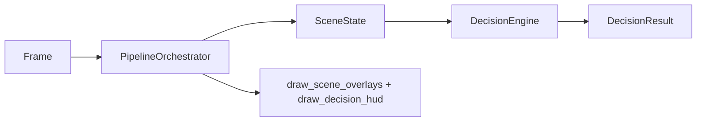

# Decision Engine & Pipeline — Interview Cheatsheet

High-value Q&A from the **Autonomous Driving Car** decision layer and pipeline orchestrator.  
Full design spec: `docs/decision_engine_design.md` · Implementation report: `docs/decision_engine_implementation_report.md`

---

## Elevator pitch (30 seconds)

Implemented `PipelineOrchestrator` that runs lane → vehicle → sign → signal on each frame, aggregates into `SceneState`, and evaluates twelve rules via `DecisionEngine` to emit one of five `ADASRecommendation` values. Composite visualization stacks module overlays plus a decision HUD. **29 new pytest tests**; full suite **58/58**. Stub pipeline returns **STOP** on synthetic red light (R01).

---

## Architecture (must know)

**Q: Walk through `PipelineOrchestrator.run_frame()`.**  
`_validate_frame()` → optional `_ensure_initialized()` → four `predict()` calls in order → `SceneState.from_perception()` → `DecisionEngine.evaluate()` → `PipelineResult(scene_state, decision, total_time_ms)`.

**Q: What is `REFERENCE_ORDER`?**  
`("lane_detection", "vehicle_detection", "traffic_sign", "traffic_signal")` — sequential, not parallel.

**Q: Where does decision logic live?**  
`src/decision/rules.py` (pure rule functions + `RULE_REGISTRY`) and `src/decision/decision_engine.py` (`evaluate`, `arbitrate`).

**Q: How does visualization work?**  
`visualize()` → `draw_scene_overlays()` (lane, vehicle, sign, signal) → `draw_decision_hud()` (banner + rule list + L/V/S/T status dots).



---

## SceneState (must know)

**Q: What does `SceneState` hold?**  
Four typed results (`LaneDetectionResult`, `VehicleDetectionResult`, `TrafficSignDetectionResult`, `TrafficSignalDetectionResult`), frame metadata, `module_statuses`, and boolean `lane_ok` / `vehicles_ok` / `signs_ok` / `signals_ok`.

**Q: How is `lane_ok` determined?**  
`raw_status` ∈ `{parsed, stub_segmentation, stub}` **and** (`lane_center_x` is not None **or** `lane_mask` is not None).

**Q: How are vehicle/sign/signal `*_ok` determined?**  
`raw_status` ∈ `{parsed, stub}`.

**Q: What's the difference between `to_dict()` and `perception_dict()`?**  
`to_dict()` strips mask arrays to `{present, shape}` for JSON; `perception_dict()` uses each module's full `to_prediction_dict()`.

**Q: Is segmentation used?**  
`SceneState.segmentation` exists but orchestrator never populates it — always `None` in practice.

---

## DecisionEngine (must know)

**Q: What does `evaluate()` do?**  
1. `hits = evaluate_all(scene, config)`  
2. Remove `R12_default_proceed` if any other rule fired  
3. `arbitrate(remaining hits)` → single `DecisionResult`

**Q: How does `arbitrate()` pick a winner?**  
`max(hits, key=(priority, confidence))`. All hits kept in `rule_hits` sorted by priority descending.

**Q: What are the five recommendations?**  
`PROCEED`, `STOP`, `SLOW_DOWN`, `KEEP_LANE`, `WARNING` — enum `ADASRecommendation`.

**Q: Where do thresholds come from?**  
`config/default.yaml` → `decision:` section, loaded by `get_decision_config()` into `DecisionConfig`.

---

## Rule catalog (memorize priorities)

| Pri | ID | Rec | Trigger (short) |
|-----|-----|-----|-----------------|
| 100 | R01 | STOP | Red light, conf ≥ 0.7 |
| 95 | R02 | STOP | Stop sign in lower 40% of frame |
| 90 | R03 | STOP | Person on drivable mask |
| 70 | R04 | SLOW_DOWN | Yellow light |
| 65 | R05 | SLOW_DOWN | `active_speed_limit_kmh` set |
| 60 | R06 | SLOW_DOWN | Person/bicycle in lower third |
| 55 | R07 | WARNING | Pedestrian crossing sign |
| 50 | R08 | WARNING | Large truck/bus (area ≥ 8% frame) |
| 45 | R09 | WARNING | `lane_departure` |
| 40 | R10 | KEEP_LANE | Offset > 35 px, not departing |
| 10 | R11 | PROCEED | Green light, no stop state |
| 1 | R12 | PROCEED | Default fallback |

**Q: What wins if red and green both detected?**  
R01 (priority 100) beats R11 (priority 10). Test: `test_conflict_red_beats_green_via_engine`.

**Q: Does R12 always run?**  
Yes — `rule_r12_default_proceed` always returns a hit, but `evaluate()` excludes it from arbitration when any other rule fires.

**Q: What cross-module rule exists?**  
R03 — `overlaps_drivable_mask()` checks person bbox against `lane.drivable_mask`.

---

## PipelineOrchestrator (must know)

**Q: What is `PipelineResult`?**  
`scene_state: SceneState`, `decision: DecisionResult`, `total_time_ms: float | None`.

**Q: What does `PipelineConfig` control?**  
Per-module `run_*` flags, `auto_initialize`, `collect_timing`. `run_segmentation` is stored but **not used**.

**Q: How do tests inject stubs?**  
Pass module instances to `PipelineOrchestrator(lane_module=..., ...)` — same pattern as perception tests. Fixture: `pipeline_orchestrator` in `conftest.py`.

**Q: What does stub E2E return?**  
`ADASRecommendation.STOP` — stub signal engine emits `red_light` at confidence 0.90.

**Q: Is there a gate script?**  
**No.** `scripts/verify_pipeline.py` was not implemented. Verification is pytest-only.

---

## Visualization (must know)

**Q: Overlay draw order?**  
Lane → vehicles → signs → signals (`draw_scene_overlays`).

**Q: HUD colors for STOP / PROCEED?**  
STOP banner BGR `(0, 0, 220)` red; PROCEED `(0, 200, 0)` green.

**Q: What changed in lane visualization?**  
`LaneDetectionModule.visualize()` now calls `draw_lane_results()`. `draw_lane_center()` accepts scalar `lane_center_x` (float) from `to_prediction_dict()`.

**Q: What are the L/V/S/T dots?**  
Module health strip in `_draw_module_status_strip()` — green = `*_ok`, red = failed.

---

## Data structures (quick reference)

| Type | Key fields |
|------|------------|
| `SceneState` | `lane`, `vehicles`, `signs`, `signals`, `*_ok`, `module_statuses` |
| `ModuleStatus` | `module_name`, `raw_status`, `ok` |
| `RuleHit` | `rule_id`, `recommendation`, `priority`, `message`, `source_module`, `confidence` |
| `DecisionResult` | `recommendation`, `priority`, `rule_hits`, `primary_message`, `explanation` |
| `PipelineResult` | `scene_state`, `decision`, `total_time_ms` |

---

## Design decisions (why questions)

| Decision | Why |
|----------|-----|
| Store full dataclasses in `SceneState` | Type-safe; rules read `summary` fields directly |
| R12 always fires then filtered | Guarantees a hit list; default PROCEED when nothing else applies |
| Sequential module calls | Simpler debug; modules are frame-independent in v1 |
| Exclude R12 when others fire | Prevents default PROCEED from appearing in `rule_hits` alongside STOP |
| Scalar `lane_center` in overlays | `to_prediction_dict()` exposes `lane_center_x` as `"lane_center"` float |
| No segmentation in pipeline | `SegmentationModule` still a stub; flag reserved only |

---

## Test inventory

| File | Tests |
|------|-------|
| `test_scene_state.py` | 5 |
| `test_decision_rules.py` | 10 |
| `test_decision_engine.py` | 6 |
| `test_pipeline_orchestrator.py` | 8 |
| **Decision + pipeline total** | **29** |
| **Full repo** | **58** |

**Key integration test:** `test_stub_pipeline_stop_on_red_light` — all modules ok → STOP.

---

## Limitations (honest answers)

| Gap | Answer |
|-----|--------|
| Temporal smoothing? | **No** — per-frame only |
| Gradio demo? | **No** — `src/app.py` still stub |
| Segmentation in pipeline? | **No** |
| `verify_pipeline.py`? | **Not implemented** |
| Real weights in CI? | **No** — stub engines in orchestrator tests |
| `bbox_lower_fraction()` used? | **Defined but unused** |

---

## Code locations (rapid lookup)

| Component | Path |
|-----------|------|
| Scene aggregation | `src/decision/scene_state.py` |
| Rules R01–R12 | `src/decision/rules.py` |
| Engine | `src/decision/decision_engine.py` |
| Types | `src/decision/types.py` |
| Orchestrator | `src/pipeline/orchestrator.py` |
| Composite overlays | `src/visualization/overlays.py` → `draw_scene_overlays()` |
| HUD | `src/visualization/hud.py` → `draw_decision_hud()` |
| Config | `config/default.yaml` → `decision:`, `pipeline:` |
| Config loaders | `src/utils/model_paths.py` → `get_decision_config()`, `get_pipeline_config()` |

---

## One-liner for interviews

*Integrated four perception modules through `PipelineOrchestrator` into a rule-based `DecisionEngine` with priority arbitration, `SceneState` aggregation, composite OpenCV visualization, and 29 pytest cases — stub pipeline correctly emits STOP on red traffic light.*

---

## Public import cheat sheet

```python
from src.decision import DecisionEngine, SceneState, ADASRecommendation
from src.pipeline import PipelineOrchestrator, PipelineConfig, PipelineResult
```

```python
result = orchestrator.run_frame(frame)
result.decision.recommendation   # ADASRecommendation.STOP
result.scene_state.lane_ok       # bool
result.decision.to_dict()        # JSON-serializable
```
