# Lane Detection Implementation Review

**Date:** 2026-06-16  
**Scope:** End-to-end lane detection pipeline (`LaneDetectionModule` + YOLOP integration layer)  
**Files reviewed:**

| File | Role |
|------|------|
| `src/modules/lane_detection.py` | Orchestrator / public API |
| `src/modules/yolop/model_loader.py` | Checkpoint loading |
| `src/modules/yolop/inference.py` | Frame preprocessing + forward pass |
| `src/modules/yolop/output_parser.py` | Raw output → structured masks + geometry |
| `src/modules/yolop/lane_geometry.py` | Lane center + vehicle offset |
| `src/modules/yolop/postprocess.py` | Mask morphological refinement |

---

## 1. Current Workflow Diagram

The pipeline is wired end-to-end at the orchestration level. Most stages execute, but the YOLOP forward pass is stubbed, so downstream stages typically receive empty masks.

```mermaid
flowchart TD
    A[Input BGR Frame<br/>H x W x 3] --> B[LaneDetectionModule._validate_input]
    B --> C[LanePreprocessor.preprocess]
    C --> C1[Resize → Grayscale → Blur → Canny → ROI mask]
    C1 --> D[preprocessed_edges<br/>stored in result only]

    A --> E[YOLOPInferenceEngine.run]
    E --> E1[preprocess: resize 640x640, RGB, normalize, NCHW]
    E1 --> E2["_execute_forward() STUB<br/>lane_head=None, drivable_head=None"]
    E2 --> E3[postprocess STUB<br/>maps heads to dict keys]
    E3 --> F[raw_outputs dict<br/>inference_status=stub]

    F --> G[YOLOPOutputParser.parse]
    G --> G1[extract_drivable_area raw_outputs index 1]
    G --> G2[extract_lane_information raw_outputs index 2]
    G1 --> G3[argmax → binary mask]
    G2 --> G3
    G3 --> G4[compute_lane_center via LaneGeometryExtractor]
    G4 --> G5[compute_vehicle_offset via LaneGeometryExtractor]
    G5 --> G6[detect_lane_departure STUB → always False]
    G6 --> H[ParsedYOLOPOutput]

    H --> I{apply_mask_postprocess?}
    I -->|yes| J[postprocess_lane_mask<br/>morphology → connect_lane]
    I -->|no| K[raw lane_mask]
    J --> L[LaneGeometryExtractor<br/>compute_lane_center + offset]
    K --> L

    L --> M[LaneDetectionResult]
    D --> M

    subgraph init [initialize]
        N[YOLOPModelLoader.load_model] --> O[torch.load + validate state_dict]
        O --> P[inference_engine.attach_model]
        P --> Q["TODO: instantiate YOLOP nn.Module"]
    end
```



### Initialization path

```
LaneDetectionModule.initialize()
  → YOLOPModelLoader.load_model()     [implemented]
  → YOLOPModelLoader.get_model()      [returns checkpoint package, not nn.Module]
  → YOLOPInferenceEngine.attach_model() [stores package; architecture not built]
```

### Data contracts today

| Stage | Input | Output | Status |
|-------|-------|--------|--------|
| `LanePreprocessor` | BGR frame | Edge/ROI image | Implemented |
| `YOLOPInferenceEngine.run` | BGR frame | Dict with `lane_mask`, `drivable_mask`, `inference_status` | Stub forward pass |
| `YOLOPOutputParser.parse` | Raw dict or sequence | `ParsedYOLOPOutput` | Partial (masks need real tensors) |
| `postprocess_lane_mask` | Binary mask | Refined binary mask | Implemented |
| `LaneGeometryExtractor` | Binary mask | `lane_center_x`, offset | Implemented (simple mean-x) |
| `LaneDetectionModule.predict` | BGR frame | `LaneDetectionResult` | Orchestration complete |

---

## 2. Missing Implementations

### Critical (blocks real lane detection)

| Component | What is missing |
|-----------|-----------------|
| **YOLOP network architecture** | No `nn.Module` definition or vendored YOLOP repo integration. `attach_model()` stores weights but never loads them into a network. |
| **Forward pass** | `_execute_forward()` always returns `lane_head=None`, `drivable_head=None`, `status="stub"`. |
| **Inference postprocess** | No decoding of segmentation logits, no resize of masks back to `original_shape` using `scale_x` / `scale_y`. |
| **Left/right lane polylines** | `extract_lane_information()` returns `left_lane=None`, `right_lane=None`. No skeletonization, clustering, or curve fitting. |
| **Lane departure detection** | `detect_lane_departure()` always returns `is_departing=False`. `LaneDetectionModule` hardcodes `lane_departure=False`. |
| **Visualization** | `visualize()` returns an unannotated frame copy. |

### Partial / degraded behavior

| Component | Gap |
|-----------|-----|
| **Lane center geometry** | Uses global mean x of all lane pixels, not row-wise sampling at the evaluation row (`evaluation_row_ratio` in `ParserConfig` is unused). `center_line` is never populated. |
| **Dual preprocessing** | `LanePreprocessor` output is computed every frame but never fed into YOLOP. Two independent preprocessing paths exist with no documented contract. |
| **Parser ↔ inference output format** | Parser supports sequence indices `[1]`, `[2]` and dict keys `lane_mask`/`lane_head`. Inference stub returns dict with `None` values — parser cannot produce masks until forward pass is real. |
| **Device management** | `YOLOPModelLoader.device` and `InferenceConfig.device` are separate; tensors are not moved to GPU. `_architecture_ready` flag is never set `True`. |
| **Legacy `utils.py`** | `parse_yolop_output()`, `parse_lane_mask()`, `compute_vehicle_offset()` remain full placeholders and are no longer used by `LaneDetectionModule`. |

---

## 3. Placeholder Methods Still Remaining

### `src/modules/yolop/inference.py`

| Method / block | Location | Behavior |
|----------------|----------|----------|
| `attach_model()` | Lines 118–119 | `# TODO: Instantiate YOLOP network architecture and load state_dict` |
| `postprocess()` | Lines 242–245 | `# TODO: Decode lane/drivable/detection heads; resize masks` |
| `_execute_forward()` | Lines 309–311 | `# TODO: torch.Tensor conversion, forward pass, capture heads` — returns all-`None` stub |

### `src/modules/yolop/output_parser.py`

| Method | Location | Behavior |
|--------|----------|----------|
| `extract_lane_information()` | Lines 191–192 | `# TODO: Skeletonize, cluster left/right, fit polylines` |
| `detect_lane_departure()` | Lines 351–352 | `# TODO: Compare offset to threshold, set direction` — always `False` |

### `src/modules/yolop/utils.py` (legacy, unused by main pipeline)

| Function | Behavior |
|----------|----------|
| `parse_lane_mask()` | Returns all-`None` lane fields |
| `compute_vehicle_offset()` | Returns `vehicle_offset=None`, `lane_departure=False` |
| `parse_yolop_output()` | Orchestrates the two placeholders above |

### `src/modules/lane_detection.py`

| Method | Behavior |
|--------|----------|
| `visualize()` | Returns `frame.copy()` with no overlays |

---

## 4. Technical Debt

### Architecture and API

1. **Duplicate geometry computation** — `YOLOPOutputParser.parse()` already calls `compute_lane_center()` and `compute_vehicle_offset()`, but `LaneDetectionModule._run_pipeline()` re-runs `LaneGeometryExtractor` on the post-processed mask and ignores `parsed.lane_center` / `parsed.vehicle_offset`. Geometry may differ between parser output and final result.

2. **Return type mismatch with `BaseModule`** — `BaseModule.predict()` is typed to return `PredictionResult` (`dict`). `LaneDetectionModule.predict()` returns `LaneDetectionResult` (dataclass). `BaseModule.run_predict()` calls `len(results)` in `_on_after_predict`, which will fail on a dataclass.

3. **Schema inconsistency** — `ParsedYOLOPOutput.to_prediction_dict()` maps `lane_center` to `center_line` (polyline), while `LaneDetectionResult.to_prediction_dict()` maps `lane_center` to `lane_center_x` (scalar). Downstream consumers may receive incompatible shapes for the same key.

4. **Parallel legacy API** — `src/modules/yolop/utils.py` duplicates responsibilities now handled by `YOLOPOutputParser` and `LaneGeometryExtractor`. Risk of future callers using the wrong entry point.

5. **Disconnected classical preprocessing** — `LanePreprocessor` runs on every `predict()` call but its output is only stored in `LaneDetectionResult.preprocessed_edges`. No fusion with YOLOP input or fallback path when YOLOP is unavailable.

### Configuration and paths

6. **Default checkpoint path split** — `YOLOPModelLoader.DEFAULT_YOLOP_CHECKPOINT` hardcodes a Colab Drive path. `LaneDetectionModule` correctly uses `get_yolop_weights_path()` from config, but a bare `YOLOPModelLoader()` without injection falls back to the Colab path.

7. **Postprocess parameters not configurable** — `kernel_size`, `min_area`, `shadow_height` in `postprocess_lane_mask()` use fixed defaults; not exposed via config or `LaneDetectionModule` constructor.

### Geometry quality

8. **Naive lane center** — Global mean x across all lane pixels is sensitive to curved roads, merging lanes, and noise. `ParserConfig.evaluation_row_ratio` is defined but unused in geometry code.

9. **No mask resolution alignment** — Until inference postprocess resizes masks to original frame dimensions, geometry computed on 640×640 masks will not align with full-resolution frames.

### Operational

10. **Silent degradation** — `predict()` auto-initializes on failure and returns `LaneDetectionResult.empty(raw_status="init_failed")` instead of surfacing errors to callers. `YOLOPInferenceEngine.run()` returns `empty_output()` when not ready instead of always raising `InferenceNotReadyError`.

11. **No automated tests** — No unit or integration tests found for mask parsing, geometry, postprocess, or the orchestrated pipeline.

12. **`weights_only=False` in `torch.load`** — Required for arbitrary checkpoints today; should be revisited for security once checkpoint format is fixed.

---

## 5. Integration Risks

| Risk | Severity | Description |
|------|----------|-------------|
| **Stub inference masks production** | High | Pipeline appears complete but always returns empty geometry. Callers may not distinguish stub vs. real failure without checking `raw_status`. |
| **Output format mismatch** | High | Parser expects multi-class tensors at indices `[1]`/`[2]` or pre-decoded masks. Inference returns a flat dict with different key names until postprocess is implemented. Contract must be frozen before architecture integration. |
| **Mask size vs. frame size** | High | Geometry uses `frame.shape[1]` for offset but mask may be model input size (640×640). Offset and center will be wrong without resize + scale correction. |
| **`run_predict()` hook breakage** | Medium | `BaseModule.run_predict()` assumes dict results; `LaneDetectionResult` breaks `_on_after_predict`. |
| **Double geometry sources** | Medium | Parser and module both compute center/offset; tests and decision engine may read inconsistent values depending on code path. |
| **Device drift** | Medium | Loader `device`, inference `config.device`, and actual tensor placement are not synchronized. GPU inference will fail silently or run on CPU unexpectedly. |
| **Colab vs. local paths** | Medium | Missing weights on local Windows dev machines cause init failure unless config paths and assets are present. |
| **OpenCV / PyTorch import chain** | Medium | Importing `src.modules` pulls in `cv2` and `torch` dependencies. Environment without them fails at import time, not at `initialize()`. |
| **LanePreprocessor resize** | Low | Default `target_size=(1280, 720)` may not match camera input or YOLOP input; edges stored in result may not align with inference resolution. |
| **Legacy utils confusion** | Low | External code importing `parse_yolop_output` gets placeholder behavior while `LaneDetectionModule` uses the real parser path. |

---

## 6. Required Tasks Before Production Readiness

### Phase A — Core inference (blocking)

- [ ] Integrate YOLOP `nn.Module` (vendored submodule or official weights-compatible architecture).
- [ ] Load `state_dict` in `attach_model()`; set `_architecture_ready = True` when weights bind successfully.
- [ ] Implement `_execute_forward()`: tensor conversion, `torch.no_grad()`, multi-head output capture.
- [ ] Implement `postprocess()`: argmax/sigmoid thresholding, mask resize to `original_shape`.
- [ ] Align raw output contract between `inference.py` and `output_parser.py` (document and test).
- [ ] Synchronize `device` across loader, inference config, and tensor placement; add CUDA support and warmup.

### Phase B — Lane geometry and quality

- [ ] Implement left/right lane extraction (connected components, sliding-window, or polynomial fit per YOLOP reference).
- [ ] Populate `center_line` and/or row-specific `lane_center_x` using `evaluation_row_ratio`.
- [ ] Resize masks before geometry; verify offset in original image coordinates.
- [ ] Expose postprocess parameters (`min_area`, `shadow_height`, kernel size) via config.
- [ ] Implement `detect_lane_departure()` and wire into `LaneDetectionResult.lane_departure`.
- [ ] Resolve duplicate geometry: either parser-only or module-only, with postprocess applied in one place.

### Phase C — Module integration and API

- [ ] Fix `BaseModule` compatibility: `predict()` returns dict via `to_prediction_dict()` or update `run_predict()` hooks for dataclass results.
- [ ] Unify `lane_center` schema across `ParsedYOLOPOutput` and `LaneDetectionResult`.
- [ ] Decide fate of `LanePreprocessor` (feed YOLOP, fusion, or optional debug-only path).
- [ ] Implement `visualize()` using `src/visualization/overlays.py`.
- [ ] Deprecate or remove `utils.py` placeholders after migration.
- [ ] Define explicit error policy: fail fast vs. empty result; document `raw_status` values.

### Phase D — Validation and deployment

- [ ] Unit tests: mask parsing, postprocess, geometry, parser edge cases (empty mask, wrong shape).
- [ ] Integration tests: full pipeline with real `End-to-end.pth` on sample road frames.
- [ ] Benchmark latency (CPU/GPU) and memory at target resolution.
- [ ] Verify `config/default.yaml` weights path on Colab Drive and local dev.
- [ ] Add CI smoke test that skips inference when weights absent but validates import and stub pipeline.
- [ ] Document operational runbook: init, predict, cleanup, expected `raw_status` values.

---

## Summary

The lane detection stack has a **well-structured orchestration layer** with dependency injection, logging, error handling, and a clear `LaneDetectionResult` contract. Checkpoint loading, mask postprocessing, segmentation parsing (given real tensors), and basic geometry are in place.

**Production readiness is blocked by the YOLOP forward pass stub.** Until the network architecture is integrated and masks are resized to frame coordinates, the pipeline will run without error but produce empty or incorrect lane data. Secondary gaps include left/right lane polylines, lane departure logic, visualization, API/schema alignment with `BaseModule`, and test coverage.

**Recommended next step:** Integrate the YOLOP model architecture and real forward pass in `inference.py`, then add an integration test that asserts non-empty `lane_mask` and plausible `lane_center_x` on a known demo frame.
