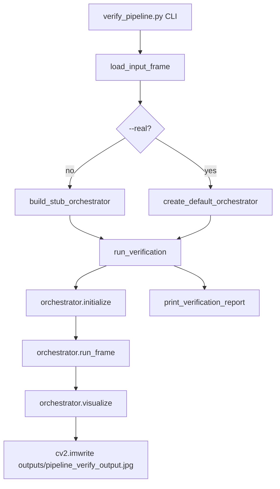

# Pipeline Verification Report

**Date:** June 2026  
**Gate script:** `scripts/verify_pipeline.py`  
**Status:** Implemented and verified

---

## 1. Summary

End-to-end ADAS pipeline verification gate validates `PipelineOrchestrator` wiring from perception through `SceneState` aggregation, `DecisionEngine` evaluation, and composite visualization output.

| Check | Result |
|-------|--------|
| Orchestrator initializes | **PASS** |
| Modules initialize | **PASS** |
| Pipeline runs | **PASS** |
| `SceneState` created | **PASS** |
| `DecisionResult` generated | **PASS** |
| Visualization generated | **PASS** |
| Output image saved | **PASS** — `outputs/pipeline_verify_output.jpg` |
| Gate tests (`tests/test_verify_pipeline.py`) | **PASS** — 7/7 |
| Full test suite | **PASS** — 65/65 |

**Default stub run decision:** `STOP` via rule `R01_red_light_stop` (priority 100, confidence 0.90).

---

## 2. Files Created

| File | Purpose |
|------|---------|
| `scripts/verify_pipeline.py` | Pipeline verification gate script |
| `tests/test_verify_pipeline.py` | Unit + subprocess tests for gate (7 tests) |
| `outputs/pipeline_verify_output.jpg` | Annotated output (generated on gate run) |
| `docs/pipeline_verification_report.md` | This report |

---

## 3. Gate Script Architecture



### Required imports (implemented)

```python
from src.pipeline import PipelineOrchestrator, create_default_orchestrator
from src.decision import DecisionEngine, SceneState
```

### CLI usage

```bash
python scripts/verify_pipeline.py
python scripts/verify_pipeline.py --image path/to/image.jpg
python scripts/verify_pipeline.py --video path/to/video.mp4
python scripts/verify_pipeline.py --real          # optional: real module weights
python scripts/verify_pipeline.py --output path/to/out.jpg
```

| Mode | Input source |
|------|----------------|
| Default | `tests/fixtures/road_sample.jpg` if present, else synthetic 1280×720 road |
| `--image` | User image via `cv2.imread` |
| `--video` | First frame of video via `cv2.VideoCapture` |

---

## 4. Verification Checks (`run_verification`)

| Step | PASS message | Validation |
|------|--------------|------------|
| 1 | `orchestrator initializes` | Argument is `PipelineOrchestrator` instance |
| 2 | `modules initialize` | All four modules `is_initialized` after `initialize()` |
| 3 | `pipeline runs` | `run_frame()` returns `PipelineResult` |
| 4 | `SceneState created` | `result.scene_state` is `SceneState` |
| 5 | `DecisionResult generated` | `result.decision` is `DecisionResult`; engine is `DecisionEngine` |
| 6 | `visualization generated` | `visualize()` returns uint8 BGR frame, differs from input |
| 7 | (implicit) | `cv2.imwrite` to `outputs/pipeline_verify_output.jpg` (or `--output`) |
| 8 | (implicit) | `orchestrator.cleanup()` |

---

## 5. Actual Console Output

### 5.1 Default run (`python scripts/verify_pipeline.py`)

Captured June 2026 (stderr suppressed; YOLOP stub weights used):

```text
PASS: orchestrator initializes
PASS: modules initialize
PASS: pipeline runs
PASS: SceneState created
PASS: DecisionResult generated
PASS: visualization generated

--- Decision ---
  recommendation   = STOP
  priority         = 100
  primary_message  = Red traffic light detected — stop required

--- Rule ---
  rule_id          = R01_red_light_stop
  source_module    = traffic_signal
  confidence       = 0.9000

--- Module statuses ---
  lane_detection       ok=True raw_status=stub_segmentation inference_ms=None
  vehicle_detection    ok=True raw_status=stub inference_ms=2.5
  traffic_sign         ok=True raw_status=stub inference_ms=2.0
  traffic_signal       ok=True raw_status=stub inference_ms=2.0

--- Inference timing ---
  pipeline_total_ms = 35.739
  lane_raw_status   = stub_segmentation
  vehicle_ms        = 2.5
  sign_ms           = 2.0
  signal_ms         = 2.0

============================================================
PIPELINE GATE: ALL CHECKS PASSED
  source           = stub:fixture:road_sample.jpg
  frame_shape      = (720, 1280)
  output_image     = .../outputs/pipeline_verify_output.jpg
============================================================
```

### 5.2 Image run (`python scripts/verify_pipeline.py --image tests/fixtures/road_sample.jpg`)

```text
PASS: orchestrator initializes
PASS: modules initialize
PASS: pipeline runs
PASS: SceneState created
PASS: DecisionResult generated
PASS: visualization generated

--- Decision ---
  recommendation   = STOP
  priority         = 100
  primary_message  = Red traffic light detected — stop required

--- Rule ---
  rule_id          = R01_red_light_stop
  source_module    = traffic_signal
  confidence       = 0.9000

--- Module statuses ---
  lane_detection       ok=True raw_status=stub_segmentation inference_ms=None
  vehicle_detection    ok=True raw_status=stub inference_ms=2.5
  traffic_sign         ok=True raw_status=stub inference_ms=2.0
  traffic_signal       ok=True raw_status=stub inference_ms=2.0

--- Inference timing ---
  pipeline_total_ms = 42.357
  lane_raw_status   = stub_segmentation
  vehicle_ms        = 2.5
  sign_ms           = 2.0
  signal_ms         = 2.0

============================================================
PIPELINE GATE: ALL CHECKS PASSED
  source           = stub:image:road_sample.jpg
  frame_shape      = (720, 1280)
  output_image     = .../outputs/pipeline_verify_output.jpg
============================================================
```

### 5.3 Video run

Verified via `tests/test_verify_pipeline.py::test_cli_with_video` — subprocess exit code 0, stdout contains `video:input.avi:frame0`, output image written.

---

## 6. Stub Orchestrator Construction

`build_stub_orchestrator()` wires:

| Module | Stub component |
|--------|----------------|
| `LaneDetectionModule` | `stub_yolop_weights.pth` + `_StubYOLOPInferenceEngine` (`stub_segmentation`) |
| `VehicleDetectionModule` | `_StubLoader` + `_StubEngine` (car box, `stub`) |
| `TrafficSignModule` | `_StubLoader` + `_StubEngine` (stop sign, `stub`) |
| `TrafficSignalModule` | `_StubLoader` + `_StubEngine` (red_light, conf 0.90, `stub`) |
| `DecisionEngine` | Default config from `get_decision_config()` |

`PipelineConfig(auto_initialize=False, collect_timing=True)` — gate calls `initialize()` explicitly before `run_frame()`.

---

## 7. Tests Added (`tests/test_verify_pipeline.py`)

| Test | Type | Assertion |
|------|------|-----------|
| `test_build_stub_orchestrator` | Unit | Returns `PipelineOrchestrator` |
| `test_run_verification_stub` | Unit | `SceneState`, `DecisionResult`, output file |
| `test_load_input_frame_synthetic` | Unit | Default frame loads |
| `test_cli_default_exit_zero` | Subprocess | All PASS lines + exit 0 |
| `test_cli_with_image` | Subprocess | `--image` mode |
| `test_cli_with_video` | Subprocess | `--video` first frame |
| `test_stub_pipeline_emits_stop` | Unit | `ADASRecommendation.STOP` |

```text
$ python -m pytest tests/test_verify_pipeline.py -q
.......                                                                  [100%]
7 passed
```

```text
$ python -m pytest tests/ -q
.................................................................        [100%]
65 passed
```

---

## 8. Output Artifact

| Path | Description |
|------|-------------|
| `outputs/pipeline_verify_output.jpg` | Composite annotated frame: lane + vehicle + sign + signal overlays + decision HUD (STOP banner) |

Created automatically when the gate script runs (directory `outputs/` created if missing).

---

## 9. Limitations

| Item | Notes |
|------|-------|
| `--real` mode | Uses `create_default_orchestrator()`; requires weights on disk; not run in CI gate tests |
| Video processing | Only **first frame** verified; no full-video pipeline loop |
| Segmentation | Not included in gate (`run_segmentation` remains false) |
| Timing variance | `pipeline_total_ms` varies by machine (~35–45 ms on dev hardware) |
| Perception modules | **Not modified** — gate uses injectable stubs by default |

---

## 10. How to Re-run

```bash
# From project root
python scripts/verify_pipeline.py

# With custom image
python scripts/verify_pipeline.py --image tests/fixtures/road_sample.jpg

# With video (first frame)
python scripts/verify_pipeline.py --video path/to/clip.mp4

# Run gate tests only
python -m pytest tests/test_verify_pipeline.py -v
```

Expected exit code: **0** with banner `PIPELINE GATE: ALL CHECKS PASSED`.

---

*End of Pipeline Verification Report.*
