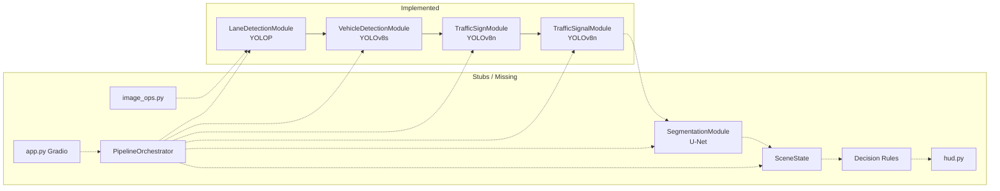

# Autonomous Driving Assistance System — Project Status Report

**Repository:** Autonomous Driving Car  
**Date:** June 18, 2026  
**Scope:** Full-repository static review (source, config, tests, scripts, docs)  
**Test baseline:** `29 passed` (`python -m pytest tests/ -q`, verified this session)

---

## Executive Summary

The ADAS perception stack has **four implemented perception modules** (lane, vehicle, traffic sign, traffic signal) sharing a consistent `BaseModule` contract and YOLO-family subpackage pattern. **Integration layers remain unbuilt:** the pipeline orchestrator, decision engine, Gradio web app, and semantic segmentation are still stubs. Modules run **independently** — no end-to-end frame pipeline exists yet.

| Layer | Status |
|-------|--------|
| Perception (4/5 modules) | **Mostly implemented** (~80–90% each) |
| Segmentation | **Stub** |
| Orchestrator | **Stub** (comments only) |
| Decision engine | **Stub** (TODO comments) |
| Web application | **Stub** |
| Evaluation | **Not started** |

**Verdict:** The project is a **well-structured modular perception library** awaiting pipeline fusion and decision logic — not a runnable end-to-end ADAS application yet.

### Architecture (current vs planned)



---

## 1. Completed Modules

Modules with full `initialize()` / `predict()` / `cleanup()` implementations, structured outputs, config integration, and integration tests (where noted).

### 1.1 Lane Detection — `LaneDetectionModule`

| Item | Detail |
|------|--------|
| **File** | `src/modules/lane_detection.py` |
| **Subpackage** | `src/modules/yolop/` (loader, inference, parser, postprocess, lane_geometry, mask_resize, vendored MCnet) |
| **Model** | YOLOP (`yolop/End-to-end.pth`) |
| **Output** | `LaneDetectionResult` — lane center, vehicle offset, departure flag, `to_prediction_dict()` |
| **Pipeline version** | `LANE_DETECTION_PIPELINE_VERSION = 2` |
| **Tests** | `tests/test_lane_detection_pipeline.py` (3), `tests/test_mask_resize_geometry.py` (6), `tests/test_yolop_output_parser.py` (2) |
| **Gate script** | `scripts/verify_mask_resize.py` (geometry gate; no dedicated lane gate script) |
| **Docs** | `docs/yolop_vendor_implementation_report.md`, `docs/mask_resize_*.md` |

**Caveats:** `visualize()` returns `frame.copy()` only — **not wired** to `draw_lane_results()` in `overlays.py`. YOLOP detection-head decode has TODO comments in `yolop/inference.py`. Left/right lane polylines stubbed in `yolop/output_parser.py`. CI tests use stub inference engine in `conftest.py` when real weights are unavailable.

### 1.2 Vehicle Detection — `VehicleDetectionModule`

| Item | Detail |
|------|--------|
| **File** | `src/modules/vehicle_detection.py` |
| **Subpackage** | `src/modules/yolov8/` |
| **Model** | YOLOv8s (Ultralytics; COCO with 6-class ADAS filter: person, bicycle, car, motorcycle, bus, truck) |
| **Output** | `VehicleDetectionResult` — detections, `nearest_object`, counts, `to_prediction_dict()` |
| **Tests** | `tests/test_vehicle_detection_pipeline.py` (5) |
| **Gate script** | `scripts/verify_vehicle_detection.py` |
| **Docs** | `docs/vehicle_detection_implementation_report.md` |

**Caveats:** `visualize()` **implemented** via `draw_vehicle_detections()`. Real weights optional (Ultralytics auto-download fallback for COCO). No object tracking (`track_id` reserved but unused).

### 1.3 Traffic Sign Recognition — `TrafficSignModule`

| Item | Detail |
|------|--------|
| **File** | `src/modules/traffic_sign.py` |
| **Subpackage** | `src/modules/yolov8_sign/` |
| **Model** | YOLOv8n fine-tuned (`yolov8_sign/traffic_signs_yolov8n.pt`) |
| **Classes** | 7 ADAS signs (`stop`, speed limits, turns, `keep_right`, `pedestrian_crossing`) |
| **Output** | `TrafficSignDetectionResult` — `active_speed_limit_kmh`, `nearest_sign`, regulatory flags |
| **Tests** | `tests/test_traffic_sign_pipeline.py` (6) |
| **Gate script** | `scripts/verify_traffic_sign_detection.py` |
| **Docs** | `docs/traffic_sign_implementation_report.md` |

**Caveats:** Fine-tuned weights **required** for real inference (no COCO fallback). `visualize()` **implemented** via `draw_traffic_signs()`.

### 1.4 Traffic Signal Detection — `TrafficSignalModule`

| Item | Detail |
|------|--------|
| **File** | `src/modules/traffic_signal.py` |
| **Subpackage** | `src/modules/yolov8_signal/` |
| **Model** | YOLOv8n fine-tuned (`yolov8_signal/traffic_signals_yolov8n.pt`) |
| **Classes** | `red_light`, `yellow_light`, `green_light` |
| **Output** | `TrafficSignalDetectionResult` — `controlling_signal`, `dominant_state`, stop/caution/proceed flags |
| **Tests** | `tests/test_traffic_signal_pipeline.py` (7) |
| **Gate script** | `scripts/verify_traffic_signal_detection.py` |
| **Docs** | `docs/traffic_signal_implementation_report.md` |

**Caveats:** Fine-tuned weights **required** for real inference. `visualize()` **implemented** via `draw_traffic_signals()`. No temporal smoothing (per-frame state only).

### 1.5 Shared Infrastructure (complete, not perception modules)

| Component | File | Role |
|-----------|------|------|
| **Base contract** | `src/modules/base.py` | Abstract `BaseModule` with lifecycle (`initialize`, `predict`, `visualize`, `cleanup`) |
| **Path resolution** | `src/utils/model_paths.py` | Config-driven weight paths for all models |
| **Lane preprocessing** | `src/preprocessing/lane_preprocess.py` | Used internally by lane module |
| **Overlays** | `src/visualization/overlays.py` | Draw functions for lane, vehicle, sign, signal |
| **Configuration** | `config/default.yaml` | Central paths, thresholds, model selections |
| **Class labels** | `config/classes.yaml` | Sign (7) and signal (3) class names; legacy CNN labels |

---

## 2. Stub Modules

| Module / Component | File(s) | Status |
|--------------------|---------|--------|
| **Semantic Segmentation** | `src/modules/segmentation.py` | Stub — `predict()` returns `{}`; no `unet/` subpackage |
| **Decision — Scene State** | `src/decision/scene_state.py` | Stub — single TODO comment |
| **Decision — Rules** | `src/decision/rules.py` | Stub — single TODO comment |
| **Pipeline Orchestrator** | `src/pipeline/orchestrator.py` | Stub — docstring + comment block only |
| **Gradio Web App** | `src/app.py` | Stub — TODO comment |
| **Decision HUD** | `src/visualization/hud.py` | Stub — TODO comment |
| **General image ops** | `src/preprocessing/image_ops.py` | Stub — TODO comment |
| **Dataset prep script** | `scripts/prepare_datasets.py` | Stub |
| **Weight download script** | `scripts/download_weights.py` | Stub |
| **Lane evaluation** | `evaluation/evaluation_lane_detection.py` | Empty file |
| **Sign evaluation** | `evaluation/evaluation_traffic_sign_detection.py` | **Does not exist** |
| **Signal evaluation** | `evaluation/evaluation_traffic_signal_detection.py` | **Does not exist** |

### Partially implemented (not full stubs, but incomplete)

| Component | Gap |
|-----------|-----|
| `LaneDetectionModule.visualize()` | Overlays exist (`draw_lane_results`) but module returns `frame.copy()` |
| `src/modules/yolop/inference.py` | Detection-head decode TODOs remain |
| `src/modules/yolop/utils.py` | Polynomial fitting / offset TODOs |
| `README.md` | Still says "scaffold only"; lists SSD/YOLOv5/CNN (outdated) |
| `docs/project_implementation_report.md` | Predates vehicle/sign/signal implementation |
| `docs/interview_cheatsheet.md` | Predates four-module completion |

---

## 3. Remaining Architectural Gaps

### 3.1 Integration gaps (critical path to MVP)

| Gap | Impact |
|-----|--------|
| **No pipeline orchestrator class** | Modules cannot run in reference order on a single frame |
| **No `SceneState` dataclass** | Per-module outputs not aggregated for decisions |
| **No decision rules engine** | No STOP / SLOW DOWN / PROCEED recommendations |
| **No composite visualization** | No single annotated frame combining all module overlays |
| **No web application** | No user-facing demo (Gradio stub) |
| **No `src/pipeline/__init__.py`** | Pipeline package not importable as a module |

### 3.2 Perception gaps

| Gap | Module |
|-----|--------|
| Segmentation not implemented | U-Net / Cityscapes path configured but unused |
| Lane `visualize()` not wired | Overlays unused by module API |
| YOLOP detection head unused | Object detection from lane model not consumed (vehicle module covers this separately) |
| Fine-tuned sign/signal weights | Config paths exist; weights not in repo (`models/trained/.gitkeep` only) |
| Temporal signal smoothing | Flicker on traffic lights (design defers to v2) |
| Object tracking | `track_id` reserved but unused across modules |
| Cityscapes class map | Not defined in `config/classes.yaml` |

### 3.3 Operations & quality gaps

| Gap | Notes |
|-----|-------|
| No end-to-end integration test | No test runs lane → vehicle → sign → signal on one frame |
| Evaluation scripts empty/missing | No mAP, IoU, or lane metrics automation |
| Legacy config keys | `ssd_mobilenetv2`, `yolov5`, `traffic_light_cnn` retained for migration |
| No `pyproject.toml` / editable install | `sys.path` hacks in tests and scripts |
| README / docs drift | Multiple docs contradict current YOLOv8 stack |

### 3.4 Reference pipeline (planned, not built)

From `src/pipeline/orchestrator.py`:

```
Image Processing → Lane Detection → Object Detection →
Traffic Sign Recognition → Traffic Signal Detection →
Semantic Segmentation → Decision Support
```

Only the four middle perception steps have module implementations. Image processing is partial (`lane_preprocess.py` exists; `image_ops.py` is a stub). Segmentation and decision support are stubs.

**Note:** YOLOP lane detection produces internal lane/drivable segmentation masks — this is separate from the standalone `SegmentationModule` (Cityscapes U-Net semantic segmentation).

---

## 4. Files Not Yet Connected to Orchestrator

**Zero Python files import `orchestrator`.** Because the orchestrator has no implementation, everything runs in isolation.

### Perception modules (implemented, unwired)

| File | Exports |
|------|---------|
| `src/modules/lane_detection.py` | `LaneDetectionModule` |
| `src/modules/vehicle_detection.py` | `VehicleDetectionModule` |
| `src/modules/traffic_sign.py` | `TrafficSignModule` |
| `src/modules/traffic_signal.py` | `TrafficSignalModule` |

All four expose `to_prediction_dict()` on their result dataclasses — orchestrator-ready API, unused.

### Subpackages (supporting, unwired at pipeline level)

| Path | Purpose |
|------|---------|
| `src/modules/yolop/*` | Lane YOLOP stack |
| `src/modules/yolov8/*` | Vehicle Ultralytics stack |
| `src/modules/yolov8_sign/*` | Sign fine-tuned stack |
| `src/modules/yolov8_signal/*` | Signal fine-tuned stack |

### Infrastructure (unwired)

| File | Purpose |
|------|---------|
| `src/preprocessing/lane_preprocess.py` | Used internally by lane module only |
| `src/preprocessing/image_ops.py` | General image ops (stub) |
| `src/visualization/overlays.py` | Per-module draw functions; no orchestrator composite |
| `src/visualization/hud.py` | Decision HUD (stub) |
| `src/utils/model_paths.py` | Config path resolution (used by modules individually) |
| `src/decision/scene_state.py` | Stub |
| `src/decision/rules.py` | Stub |
| `src/app.py` | Stub |

### Gate scripts (run modules in isolation, not via orchestrator)

| Script | Module |
|--------|--------|
| `scripts/verify_mask_resize.py` | Lane geometry |
| `scripts/verify_vehicle_detection.py` | Vehicle |
| `scripts/verify_traffic_sign_detection.py` | Traffic sign |
| `scripts/verify_traffic_signal_detection.py` | Traffic signal |
| `scripts/verify_environment.py` | Config/path validation |

### Stub module (unwired)

| File | Purpose |
|------|---------|
| `src/modules/segmentation.py` | U-Net placeholder |

---

## 5. Whether Decision Engine Exists

**No — not implemented.**

| File | Content |
|------|---------|
| `src/decision/scene_state.py` | `# TODO: Define SceneState fields for lane, objects, signs, signals, and segmentation.` |
| `src/decision/rules.py` | `# TODO: Fuse module outputs and generate driving recommendations` |

There is **no** `DecisionEngine` class, no rule evaluation, no recommendation output type, and no import of perception results. Design references exist in module design docs (`SceneState.signals`, `SceneState.signs`, etc.) but code is absent.

Planned recommendations (from `rules.py` comment): Continue Driving, Slow Down, Stop, Maintain Lane, Warning Alert.

---

## 6. Whether Orchestrator Exists

**File exists; implementation does not.**

`src/pipeline/orchestrator.py` (7 lines) contains only:

- Module docstring: *"Pipeline orchestrator — runs all modules in reference workflow order."*
- Comment block listing the reference pipeline order

There is **no** `PipelineOrchestrator` class, no `run_frame()` method, no module instantiation, and no `src/pipeline/__init__.py`. The pipeline package is a single stub file.

---

## 7. Segmentation Module Status

**Still a stub — not implemented.**

`src/modules/segmentation.py` (33 lines):

- Docstring references U-Net / Cityscapes
- `initialize()`, `cleanup()` are `pass`
- `predict()` returns `{}`
- `visualize()` returns `frame.copy()`
- **No** `src/modules/unet/` subpackage (unlike yolov8/yolov8_sign/yolov8_signal pattern)

Config is ready (`weight_files.unet`, `models.segmentation: "UNet"`, `get_unet_weights_path()` in `model_paths.py`) but no inference code consumes it. No tests, no verify script, no evaluation.

---

## 8. Recommended Next Implementation Order

Prioritized for maximum integration value now that four perception modules are complete.

| Priority | Work item | Rationale | Est. effort |
|----------|-----------|-----------|-------------|
| **1** | **Pipeline orchestrator** (`src/pipeline/orchestrator.py`) | Unblocks end-to-end demos; wires existing modules in reference order | 3–5 days |
| **2** | **`SceneState` + decision rules** (`src/decision/`) | Converts detections into ADAS recommendations (STOP, PROCEED, etc.) | 3–5 days |
| **3** | **Composite visualization** | Single `draw_scene()` or orchestrator `visualize_all()` using existing overlays | 1–2 days |
| **4** | **Wire `LaneDetectionModule.visualize()`** | Quick win — `draw_lane_results()` already exists in overlays | 0.5 day |
| **5** | **End-to-end integration test** | `tests/test_pipeline_orchestrator.py` — one frame through all modules | 1 day |
| **6** | **Decision HUD** (`src/visualization/hud.py`) | Display recommendation on composite frame | 1 day |
| **7** | **Gradio web app** (`src/app.py`) | User-facing video/webcam demo | 3–5 days |
| **8** | **Semantic segmentation** (`segmentation.py` + `unet/`) | Fifth perception module; lower priority if drivable area from YOLOP suffices | 5–7 days |
| **9** | **Evaluation scripts** | `evaluation_lane_detection.py`, sign/signal eval | 3–5 days |
| **10** | **README + docs sync** | Fix SSD/YOLOv5/CNN references; update project status | 0.5 day |
| **11** | **Training / weight artifacts** | `traffic_signs_yolov8n.pt`, `traffic_signals_yolov8n.pt` on Drive | 5–10 days (ops) |

### Suggested orchestrator MVP contract

```python
class PipelineOrchestrator:
    def run_frame(self, frame: np.ndarray) -> SceneState: ...
    def visualize(self, frame: np.ndarray, state: SceneState) -> np.ndarray: ...
```

Load modules via config; call `predict()` in order; populate `SceneState`; pass to `rules.evaluate()`.

---

## Appendix A: Repository Structure

```
Autonomous Driving Car/
├── README.md                         # OUTDATED — "scaffold only", old model names
├── requirements.txt                  # torch, ultralytics, opencv, gradio, pytest
├── yolov8s.pt                        # Root-level YOLOv8 weights (present)
├── config/
│   ├── default.yaml                  # Central config (current)
│   └── classes.yaml                  # Sign/signal labels (partial)
├── data/                             # .gitkeep placeholders only
├── models/
│   ├── pretrained/.gitkeep
│   └── trained/.gitkeep              # Fine-tuned sign/signal weights expected here
├── src/
│   ├── app.py                        # STUB — Gradio TODO
│   ├── modules/
│   │   ├── base.py                   # Complete ABC
│   │   ├── lane_detection.py         # ~80% — YOLOP pipeline
│   │   ├── vehicle_detection.py      # ~85% — YOLOv8
│   │   ├── traffic_sign.py           # ~85% — YOLOv8 sign
│   │   ├── traffic_signal.py         # ~85% — YOLOv8 signal
│   │   ├── segmentation.py           # STUB
│   │   ├── yolop/                    # Lane subpackage (vendored MCnet)
│   │   ├── yolov8/                   # Vehicle subpackage
│   │   ├── yolov8_sign/              # Sign subpackage
│   │   └── yolov8_signal/            # Signal subpackage
│   ├── pipeline/
│   │   └── orchestrator.py           # STUB — comments only
│   ├── decision/
│   │   ├── scene_state.py            # STUB
│   │   └── rules.py                  # STUB
│   ├── preprocessing/
│   │   ├── lane_preprocess.py        # Used by lane module
│   │   └── image_ops.py              # STUB
│   ├── utils/
│   │   └── model_paths.py            # Complete path resolution
│   └── visualization/
│       ├── overlays.py               # Complete — lane, vehicle, sign, signal draws
│       └── hud.py                    # STUB
├── tests/                            # 29 tests, 6 test files + conftest
├── scripts/                          # 5 verify scripts + 2 stubs
├── evaluation/
│   └── evaluation_lane_detection.py  # EMPTY
└── docs/                             # 28 markdown reports
```

---

## Appendix B: Test & Verification Inventory

| Suite / Script | Status |
|----------------|--------|
| `pytest tests/` | **29 passed** |
| `scripts/verify_environment.py` | Present |
| `scripts/verify_vehicle_detection.py` | Present |
| `scripts/verify_traffic_sign_detection.py` | Present |
| `scripts/verify_traffic_signal_detection.py` | Present |
| `scripts/verify_mask_resize.py` | Present (lane geometry) |
| `scripts/verify_lane_detection.py` | **Missing** |
| `scripts/prepare_datasets.py` | Stub |
| `scripts/download_weights.py` | Stub |

### Test breakdown by module

| Module | Tests |
|--------|-------|
| Lane detection | 3 pipeline + 6 geometry + 2 parser = **11** |
| Vehicle detection | **5** |
| Traffic sign | **6** |
| Traffic signal | **7** |
| **Total** | **29** |

No tests for segmentation, orchestrator, decision, or app.

---

## Appendix C: Configuration vs README Drift

| `README.md` says | Actual implementation |
|------------------|----------------------|
| SSD MobileNetV2 (vehicle) | **YOLOv8s** (`VehicleDetectionModule`) |
| YOLOv5 (signs) | **YOLOv8n** (`TrafficSignModule`) |
| CNN (signals) | **YOLOv8n** (`TrafficSignalModule`) |
| "Scaffold only" | **4/5 perception modules implemented** |

`config/default.yaml` is current; `README.md` is not.

---

## Appendix D: Module Completion Matrix

| Module | Loader | Inference | Parser | Schema | visualize() | Tests | Gate | Orchestrator |
|--------|--------|-----------|--------|--------|-------------|-------|------|--------------|
| Lane | ✅ | ✅ | ✅ | ✅ | ⚠️ stub | ✅ | ⚠️ partial | ❌ |
| Vehicle | ✅ | ✅ | ✅ | ✅ | ✅ | ✅ | ✅ | ❌ |
| Traffic sign | ✅ | ✅ | ✅ | ✅ | ✅ | ✅ | ✅ | ❌ |
| Traffic signal | ✅ | ✅ | ✅ | ✅ | ✅ | ✅ | ✅ | ❌ |
| Segmentation | ❌ | ❌ | ❌ | ❌ | ❌ | ❌ | ❌ | ❌ |
| Decision | ❌ | — | — | ❌ | ❌ | ❌ | ❌ | ❌ |
| Orchestrator | — | — | — | — | — | ❌ | ❌ | ❌ |

**Legend:** ✅ implemented · ⚠️ partial · ❌ missing

---

## Appendix E: Documentation Index

| Document | Relevance |
|----------|-----------|
| `docs/traffic_signal_implementation_report.md` | Current — signal module |
| `docs/traffic_sign_implementation_report.md` | Current — sign module |
| `docs/vehicle_detection_implementation_report.md` | Current — vehicle module |
| `docs/yolop_vendor_implementation_report.md` | Current — lane/YOLOP |
| `docs/project_implementation_report.md` | **Stale** — pre-sign/signal/vehicle |
| `docs/interview_cheatsheet.md` | **Stale** — predates four-module completion |
| `docs/traffic_signal_detection_design.md` | Design (implemented) |
| `docs/traffic_sign_detection_design.md` | Design (implemented) |
| `docs/vehicle_detection_design.md` | Design (implemented) |

---

*End of Project Status Report.*
