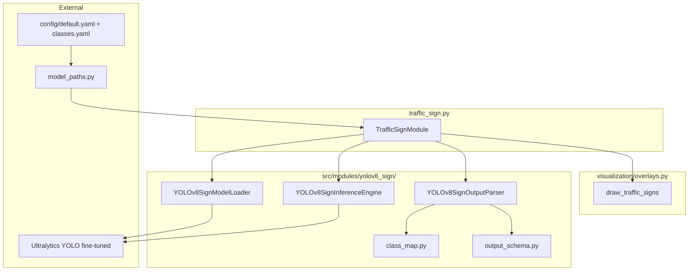
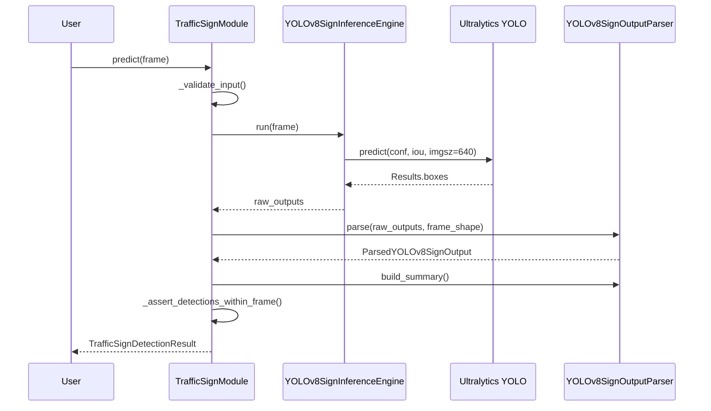

# Traffic Sign Detection Module — Design Report

**Repository:** Autonomous Driving Car  
**Date:** June 2026  
**Status:** Design only — **no implementation in this document**  
**Author basis:** Static analysis of `src/modules/traffic_sign.py`, `config/default.yaml`, `config/classes.yaml`, implemented `VehicleDetectionModule` / `yolov8/` pattern, and `docs/vehicle_detection_design.md`

---

## Executive answers (read this first)

| Question | Design answer |
|----------|---------------|
| **Which model?** | **YOLOv8n** (default), fine-tuned on GTSRB-derived labels; Ultralytics API (same stack as vehicle detection) |
| **Why that model?** | PyTorch/Ultralytics already in repo; small-object signs benefit from detector+classifier in one pass; `n` variant keeps latency acceptable alongside YOLOP + YOLOv8 vehicle |
| **Dataset?** | **GTSRB** (primary, path in config); optional Bdd100K sign subset for pretraining transfer; 7-class ADAS subset for v1 (see `config/classes.yaml`) |
| **Classes?** | v1: `stop`, `speed_limit_30`, `speed_limit_60`, `turn_left`, `turn_right`, `keep_right`, `pedestrian_crossing` — extensible to full GTSRB-43 |
| **Folder structure?** | `traffic_sign.py` orchestrator + `src/modules/yolov8_sign/` subpackage (loader, inference, parser, schema) |
| **Output schema?** | `TrafficSignDetectionResult` with `list[DetectedSign]`, each with bbox + sign label + confidence + optional `speed_limit_kmh` |
| **Inference pipeline?** | Frame → validate → YOLOv8 fine-tuned forward → parse → filter sign classes → frame-space boxes → summary → result |
| **Testing plan?** | Stub loader/engine in `conftest.py`; `tests/test_traffic_sign_pipeline.py`; `scripts/verify_traffic_sign_detection.py` |
| **Evaluation metrics?** | mAP@0.5, per-class P/R/F1, confusion matrix; optional sign localization IoU on GTSRB test split |

---

## Table of Contents

1. [A. Current Repository Compatibility Analysis](#a-current-repository-compatibility-analysis)
2. [B. Model Selection](#b-model-selection)
3. [C. Dataset Strategy](#c-dataset-strategy)
4. [D. Class Design](#d-class-design)
5. [E. Recommended Architecture & Folder Structure](#e-recommended-architecture--folder-structure)
6. [F. Data Flow & Inference Pipeline](#f-data-flow--inference-pipeline)
7. [G. Output Schema](#g-output-schema)
8. [H. Dependencies & Configuration](#h-dependencies--configuration)
9. [I. Visualization Strategy](#i-visualization-strategy)
10. [J. Error Handling](#j-error-handling)
11. [K. Testing Plan](#k-testing-plan)
12. [L. Evaluation Metrics & Scripts](#l-evaluation-metrics--scripts)
13. [M. Future Decision Engine Integration](#m-future-decision-engine-integration)
14. [N. Alternatives Considered](#n-alternatives-considered)
15. [O. Estimated Implementation Complexity](#o-estimated-implementation-complexity)
16. [P. Files to Create / Modify](#p-files-to-create--modify)

---

## A. Current Repository Compatibility Analysis

### A.1 Existing stub: `TrafficSignModule`

`src/modules/traffic_sign.py` is a **stub** (33 lines):

- Docstring: **YOLOv5**, GTSRB-trained
- `predict()` returns `{}`
- `initialize()`, `cleanup()` are `pass`
- `visualize()` returns `frame.copy()` only

### A.2 Configuration (as-is)

| Setting | Value | File |
|---------|-------|------|
| Model name | `YOLOv5` | `config/default.yaml` → `models.traffic_sign` |
| Weights | `yolov5_traffic_signs.pt` | `weight_files.yolov5` |
| Weight location | `trained` | `weight_locations.yolov5` |
| Dataset path | `${data_root}/datasets/gtsrb` | `paths.gtsrb` |
| Confidence | `0.5` | `thresholds.sign_confidence` |
| Class placeholders | 7 sign names | `config/classes.yaml` |

`get_yolov5_weights_path()` exists in `src/utils/model_paths.py` but is **unused** by stub code.

### A.3 Reference implementations in repo

| Module | Status | Pattern to mirror |
|--------|--------|-------------------|
| Lane detection | Implemented | `lane_detection.py` + `yolop/` |
| Vehicle detection | Implemented | `vehicle_detection.py` + `yolov8/` |
| Traffic sign | **Stub** | Should follow same decomposition |

`BaseModule` contract (`src/modules/base.py`): `initialize`, `predict`, `visualize`, `cleanup`.

### A.4 Pipeline position

`src/pipeline/orchestrator.py` (comments only):

```
Lane Detection → Object Detection → Traffic Sign Recognition → Traffic Signal → Segmentation → Decision
```

Traffic sign runs **after** vehicle detection; no hard dependency on lane/vehicle outputs in v1.

### A.5 Deliberate separations

| Module | Detects | Why separate |
|--------|---------|--------------|
| Vehicle detection (YOLOv8) | COCO road users | Dynamic obstacles |
| **Traffic sign (this module)** | Regulatory/warning signs | Static traffic rules |
| Traffic signal (CNN stub) | Red/yellow/green light **state** | Temporal signal semantics |

COCO class `stop sign` (id 11) exists in generic detectors but is **insufficient** for speed limits, turns, etc. — dedicated sign model required.

---

## B. Model Selection

### B.1 Recommended model: **YOLOv8n** (fine-tuned)

| Variant | Recommendation |
|---------|----------------|
| **yolov8n** | **Default** — signs are small but v1 uses only 7 classes; lowest latency when chained with YOLOP + YOLOv8s vehicle |
| yolov8s | Fallback if recall on distant signs is poor after evaluation |
| yolov8m | Not recommended for Colab triple-model (YOLOP + vehicle + sign) |

**Weight artifact (proposed):**

```
{data_root}/models/trained/yolov8_sign/traffic_signs_yolov8n.pt
```

Config migration: add `yolov8_sign` weight key; deprecate or alias `yolov5_traffic_signs.pt` if no trained weights exist yet.

### B.2 Why YOLOv8 (fine-tuned) instead of config’s YOLOv5

| Factor | YOLOv5 (config/stub) | YOLOv8n (recommended) |
|--------|------------------------|----------------------|
| Repo dependency | Would add second Ultralytics model family | **`ultralytics` already in `requirements.txt`** (vehicle module) |
| Architecture parity | Different head/API from vehicle `yolov8/` | **Same loader/inference/parser pattern** as `VehicleDetectionModule` |
| Maintenance | Legacy v5 training pipelines | Active Ultralytics v8 export/train |
| Fine-tuning | Required either way (7 custom classes) | Required; pretrained COCO not sufficient |
| Stub alignment | Matches `traffic_sign.py` docstring | Requires config/README update |

**Decision:** Implement with **Ultralytics YOLOv8n** fine-tuned on sign data. Update `config/default.yaml` `models.traffic_sign: "YOLOv8"` during implementation. Ultralytics `YOLO()` can still load legacy `.pt` files if `yolov5_traffic_signs.pt` is produced before migration.

### B.3 Why not other models?

| Alternative | Verdict |
|-------------|---------|
| **SSD MobileNetV2** | TensorFlow `.pb`; repo is PyTorch-first — rejected |
| **Faster R-CNN** | Too slow for real-time ADAS video pipeline |
| **YOLOv8s (COCO pretrained, no fine-tune)** | Only detects generic `stop sign`; misses speed limits and EU/GTSRB-specific classes |
| **Two-stage (detect + CNN classify)** | Higher latency; more moving parts; defer unless sign-in-crop fails |
| **YOLOP det head** | Unparsed; wrong label set — rejected (same as vehicle design) |

### B.4 Interview rationale (one paragraph)

Traffic signs are **small, class-specific objects** requiring a detector trained on sign datasets (GTSRB), not COCO road users. YOLOv8n provides a **single forward pass** for localization + classification, shares the **Ultralytics stack** already used for vehicle detection, and keeps GPU memory feasible when run sequentially with YOLOP and YOLOv8s. Fine-tuning on GTSRB (mapped to the project’s 7 ADAS classes) is mandatory regardless of YOLOv5 vs YOLOv8 choice.

---

## C. Dataset Strategy

### C.1 Primary dataset: **GTSRB**

**German Traffic Sign Recognition Benchmark**

- Config path: `paths.gtsrb` → `${data_root}/datasets/gtsrb`
- Full benchmark: **43 classes**, 39,209 train + 12,630 test images (cropped sign patches)
- `scripts/prepare_datasets.py` — **TODO stub**; implementation PR should document expected layout:

```
gtsrb/
├── Train/
│   └── 00000/   # class folders 0–42
│       └── *.ppm
├── Test/
│   └── *.ppm
└── Test.csv     # annotations
```

### C.2 v1 training strategy: **7-class ADAS subset**

Map selected GTSRB class IDs → `config/classes.yaml` labels:

| ADAS label (`classes.yaml`) | Example GTSRB mapping (to finalize in `class_map.py`) |
|-----------------------------|--------------------------------------------------------|
| `stop` | Class 14 (Stop) |
| `speed_limit_30` | Class 1 (Speed limit 30) |
| `speed_limit_60` | Class 5 (Speed limit 60) |
| `turn_left` | Class 38 (Turn left ahead) |
| `turn_right` | Class 34 (Turn right ahead) |
| `keep_right` | Class 36 (Pass on right) |
| `pedestrian_crossing` | Class 12 (Pedestrians) |

**Note:** Exact GTSRB ID mapping must be verified against official `classes.csv` during implementation. Unused GTSRB classes are **ignored in v1** (not negative samples unless included in training config).

### C.3 Detection vs classification training data

GTSRB provides **cropped sign images**, not full dashcam frames. For YOLO bounding-box training:

| Approach | Pros | Cons |
|----------|------|------|
| **A. Synthetic paste** | Full-frame boxes; fast bootstrap | Domain gap vs real video |
| **B. Bdd100K / LISA signs** | Real scene context | Extra dataset prep |
| **C. Full-frame GTSRB + bbox = full image** | Simple for patch data | Teaches classification more than localization in scene |

**Recommended v1:** Train on **Bdd100K sign annotations** (if available on Drive) or **synthetic composite** (signs pasted on `road_sample.jpg`-style backgrounds) **plus** GTSRB crops for classification robustness. Document chosen approach in training README.

### C.4 Evaluation split

- Hold out **20% GTSRB test** (or official test set) for classification metrics
- Separate **dashcam frame set** (project videos under `paths.videos`) for end-to-end pipeline demos — not in repo today

### C.5 Dataset limitations (document for viva)

- GTSRB is **German/EU** sign geometry — Indian/regional signs (e.g. unique speed limit boards) need local fine-tuning
- Cropped training data → poor localization until full-frame fine-tune
- `data/raw/` and `data/samples/` are empty in repo — **no bundled training data**

---

## D. Class Design

### D.1 v1 detection classes (from `config/classes.yaml`)

```yaml
traffic_sign_classes:
  - stop
  - speed_limit_30
  - speed_limit_60
  - turn_left
  - turn_right
  - keep_right
  - pedestrian_crossing
```

**Total: 7 classes** for first implementation.

### D.2 Class index convention (model internal)

| `class_id` | `sign_label` | Regulatory meaning |
|------------|--------------|-------------------|
| 0 | `stop` | Mandatory stop |
| 1 | `speed_limit_30` | Max speed 30 km/h |
| 2 | `speed_limit_60` | Max speed 60 km/h |
| 3 | `turn_left` | Turn left guidance |
| 4 | `turn_right` | Turn right guidance |
| 5 | `keep_right` | Keep right / pass right |
| 6 | `pedestrian_crossing` | Pedestrian crossing warning |

Stored in `src/modules/yolov8_sign/class_map.py` as `SIGN_CLASS_ID_TO_LABEL` (mirror of `COCO_CLASS_ID_TO_LABEL` in vehicle parser).

### D.3 Derived fields (parser enrichment)

| Field | Source | Example |
|-------|--------|---------|
| `speed_limit_kmh` | Parsed from label if `speed_limit_*` | `30`, `60`, or `None` |
| `is_regulatory` | Static map | `stop`, speed limits → `True` |
| `is_warning` | Static map | `pedestrian_crossing` → `True` |

### D.4 Future class expansion

- Phase 2: full **GTSRB-43** or **Mapillary Traffic Sign** taxonomy
- Phase 3: regional India signs (manual annotation)

### D.5 Excluded from this module

- **Traffic lights** (red/yellow/green) → `TrafficSignalModule` (CNN stub)
- **COCO `stop sign` only** → insufficient; not using vehicle YOLOv8 filter

---

## E. Recommended Architecture & Folder Structure

### E.1 High-level structure

```
src/modules/
├── traffic_sign.py              # Orchestrator: TrafficSignModule
└── yolov8_sign/
    ├── __init__.py              # Public exports
    ├── model_loader.py          # YOLOv8SignModelLoader
    ├── inference.py             # YOLOv8SignInferenceEngine
    ├── output_parser.py         # Class filter + bbox clip + speed parse
    ├── output_schema.py         # TrafficSignDetectionResult dataclasses
    └── class_map.py             # class_id ↔ label, GTSRB mapping helpers
```

**Why `yolov8_sign/` not `yolov5/`:** Distinguishes sign fine-tuned weights from vehicle `yolov8/` COCO detector; avoids overwriting vehicle package.

### E.2 Architecture diagram



### E.3 Logical class diagram

```
BaseModule
    └── TrafficSignModule
            ├── YOLOv8SignModelLoader
            ├── YOLOv8SignInferenceEngine
            └── YOLOv8SignOutputParser

TrafficSignDetectionResult
    └── list[DetectedSign]
            └── SignBoundingBoxData (reuse pattern from BoundingBoxData)
```

### E.4 Injectable dependencies (match vehicle module)

```python
TrafficSignModule(
    weights_path=None,
    model_loader=None,
    inference_engine=None,
    output_parser=None,
    device="cpu",
    model_variant="n",
    confidence_threshold=0.5,
    iou_threshold=0.45,
    imgsz=640,
)
```

---

## F. Data Flow & Inference Pipeline

### F.1 Step-by-step execution

| Step | Action | File | Method |
|------|--------|------|--------|
| 1 | Receive BGR frame | `traffic_sign.py` | `predict(frame)` |
| 2 | Auto-init if needed | `traffic_sign.py` | `initialize()` |
| 3 | Validate frame | `traffic_sign.py` | `_validate_input()` |
| 4 | Forward pass | `inference.py` | `YOLOv8SignInferenceEngine.run()` |
| 5 | Ultralytics predict | `inference.py` | `_model.predict(source=frame, ...)` |
| 6 | Extract tensors | `inference.py` | `_build_raw_output()` → `boxes_xyxy`, `conf`, `cls` |
| 7 | Parse outputs | `output_parser.py` | `YOLOv8SignOutputParser.parse(raw, frame_shape)` |
| 8 | Filter sign classes | `output_parser.py` | `ALLOWED_SIGN_CLASS_IDS` |
| 9 | Confidence filter | `output_parser.py` | `ParserConfig.confidence_threshold` |
| 10 | Clip bbox to frame | `output_parser.py` | `_clip_bbox_to_frame()` |
| 11 | Enrich speed limit | `output_parser.py` | `_extract_speed_limit_kmh()` |
| 12 | Build summary | `output_parser.py` | `build_summary()` |
| 13 | Assemble result | `traffic_sign.py` | `TrafficSignDetectionResult(...)` |
| 14 | Assert in-frame | `traffic_sign.py` | `_assert_detections_within_frame()` |
| 15 | Return | `traffic_sign.py` | `TrafficSignDetectionResult` |

### F.2 Initialization flow

| Step | File | Method |
|------|------|--------|
| Resolve weights | `model_paths.py` | `get_traffic_sign_weights_path()` (new) |
| Load model | `model_loader.py` | `YOLOv8SignModelLoader.load_model()` |
| Package | `model_loader.py` | `get_model()` |
| Attach | `inference.py` | `attach_model()` |

### F.3 Inference configuration

```python
@dataclass(frozen=True)
class YOLOv8SignInferenceConfig:
    imgsz: int = 640
    confidence_threshold: float = 0.5   # thresholds.sign_confidence
    iou_threshold: float = 0.45         # new: thresholds.sign_iou (proposed)
    device: str = "cpu"
    max_det: int = 50                   # signs per frame typically < 10
    half: bool = False
```

**Coordinate space:** All boxes in **original frame pixels** (Ultralytics returns image-space `xyxy` when `source` is numpy BGR).

### F.4 Sequence diagram



---

## G. Output Schema

### G.1 `SignBoundingBoxData`

Mirror `BoundingBoxData` from `src/modules/yolov8/output_schema.py`:

| Field | Type | Purpose |
|-------|------|---------|
| `x1`, `y1`, `x2`, `y2` | `int` | Inclusive frame-space corners |
| `width`, `height` | `int` | Derived dimensions |
| `center_x`, `center_y` | `float` | Box center |
| `area` | `int` | Pixel area |

Factory: `SignBoundingBoxData.from_xyxy(...)`

### G.2 `DetectedSign`

| Field | Type | Purpose | Example |
|-------|------|---------|---------|
| `sign_label` | `str` | ADAS sign name | `"stop"` |
| `class_id` | `int` | Model class index 0–6 | `0` |
| `confidence` | `float` | Detection score | `0.87` |
| `bbox` | `SignBoundingBoxData` | Location | `[420, 80, 480, 140]` |
| `speed_limit_kmh` | `int \| None` | Parsed numeric limit | `30` or `None` |
| `is_regulatory` | `bool` | Rule-enforcement flag | `True` for stop |
| `track_id` | `int \| None` | Reserved | `None` |

### G.3 `TrafficSignDetectionSummary`

| Field | Type | Purpose |
|-------|------|---------|
| `count_by_label` | `dict[str, int]` | e.g. `{"stop": 1}` |
| `total_count` | `int` | Total signs detected |
| `nearest_sign` | `DetectedSign \| None` | Max `center_y` (closest in image) |
| `highest_confidence` | `DetectedSign \| None` | Max confidence |
| `active_speed_limit_kmh` | `int \| None` | Lowest visible speed limit sign (min km/h) |

**`active_speed_limit_kmh` heuristic:** Among detected `speed_limit_*` signs, take the **minimum** numeric limit (most restrictive visible) for decision engine.

### G.4 `TrafficSignDetectionResult`

| Field | Type | Purpose |
|-------|------|---------|
| `detections` | `list[DetectedSign]` | All filtered signs |
| `summary` | `TrafficSignDetectionSummary` | Aggregates |
| `frame_shape` | `(H, W) \| None` | Input dimensions |
| `inference_time_ms` | `float \| None` | Timing |
| `model_variant` | `str` | `"n"` default |
| `confidence_threshold` | `float` | Applied threshold |
| `raw_status` | `str` | `ok`, `stub`, `init_failed`, etc. |

**Methods:**

- `to_prediction_dict()` — orchestrator JSON contract
- `empty(raw_status)` — error factory

### G.5 `TRAFFIC_SIGN_OUTPUT_KEYS`

```python
TRAFFIC_SIGN_OUTPUT_KEYS = (
    "detections",
    "count_by_label",
    "total_count",
    "nearest_sign",
    "active_speed_limit_kmh",
    "raw_status",
)
```

### G.6 Serialized detection example

```json
{
  "sign_label": "speed_limit_30",
  "class_id": 1,
  "confidence": 0.91,
  "bbox": [800, 120, 860, 180],
  "speed_limit_kmh": 30,
  "is_regulatory": true
}
```

---

## H. Dependencies & Configuration

### H.1 Python packages

| Package | Status | Notes |
|---------|--------|-------|
| `ultralytics` | **Already required** | Shared with vehicle detection |
| `torch`, `opencv-python`, `numpy` | Present | No new core deps |

### H.2 Proposed `config/default.yaml` changes

```yaml
weight_files:
  yolov8_sign: "yolov8_sign/traffic_signs_yolov8n.pt"

weight_locations:
  yolov8_sign: "trained"

models:
  traffic_sign: "YOLOv8"

thresholds:
  sign_confidence: 0.5
  sign_iou: 0.45          # new

yolov8_sign:
  model_variant: "n"
  imgsz: 640
  device: "cpu"
  max_detections: 50
  num_classes: 7
```

### H.3 `model_paths.py` additions

- `get_traffic_sign_weights_path()`
- `get_yolov8_sign_config()` — merge YAML + `classes.yaml` sign list

### H.4 Class config loading

Load `config/classes.yaml` → `traffic_sign_classes` in parser or `class_map.py` to validate model `names` match training labels.

---

## I. Visualization Strategy

### I.1 Module `visualize()`

```python
def visualize(self, frame, results) -> Frame:
    from ..visualization.overlays import draw_traffic_signs
    payload = results.to_prediction_dict() if dataclass else results
    return draw_traffic_signs(frame, payload)
```

### I.2 `draw_traffic_signs()` in `overlays.py` (new)

| Element | Implementation |
|---------|----------------|
| Boxes | `cv2.rectangle`, color per sign type |
| Labels | `f"{sign_label} {confidence:.2f}"` |
| Speed limit | Extra text `"{speed_limit_kmh} km/h"` when set |
| Nearest sign | Thicker border (match vehicle pattern) |
| HUD | Top-left: `Signs: N (stop=1, ...)` |

**Proposed BGR colors:**

| Label | Color |
|-------|-------|
| `stop` | Red `(0, 0, 220)` |
| `speed_limit_*` | Blue `(220, 120, 0)` |
| `turn_*` | Yellow `(0, 220, 220)` |
| `pedestrian_crossing` | Orange `(0, 165, 255)` |

---

## J. Error Handling

Mirror `VehicleDetectionModule` patterns:

| Scenario | Behavior |
|----------|----------|
| Weights missing at configured path | Warning + fail at load (no public COCO fallback for signs — **must have fine-tuned weights**) |
| `ultralytics` not installed | `WeightsLoadError` on init |
| `predict()` before init, init fails | `TrafficSignDetectionResult.empty(raw_status="init_failed")` |
| Invalid frame | `ValueError` from `_validate_input()` |
| Inference failure | `empty(raw_status="pipeline_error")` |
| Engine not ready | `empty(raw_status="inference_not_ready")` |
| Invalid bbox after clip | Drop detection + log warning |
| Bbox outside frame post-parse | `RuntimeError` from `_assert_detections_within_frame()` |

**Important difference from vehicle detection:** Sign model **cannot** fall back to downloading a generic pretrained COCO model — fine-tuned `traffic_signs_yolov8n.pt` is **required** for meaningful output.

---

## K. Testing Plan

### K.1 Unit tests (proposed files)

| File | Tests |
|------|-------|
| `tests/test_yolov8_sign_output_parser.py` | Class filter, confidence, bbox clip, `speed_limit_kmh` extraction |
| `tests/test_yolov8_sign_class_map.py` | GTSRB ID mapping, label ↔ id roundtrip |
| `tests/test_yolov8_sign_output_schema.py` | `to_prediction_dict()`, `empty()` |

### K.2 Integration tests: `tests/test_traffic_sign_pipeline.py`

| Test | Validates |
|------|-----------|
| `test_module_initializes_with_stub_loader` | `is_initialized`, loader, engine ready |
| `test_end_to_end_predict_pipeline` | `road_frame` → `stop` or `speed_limit_30` stub detection |
| `test_predict_auto_inits` | Auto-initialize path |
| `test_visualize_returns_annotated_frame` | Shape, dtype, pixels changed |
| `test_only_allowed_sign_classes` | Labels ⊆ `traffic_sign_classes` |
| `test_active_speed_limit_in_summary` | Summary picks min speed limit |

### K.3 `conftest.py` fixtures

```python
@pytest.fixture
def stub_yolov8_sign_inference_engine():
    # Returns one "stop" box at upper-center, conf=0.92

@pytest.fixture
def stub_yolov8_sign_model_loader():
    # Skips Ultralytics

@pytest.fixture
def traffic_sign_module(...):
    # Initialized TrafficSignModule
```

### K.4 Gate script: `scripts/verify_traffic_sign_detection.py`

| Mode | Behavior |
|------|----------|
| Default (stub) | No weights; inject fake stop sign; PASS |
| `--real` | Load fine-tuned weights; run on road fixture or sign test image |

### K.5 CI policy

- **Stub tests always pass** without trained weights
- Real-weight test: `@pytest.mark.slow`, skip if `traffic_signs_yolov8n.pt` missing

---

## L. Evaluation Metrics & Scripts

### L.1 Proposed script

`evaluation/evaluation_traffic_sign_detection.py` (new — mirror intent of lane eval, currently empty)

### L.2 Detection metrics (on Bdd100K or labeled video frames)

| Metric | Definition | Target (v1 aspirational) |
|--------|------------|--------------------------|
| **mAP@0.5** | Mean AP at IoU 0.5 | ≥ 0.70 on held-out sign boxes |
| **mAP@0.5:0.95** | COCO-style strict mAP | Report only |
| **Precision** | TP / (TP + FP) | Per-class and macro |
| **Recall** | TP / (TP + FN) | Per-class — critical for `stop` |
| **F1** | Harmonic mean | Per-class |

### L.3 Classification metrics (on GTSRB crops — optional auxiliary)

| Metric | Use |
|--------|-----|
| Top-1 accuracy | Sign type correctness given cropped sign |
| Confusion matrix | Confuse speed_limit_30 vs 60 |
| Per-class recall | Regulatory signs weighted higher |

### L.4 Pipeline-level metrics (integration)

| Metric | How measured |
|--------|--------------|
| End-to-end latency | `inference_time_ms` in result |
| Frame validity rate | % frames with `raw_status == "ok"` |
| False positive rate | Manual review on `paths.videos` sample |

### L.5 Evaluation procedure

1. Prepare labeled eval set (GTSRB test + 50 dashcam frames with manual boxes)
2. Run `TrafficSignModule.predict()` per frame
3. Match predictions to GT with IoU ≥ 0.5
4. Compute sklearn `classification_report` + custom mAP script (or `torchmetrics`)
5. Write report to `docs/traffic_sign_evaluation_report.md`

### L.6 Regulatory sign priority weighting

For ADAS safety narrative, weight **stop** and **pedestrian_crossing** recall higher than turn arrows in aggregate scoring.

---

## M. Future Decision Engine Integration

### M.1 `SceneState` field (proposed)

```python
@dataclass
class SceneState:
    lane: LaneDetectionResult | None = None
    vehicles: VehicleDetectionResult | None = None
    signs: TrafficSignDetectionResult | None = None
```

### M.2 Example rules (`decision/rules.py` — future)

| Rule | Input |
|------|-------|
| **Slow Down** | `active_speed_limit_kmh` < current assumed speed |
| **Stop** | `stop` detected with confidence > 0.7 and `nearest_sign.center_y` in lower half |
| **Warning** | `pedestrian_crossing` within 30 m proxy (large bbox area) |
| **Maintain Lane** | Turn signs informational only in v1 |

### M.3 Cross-module logic

- Do **not** use vehicle COCO detections for stop signs
- Optional: suppress duplicate COCO `stop sign` if dedicated sign module fires (orchestrator responsibility)

---

## N. Alternatives Considered

| Alternative | Rejected because |
|-------------|------------------|
| YOLOv5 per stub/config | Stack fragmentation; YOLOv8 + same Ultralytics API preferred |
| COCO pretrained YOLOv8 only | Cannot detect speed limits / turns |
| Classify GTSRB crops only (no detector) | Needs sign localization in full frame |
| Single multi-task model | Out of scope; modular ADAS design |
| Reuse vehicle YOLOv8 weights | Wrong class head; different fine-tune |

---

## O. Estimated Implementation Complexity

| Work item | Effort |
|-----------|--------|
| `yolov8_sign/` package (4 files + class_map) | 2 days |
| `traffic_sign.py` orchestrator | 1 day |
| Config + `model_paths` | 0.25 day |
| `draw_traffic_signs()` | 0.5 day |
| Unit + integration tests + conftest | 1.5 days |
| `verify_traffic_sign_detection.py` | 0.25 day |
| **Training pipeline / GTSRB prep** (if weights needed) | 3–5 days |
| Evaluation script + first metrics run | 1–2 days |
| **Total (code only)** | **~6–7 developer days** |
| **Total (with training)** | **~10–12 developer days** |

---

## P. Files to Create / Modify

### Create

| Path |
|------|
| `src/modules/yolov8_sign/__init__.py` |
| `src/modules/yolov8_sign/model_loader.py` |
| `src/modules/yolov8_sign/inference.py` |
| `src/modules/yolov8_sign/output_parser.py` |
| `src/modules/yolov8_sign/output_schema.py` |
| `src/modules/yolov8_sign/class_map.py` |
| `tests/test_traffic_sign_pipeline.py` |
| `tests/test_yolov8_sign_output_parser.py` |
| `scripts/verify_traffic_sign_detection.py` |
| `evaluation/evaluation_traffic_sign_detection.py` |

### Modify

| Path |
|------|
| `src/modules/traffic_sign.py` |
| `src/modules/__init__.py` |
| `src/utils/model_paths.py` |
| `src/visualization/overlays.py` |
| `config/default.yaml` |
| `config/classes.yaml` (finalize GTSRB mappings) |
| `tests/conftest.py` |

### Do not modify (v1)

| Path | Reason |
|------|--------|
| `src/modules/yolop/*` | Lane pipeline stable |
| `src/modules/lane_detection.py` | Stable |
| `src/modules/vehicle_detection.py` | Stable |
| `src/modules/yolov8/*` | Vehicle-specific |

---

## Implementation Checklist (next PR)

- [ ] Finalize GTSRB class ID → 7 ADAS label mapping in `class_map.py`
- [ ] Train or obtain `traffic_signs_yolov8n.pt`
- [ ] Implement `yolov8_sign/` package
- [ ] Implement `TrafficSignModule` orchestrator
- [ ] Add config paths and visualization
- [ ] Add stub-based tests + gate script
- [ ] Implement evaluation script with mAP / P/R/F1
- [ ] Update README module 3 (still lists YOLOv5)

---

## READY FOR IMPLEMENTATION

This design is **complete**. It specifies model (**YOLOv8n** fine-tuned), dataset (**GTSRB** + 7-class ADAS subset), classes, folder structure (`yolov8_sign/`), output schema, inference pipeline, testing plan, and evaluation metrics — consistent with `BaseModule`, `VehicleDetectionModule`, and repository conventions. **No code changes are included in this document.** Implementation should begin only after fine-tuned weights exist or a stub-training plan is accepted.

---

*End of Traffic Sign Detection Design Report.*
