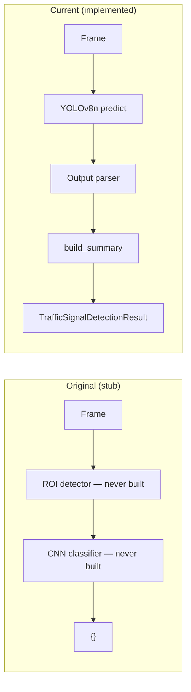
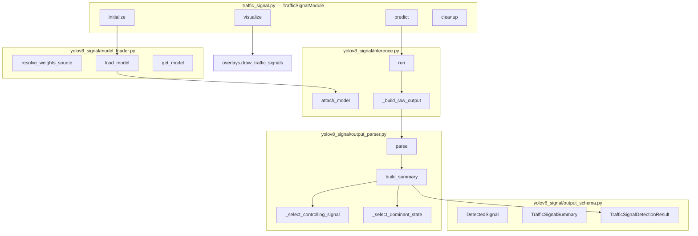
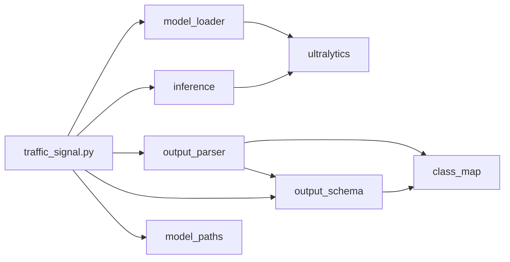
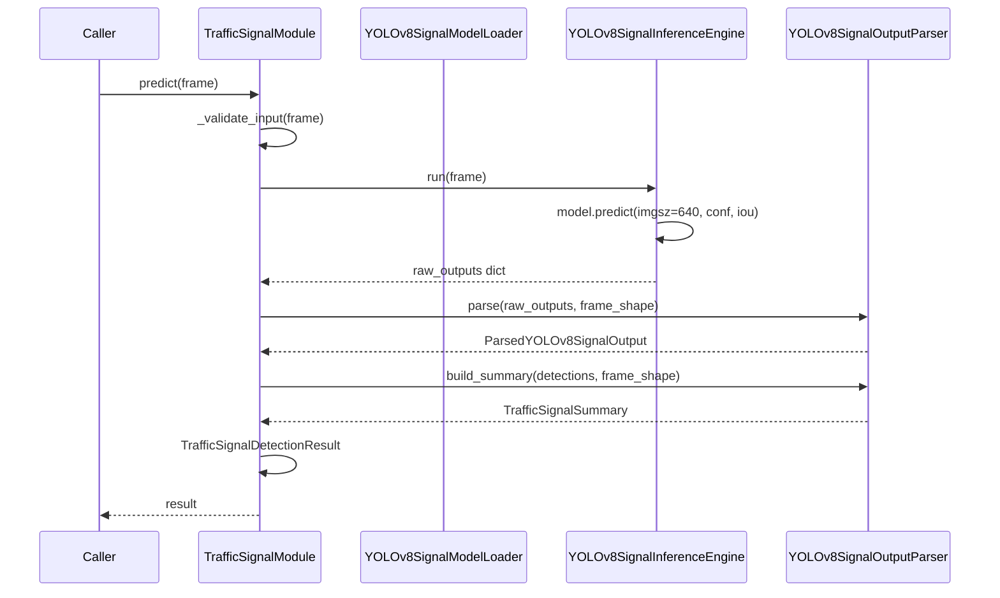

# Traffic Signal Detection Module — Technical Audit Report

**Repository:** Autonomous Driving Car  
**Module:** Traffic Signal Detection (`TrafficSignalModule`)  
**Date:** June 2026  
**Audit basis:** Static inspection of implemented source, tests, config, scripts, and design/implementation docs  
**Test baseline:** 7 signal tests in `tests/test_traffic_signal_pipeline.py`; **7/7** signal tests pass; **29/29** total pytest pass (lane + vehicle + sign + signal + parser)

---

## Section 1: Module Overview

### 1.1 Purpose

Traffic Signal Detection identifies **illuminated traffic-light states** in a forward-facing camera frame and returns:

- **Where** each light is (`bbox` in frame pixels)
- **Which state** is active (`signal_label`: `red_light`, `yellow_light`, or `green_light`)
- **How confident** the model is (`confidence`)
- **Derived behavioral flags** (`is_stop_state`, `is_caution_state`, `is_proceed_state`)
- **Aggregate scene summary** (`controlling_signal`, `dominant_state`, `has_stop_state`, `has_proceed_state`)

Unlike static traffic signs (regulatory boards), traffic signals encode **dynamic intersection control** — the ego vehicle must stop, prepare to stop, or proceed based on the active light state.

### 1.2 Role in the ADAS pipeline

Planned pipeline order (`src/pipeline/orchestrator.py`, comments only):

```
Lane Detection → Vehicle Detection → Traffic Sign Recognition →
Traffic Signal Detection → Segmentation → Decision Support
```

Traffic signal detection runs **after** traffic sign recognition. There is **no hard v1 dependency** on lane, vehicle, or sign outputs inside `TrafficSignalModule`, but the future decision engine will fuse `dominant_state` with speed limits, obstacles, and lane geometry.

**Current reality:** `TrafficSignalModule` runs **standalone**. The orchestrator is not implemented.

### 1.3 Relationship with Traffic Sign Detection

| Module | Detects | Classes | Output focus |
|--------|---------|---------|--------------|
| **Traffic sign** (`TrafficSignModule`) | Static regulatory boards | 7 (`stop`, `speed_limit_*`, turns, crossing) | `active_speed_limit_kmh`, `nearest_sign` |
| **Traffic signal** (`TrafficSignalModule`) | Illuminated light **state** | 3 (`red_light`, `yellow_light`, `green_light`) | `dominant_state`, `controlling_signal` |

**Deliberate separation:**

- Signs and signals are different perception problems (static taxonomy vs temporal state).
- Separate subpackages: `yolov8_sign/` vs `yolov8_signal/`.
- Separate weight files: `traffic_signs_yolov8n.pt` vs `traffic_signals_yolov8n.pt`.
- COCO pretrained vehicle detection has generic `traffic light` (id 9) but **no R/Y/G state** — insufficient for either module.

At intersections, both modules may fire (e.g., `stop` sign + `red_light`). Future `SceneState` must define precedence rules; not implemented in v1.

### 1.4 Why traffic-light state recognition is required

- **Stop compliance:** `red_light` / `has_stop_state` triggers halt behavior at controlled intersections.
- **Caution behavior:** `yellow_light` enables prepare-to-stop rules before red.
- **Proceed authorization:** `green_light` / `has_proceed_state` allows forward movement when safe.
- **Decision-engine input:** `dominant_state` is the primary single-field signal for rule-based ADAS without per-detection logic in the decision layer.

Without dedicated state recognition, an ADAS stack cannot distinguish red from green on the same physical housing — generic "traffic light detected" is not actionable.

---

## Section 2: Design Evolution

### 2.1 Original state (pre-implementation)

| Aspect | State |
|--------|-------|
| **File** | `src/modules/traffic_signal.py` — 33-line stub |
| **Docstring** | "CNN classifier" for red/yellow/green state |
| **`predict()`** | Returned `{}` |
| **`initialize()` / `cleanup()`** | `pass` |
| **`visualize()`** | `frame.copy()` only |
| **Config** | `models.traffic_signal: "CNN"`, `traffic_light_cnn.pt` |
| **Subpackage** | None — no `yolov8_signal/` |
| **`get_traffic_light_cnn_path()`** | Existed in `model_paths.py` but **unused** |

The original design implied a **two-stage CNN classifier** (detect ROI → classify R/Y/G) but never implemented loading, inference, ROI extraction, or parsing.

**Why CNN stub was insufficient:**

| Limitation | Impact |
|------------|--------|
| No ROI detector implemented | Two-stage pipeline incomplete — classifier had no crops |
| Higher latency | Detector pass + CNN pass vs single YOLO forward pass |
| Stack fragmentation | Custom CNN training/export path separate from Ultralytics vehicle/sign stack |
| No output schema | Returned `{}` — no integration contract for orchestrator |
| No state summarization | No `dominant_state`, `controlling_signal`, or conflict handling |
| COCO generic class unusable | Class id 9 is "traffic light" without state |

### 2.2 Current state

| Aspect | State |
|--------|-------|
| **Architecture** | YOLOv8n fine-tuned, Ultralytics API |
| **Orchestrator** | `TrafficSignalModule` — 264 lines, full lifecycle |
| **Subpackage** | `src/modules/yolov8_signal/` (6 files) |
| **Output** | `TrafficSignalDetectionResult` dataclass |
| **Config** | `models.traffic_signal: "YOLOv8"`, `yolov8_signal/traffic_signals_yolov8n.pt` |
| **Tests** | 7 integration tests + gate script |
| **Visualization** | `draw_traffic_signals()` wired via `visualize()` |

**Design references:** `docs/traffic_signal_detection_design.md`, `docs/traffic_signal_implementation_report.md`

### 2.3 Architectural transition



**Transition rationale:**

1. **Single forward pass** — localization + state classification in one Ultralytics `predict()` call.
2. **Pattern reuse** — same loader → inference → parser decomposition as `yolov8/` (vehicle) and `yolov8_sign/`.
3. **Dependency injection** — stub loaders/engines enable CI without GPU or weights.
4. **ADAS-specific summarization** — `controlling_signal` and `dominant_state` heuristics for intersection logic.

---

## Section 3: Repository Architecture

### 3.1 High-level diagram



### 3.2 File-by-file review

#### `src/modules/traffic_signal.py` (264 lines)

| Method | Responsibility |
|--------|----------------|
| `__init__` | Resolves config via `get_yolov8_signal_config()`, builds loader/engine/parser (or accepts injected deps) |
| `initialize()` | `model_loader.load_model()` → `inference_engine.attach_model()` |
| `predict()` | Auto-init, validate, `_run_pipeline()`, error → `empty()` |
| `_run_pipeline()` | `inference_engine.run()` → `output_parser.parse()` → `build_summary()` → `TrafficSignalDetectionResult` |
| `_validate_input()` | `None`, dtype, shape `(H,W,3)`, non-empty |
| `_assert_detections_within_frame()` | Fail-fast bbox bounds check |
| `visualize()` | Delegates to `draw_traffic_signals()` |
| `cleanup()` | `unload()` + `detach_model()` |
| `empty_prediction()` | Static empty result helper |

Extends `BaseModule` with `module_name="traffic_signal"`.

#### `src/modules/yolov8_signal/model_loader.py`

| Symbol | Role |
|--------|------|
| `YOLOv8SignalModelLoader` | Loads fine-tuned `.pt` via `ultralytics.YOLO` |
| `resolve_variant_name()` | Validates variant ∈ `{n, s, m}` |
| `resolve_weights_source()` | File must exist — **no COCO fallback** |
| `WeightsNotFoundError` | Missing `traffic_signals_yolov8n.pt` |
| `WeightsMetadata` | Loaded checkpoint metadata dataclass |

#### `src/modules/yolov8_signal/inference.py`

| Symbol | Role |
|--------|------|
| `YOLOv8SignalInferenceEngine` | Wraps Ultralytics `model.predict()` |
| `YOLOv8SignalInferenceConfig` | `imgsz`, `conf`, `iou`, `device`, `max_det`, `half` |
| `run()` | Forward pass → `_build_raw_output()` |
| `_build_raw_output()` | Extracts `boxes_xyxy`, `confidences`, `class_ids` tensors |
| `InferenceNotReadyError` | No attached model |
| `InferenceExecutionError` | Forward pass failure |

#### `src/modules/yolov8_signal/output_parser.py`

| Symbol | Role |
|--------|------|
| `YOLOv8SignalOutputParser` | Class filter, confidence filter, bbox clip |
| `parse()` | Raw dict → `ParsedYOLOv8SignalOutput` |
| `build_summary()` | Aggregate `TrafficSignalSummary` |
| `_select_controlling_signal()` | Upper 60% frame heuristic |
| `_select_dominant_state()` | Controlling label or `STATE_PRIORITY` fallback |
| `_select_nearest_signal()` | Max `center_y`, tie-break `area` |
| `_clip_bbox_to_frame()` | Clip + invalidate degenerate boxes |

#### `src/modules/yolov8_signal/output_schema.py`

| Symbol | Role |
|--------|------|
| `SignalBoundingBoxData` | Frame-space box with `center_x/y`, `area` |
| `DetectedSignal` | Single detection + state flags |
| `TrafficSignalSummary` | Aggregates for decision engine |
| `TrafficSignalDetectionResult` | Module-level result + `to_prediction_dict()` |
| `TRAFFIC_SIGNAL_OUTPUT_KEYS` | Stable orchestrator contract tuple |

#### `src/modules/yolov8_signal/class_map.py`

| Symbol | Role |
|--------|------|
| `SIGNAL_CLASS_ID_TO_LABEL` | `0→red_light`, `1→yellow_light`, `2→green_light` |
| `ALLOWED_SIGNAL_CLASS_IDS` | `{0, 1, 2}` |
| `STATE_PRIORITY` | red=3, yellow=2, green=1 |
| `CONTROLLING_SIGNAL_UPPER_FRACTION` | `0.60` |
| `enrich_state_flags()` | Sets stop/caution/proceed booleans |
| `bdd100k_label_to_adas_label()` | Training data label translation |
| `load_traffic_signal_classes()` | Reads `config/classes.yaml` |

#### `src/modules/yolov8_signal/__init__.py`

Re-exports public API: loader, inference, parser, schema, class_map symbols for package consumers.

### 3.3 Package dependency graph



---

## Section 4: Data Flow

End-to-end path from camera frame to typed result:

| Step | Action | File | Method |
|------|--------|------|--------|
| 1 | **Input frame** | Caller | `TrafficSignalModule.predict(frame)` |
| 2 | **Auto-init** (if needed) | `traffic_signal.py` | `initialize()` via `model_loader.load_model()` |
| 3 | **Validation** | `traffic_signal.py` | `_validate_input(frame)` |
| 4 | **Weight loading** | `model_loader.py` | `load_model()` → `YOLO(source)` |
| 5 | **Model attach** | `inference.py` | `attach_model(model_package)` |
| 6 | **Inference** | `inference.py` | `run(frame)` → `model.predict(...)` |
| 7 | **Raw tensor extraction** | `inference.py` | `_build_raw_output()` |
| 8 | **Signal parsing** | `output_parser.py` | `parse(raw_outputs, frame_shape)` |
| 9 | **Class filter** | `output_parser.py` | `ALLOWED_SIGNAL_CLASS_IDS` check in parse loop |
| 10 | **Bbox clip** | `output_parser.py` | `_clip_bbox_to_frame()` |
| 11 | **State flag enrichment** | `class_map.py` | `enrich_state_flags(signal_label)` |
| 12 | **Summary generation** | `output_parser.py` | `build_summary(detections, frame_shape)` |
| 13 | **Controlling selection** | `output_parser.py` | `_select_controlling_signal()` |
| 14 | **Dominant state** | `output_parser.py` | `_select_dominant_state()` |
| 15 | **Result assembly** | `traffic_signal.py` | `TrafficSignalDetectionResult(...)` in `_run_pipeline()` |
| 16 | **Bbox assertion** | `traffic_signal.py` | `_assert_detections_within_frame()` |
| 17 | **Serialization** (optional) | `output_schema.py` | `to_prediction_dict()` |



---

## Section 5: Signal Classes

### 5.1 Class taxonomy

Defined in `class_map.py` and `config/classes.yaml` → `traffic_signal_classes`:

| `class_id` | `signal_label` | Semantic | ADAS behavior |
|------------|----------------|----------|---------------|
| 0 | `red_light` | Stop | **Stop state** — ego must not enter intersection |
| 1 | `yellow_light` | Caution | **Caution state** — prepare to stop; do not enter if safe to stop |
| 2 | `green_light` | Proceed | **Proceed state** — authorized to move if intersection clear |

### 5.2 State flags (`enrich_state_flags`)

| Label | `is_stop_state` | `is_caution_state` | `is_proceed_state` |
|-------|-----------------|--------------------|--------------------|
| `red_light` | `True` | `False` | `False` |
| `yellow_light` | `False` | `True` | `False` |
| `green_light` | `False` | `False` | `True` |

Set per `DetectedSignal` during parsing (`output_parser.py` lines 119–129).

### 5.3 Decision-engine implications

| Summary field | Decision use (planned) |
|---------------|------------------------|
| `dominant_state` | Primary rule input: `"red_light"` → stop, `"green_light"` → proceed if clear |
| `has_stop_state` | Any red visible — conservative flag even if dominant is green (conflict) |
| `has_proceed_state` | Any green visible — conflict detection with stop |
| `controlling_signal` | Full detection dict for the light governing ego lane |
| `nearest_signal` | Proximity proxy when upper-region heuristic fails |

**Not implemented:** `src/decision/rules.py` and `scene_state.py` are stubs — no rules consume these fields yet.

---

## Section 6: Detection Logic

### 6.1 Controlling signal selection

**Method:** `YOLOv8SignalOutputParser._select_controlling_signal()` (`output_parser.py`)

**Algorithm:**

1. If no detections → `None`
2. Compute `upper_bound = frame_height * CONTROLLING_SIGNAL_UPPER_FRACTION` (0.60)
3. Filter detections where `bbox.center_y <= upper_bound` (upper road region)
4. Among upper candidates: pick `max(center_y, confidence)` — lowest in upper band ≈ nearest controlling light
5. If no upper candidates: fall back to `_select_nearest_signal()` (max `center_y`, then `area`)

**Rationale:** Traffic lights governing the ego lane typically appear in the upper-center road region of a forward camera view.

**Test evidence:** `test_controlling_signal_in_summary` — green at 15% height, red at 75% height → controlling = `green_light` (only green in upper 60%).

### 6.2 Dominant state calculation

**Method:** `YOLOv8SignalOutputParser._select_dominant_state()` (`output_parser.py`)

**Algorithm:**

1. If `controlling_signal` is not `None` → return `controlling.signal_label`
2. Else if detections exist → return label with max `state_priority()` (red=3 > yellow=2 > green=1)
3. Else → `None`

**Important:** Dominant state follows **controlling signal first**, not global red-wins. `STATE_PRIORITY` applies only when no controlling signal is selected (e.g., all lights below 60% line).

**Test evidence:** `test_dominant_state_priority` — both red and green in upper region at same height; red has higher confidence (0.92 vs 0.88) → controlling and dominant = `red_light`; `has_stop_state` and `has_proceed_state` both `True`; warning logged.

### 6.3 Signal prioritization (`STATE_PRIORITY`)

```python
STATE_PRIORITY = {
    "red_light": 3,
    "yellow_light": 2,
    "green_light": 1,
}
```

Used as **conservative fallback** when `controlling_signal` is `None`. Design intent: when spatial heuristic fails, prefer stop over proceed.

### 6.4 Bounding box validation

| Stage | Mechanism |
|-------|-----------|
| **Parser clip** | `_clip_bbox_to_frame()` — clamp to `[0, W]` / `[0, H]`; reject if `x2<=x1` or `y2<=y1` |
| **Module assert** | `_assert_detections_within_frame()` — `RuntimeError` if any box outside frame after parse |
| **Inference validate** | `_validate_frame()` in engine — shape/dtype before forward pass |
| **Module validate** | `_validate_input()` — `ValueError` on bad input before pipeline |

Dropped boxes increment `metadata.dropped_invalid` in parser output.

---

## Section 7: Output Schema Audit

### 7.1 `DetectedSignal`

| Field | Type | Description |
|-------|------|-------------|
| `signal_label` | `str` | `red_light`, `yellow_light`, or `green_light` |
| `class_id` | `int` | Model head index (0, 1, 2) |
| `confidence` | `float` | Detection confidence [0, 1] |
| `bbox` | `SignalBoundingBoxData` | Frame-space axis-aligned box |
| `is_stop_state` | `bool` | `True` iff `red_light` |
| `is_caution_state` | `bool` | `True` iff `yellow_light` |
| `is_proceed_state` | `bool` | `True` iff `green_light` |
| `track_id` | `int \| None` | Reserved for future tracking; always `None` in v1 |

**Example:**

```json
{
  "signal_label": "red_light",
  "class_id": 0,
  "confidence": 0.90,
  "bbox": [615, 105, 665, 175],
  "is_stop_state": true,
  "is_caution_state": false,
  "is_proceed_state": false,
  "track_id": null
}
```

### 7.2 `SignalBoundingBoxData`

| Field | Type | Description |
|-------|------|-------------|
| `x1, y1, x2, y2` | `int` | Inclusive corners in pixels |
| `width, height` | `int` | Box dimensions |
| `center_x, center_y` | `float` | Box center (used for controlling/nearest heuristics) |
| `area` | `int` | `width * height` |

### 7.3 `TrafficSignalSummary`

| Field | Type | Description |
|-------|------|-------------|
| `count_by_label` | `dict[str, int]` | Per-label detection counts |
| `total_count` | `int` | Total filtered detections |
| `nearest_signal` | `DetectedSignal \| None` | Highest `center_y` (closest proxy) |
| `highest_confidence` | `DetectedSignal \| None` | Max confidence detection |
| `controlling_signal` | `DetectedSignal \| None` | Upper-region governing light |
| `dominant_state` | `str \| None` | Primary state for decision engine |
| `has_stop_state` | `bool` | Any `red_light` detected |
| `has_proceed_state` | `bool` | Any `green_light` detected |

**Example (stub test):**

```json
{
  "count_by_label": {"red_light": 1},
  "total_count": 1,
  "nearest_signal": { "...": "red_light detection" },
  "highest_confidence": { "...": "same" },
  "controlling_signal": { "...": "same" },
  "dominant_state": "red_light",
  "has_stop_state": true,
  "has_proceed_state": false
}
```

### 7.4 `TrafficSignalDetectionResult`

| Field | Type | Description |
|-------|------|-------------|
| `detections` | `list[DetectedSignal]` | All filtered detections |
| `summary` | `TrafficSignalSummary` | Aggregates |
| `frame_shape` | `tuple[int, int] \| None` | `(H, W)` of input |
| `inference_time_ms` | `float \| None` | Forward pass latency |
| `model_variant` | `str` | e.g. `"n"` |
| `confidence_threshold` | `float` | Active threshold |
| `raw_status` | `str` | `ok`, `stub`, `init_failed`, `pipeline_error`, etc. |

**`to_prediction_dict()`** exposes keys in `TRAFFIC_SIGNAL_OUTPUT_KEYS` plus metadata fields for orchestrator consumption.

**`empty(raw_status)`** factory for error paths.

---

## Section 8: Verification & Testing

### 8.1 Test file: `tests/test_traffic_signal_pipeline.py`

| Test | Coverage |
|------|----------|
| `test_module_initializes_with_stub_loader` | Init attaches stub; `is_initialized`, loader, engine ready |
| `test_end_to_end_predict_pipeline` | Full pipeline; `red_light`; `dominant_state`; `has_stop_state` |
| `test_predict_auto_inits` | `predict()` before `initialize()` auto-inits |
| `test_visualize_returns_annotated_frame` | `visualize()` changes frame, same shape/dtype |
| `test_only_allowed_signal_classes` | All labels ∈ `ADAS_SIGNAL_LABELS` |
| `test_controlling_signal_in_summary` | Upper green wins over lower red |
| `test_dominant_state_priority` | Red+green conflict; dominant=`red_light`; both flags true |

**Count:** 7 tests — all pass.

### 8.2 Stub fixtures: `tests/conftest.py`

| Fixture | Behavior |
|---------|----------|
| `stub_yolov8_signal_inference_engine` | One `red_light` at upper-center, conf=0.90, `inference_status="stub"` |
| `stub_yolov8_signal_model_loader` | Skips Ultralytics; `stub://traffic_signals_yolov8n.pt` |
| `traffic_signal_module` | Pre-initialized module with stubs |

### 8.3 Gate script: `scripts/verify_traffic_signal_detection.py`

| Check | Description |
|-------|-------------|
| Module file exists | `TrafficSignalModule` importable |
| Package files | All 6 `yolov8_signal/` files present |
| Initialize | Stub (default) or real (`--real`) |
| Predict | Returns `TrafficSignalDetectionResult` |
| Detections | ≥1 in stub mode; 0 allowed in real on empty scene (WARN) |
| Bbox bounds | All boxes within frame |
| Visualize | Annotated frame differs from input |
| Cleanup | `is_initialized` false after `cleanup()` |

**Stub path (default):** No weights required; synthetic red rectangle on blank frame.

**Real path (`--real`):** Requires `traffic_signals_yolov8n.pt` + `ultralytics`; uses `road_sample.jpg` if available.

### 8.4 Test coverage gaps

| Gap | Status |
|-----|--------|
| Unit tests for `output_parser.py` in isolation | **Not present** |
| Unit tests for `class_map.py` | **Not present** |
| Real-weight CI test (`@pytest.mark.slow`) | **Designed, not implemented** |
| `evaluation/evaluation_traffic_signal_detection.py` | **Does not exist** |

---

## Section 9: Real Inference Readiness

### 9.1 Current state

| Component | Status |
|-----------|--------|
| Architecture (`yolov8_signal/` + orchestrator) | **Complete** |
| Config (`default.yaml`, `classes.yaml`) | **Complete** |
| Visualization (`draw_traffic_signals`) | **Complete** |
| Integration tests (stub) | **Complete** (7/7) |
| Gate script | **Complete** |
| Fine-tuned weights in repo | **Not present** (glob finds 0 files) |
| Training pipeline in repo | **Not present** |
| Evaluation script | **Not present** |
| Orchestrator wiring | **Not present** |

### 9.2 Weights file: `traffic_signals_yolov8n.pt`

| Property | Value |
|----------|-------|
| **Config key** | `weight_files.yolov8_signal` |
| **Relative path** | `yolov8_signal/traffic_signals_yolov8n.pt` |
| **Location type** | `trained` (under `{data_root}/models/trained/`) |
| **Resolver** | `get_traffic_signal_weights_path()` in `model_paths.py` |
| **Fallback** | **None** — `WeightsNotFoundError` if missing |

### 9.3 Training requirements (from design doc)

1. **Dataset:** Bdd100K traffic-light annotations with label map via `bdd100k_label_to_adas_label()` (`red`→`red_light`, etc.)
2. **Format:** YOLO detection format with 3-class head
3. **Base model:** `yolov8n.pt` via Ultralytics train CLI
4. **Class order:** Must match `SIGNAL_CLASS_ID_TO_LABEL` (0=red, 1=yellow, 2=green)
5. **Output:** Place checkpoint at resolved weights path

### 9.4 Evaluation requirements (not implemented)

- Per-class precision/recall on Bdd100K val split
- Confusion matrix for R/Y/G (critical: red↔green errors)
- Latency benchmark on target hardware (`inference_time_ms`)
- Night/rain/ glare robustness (design recommendation)
- Intersection scenario videos with known ground truth

---

## Section 10: Error Handling

### 10.1 Missing weights

| Location | Behavior |
|----------|----------|
| `initialize()` | Raises `WeightsNotFoundError`; logs error; `_initialized=False` |
| `predict()` auto-init | Catches weight errors → `TrafficSignalDetectionResult.empty(raw_status="init_failed")` |
| Gate `--real` | `_fail()` with path message |

**No auto-download** (unlike vehicle module COCO fallback).

### 10.2 Invalid frames

| Check | Exception | Handler |
|-------|-----------|---------|
| `traffic_signal._validate_input()` | `ValueError` | Propagates to caller |
| `inference._validate_frame()` | `InvalidFrameError` | Caught in `predict()` → `empty(raw_status="pipeline_error")` |

### 10.3 Inference failures

| Scenario | Result |
|----------|--------|
| Engine not ready | `empty(raw_status="inference_not_ready")` |
| `InferenceExecutionError` | `empty(raw_status="pipeline_error")` |
| Unexpected exception | Logged and **re-raised** |

### 10.4 Conflicting signal states

When both `has_stop_state` and `has_proceed_state` are true (red + green detected):

- `build_summary()` logs **warning** with `dominant` value
- `dominant_state` follows controlling heuristic (not automatic red-wins)
- Both boolean flags remain true for downstream conflict awareness

### 10.5 Auto initialization

`predict()` when `not self._initialized`:

1. Logs warning
2. Calls `initialize()`
3. On success → normal pipeline
4. On weight failure → `init_failed` empty result (no exception to caller)

---

## Section 11: Performance & Deployment

### 11.1 YOLOv8n characteristics

| Property | Value |
|----------|-------|
| Variant | `n` (nano) — default in config |
| Parameters | ~3M (Ultralytics YOLOv8n) |
| Input size | 640×640 (`imgsz`) |
| Max detections | 20 per frame |
| Classes | 3 (vs 80 COCO) |

Chosen for **low latency** when running sequentially with YOLOP (lane), YOLOv8 (vehicle), YOLOv8 (sign), and YOLOv8 (signal).

### 11.2 CPU inference

- Default `device: "cpu"` in `yolov8_signal` config
- Suitable for development, CI stubs, and gate scripts
- Expected latency: tens to low hundreds of ms per frame (hardware-dependent; not benchmarked in repo)

### 11.3 GPU inference

- Set `device: "cuda"` or `device: "0"` in config or constructor
- `half=True` in `YOLOv8SignalInferenceConfig` enables FP16 (default `False`)
- `cleanup()` → `torch.cuda.empty_cache()` when CUDA available

### 11.4 Real-time deployment considerations

| Concern | v1 state | Recommendation |
|---------|----------|----------------|
| Sequential 4-model stack | Not benchmarked end-to-end | Profile full pipeline; consider GPU |
| Temporal flicker | **Not implemented** | v2: majority vote over N frames (design doc) |
| Small/distant lights | yolov8n may miss | Fallback to yolov8s if recall poor |
| ONNX/TensorRT | Not in repo | `model.export()` for edge deployment |
| Batch inference | Single frame only | Video loops call `predict()` per frame |

---

## Section 12: Interview Questions

### 12.1 Beginner (25)

**Q1: What does Traffic Signal Detection do?**  
Detects red, yellow, and green traffic-light states in camera frames with bounding boxes and confidence scores.

**Q2: How many signal classes?**  
Three: `red_light`, `yellow_light`, `green_light`.

**Q3: What model is used?**  
Fine-tuned YOLOv8n via Ultralytics.

**Q4: Where is the main module class?**  
`TrafficSignalModule` in `src/modules/traffic_signal.py`.

**Q5: What subpackage contains YOLOv8 signal code?**  
`src/modules/yolov8_signal/`.

**Q6: What does `red_light` mean for driving?**  
Stop state — ego must not proceed through the intersection.

**Q7: What does `yellow_light` mean?**  
Caution state — prepare to stop; do not enter if you can stop safely.

**Q8: What does `green_light` mean?**  
Proceed state — authorized to move when intersection is clear.

**Q9: What is `dominant_state`?**  
Single string summary (`red_light`, etc.) for the decision engine.

**Q10: What is `controlling_signal`?**  
The detection deemed to govern the ego lane, selected from upper-frame candidates.

**Q11: What input does the module expect?**  
BGR `numpy.ndarray` shape `(H, W, 3)`, `uint8` preferred.

**Q12: What is the default confidence threshold?**  
0.5 (`thresholds.signal_confidence`).

**Q13: What is the default IoU for NMS?**  
0.45 (`thresholds.signal_iou`).

**Q14: Where are weights stored?**  
`{data_root}/models/trained/yolov8_signal/traffic_signals_yolov8n.pt`.

**Q15: Does the module download weights automatically?**  
No — missing file raises `WeightsNotFoundError`.

**Q16: What is `has_stop_state`?**  
`True` if any detection is `red_light`.

**Q17: What is `has_proceed_state`?**  
`True` if any detection is `green_light`.

**Q18: How do you visualize results?**  
`module.visualize(frame, result)` → `draw_traffic_signals()` in `overlays.py`.

**Q19: What colors are used for signal overlays?**  
Red for `red_light`, yellow for `yellow_light`, green for `green_light` (`SIGNAL_COLORS` in overlays).

**Q20: What is the difference between signs and signals in this project?**  
Signs = static boards (`TrafficSignModule`); signals = light states (`TrafficSignalModule`).

**Q21: How many tests cover signal detection?**  
7 in `tests/test_traffic_signal_pipeline.py`.

**Q22: What gate script verifies the module?**  
`scripts/verify_traffic_signal_detection.py`.

**Q23: Is the orchestrator wired?**  
No — `src/pipeline/orchestrator.py` is comments only.

**Q24: What was the original stub design?**  
CNN classifier for R/Y/G — never implemented.

**Q25: What does stub inference return in tests?**  
One `red_light` at upper-center, confidence 0.90, `inference_status="stub"`.

---

### 12.2 Intermediate (25)

**Q1: Why YOLOv8 over CNN classifier?**  
Single-pass detect+classify; Ultralytics already in stack; no ROI stage was ever built for CNN path.

**Q2: Why yolov8n not yolov8s?**  
Lower latency for sequential multi-model ADAS pipeline.

**Q3: Why no COCO fallback for signals?**  
COCO class 9 is generic traffic light without R/Y/G state.

**Q4: Explain dependency injection in `TrafficSignalModule`.**  
Constructor accepts `model_loader`, `inference_engine`, `output_parser` — tests inject stubs without real weights.

**Q5: What happens if `predict()` is called before `initialize()`?**  
Auto-init; on failure returns `empty(raw_status="init_failed")`.

**Q6: How does controlling signal selection work?**  
Filter detections in upper 60% of frame; pick max `(center_y, confidence)`; else nearest signal.

**Q7: How is `dominant_state` computed?**  
Label of `controlling_signal` if set; else max `STATE_PRIORITY` among all detections.

**Q8: When does `STATE_PRIORITY` apply?**  
Only when `controlling_signal` is `None` (fallback conservative pick).

**Q9: What are `STATE_PRIORITY` values?**  
red=3, yellow=2, green=1.

**Q10: What happens when red and green are both detected?**  
Warning logged; `has_stop_state` and `has_proceed_state` both true; `dominant_state` from controlling heuristic.

**Q11: Does red always win dominant state?**  
No — controlling signal wins first; red-wins only in priority fallback when no controlling signal.

**Q12: What is `nearest_signal`?**  
Detection with highest `center_y` (lowest on screen), tie-break by `area`.

**Q13: How are bounding boxes kept in frame coordinates?**  
Parser clips via `_clip_bbox_to_frame()`; module asserts via `_assert_detections_within_frame()`.

**Q14: What is `ParsedYOLOv8SignalOutput`?**  
Parser intermediate output before `TrafficSignalDetectionResult` assembly.

**Q15: What is `TRAFFIC_SIGNAL_OUTPUT_KEYS`?**  
Stable tuple of dict keys for orchestrator contract.

**Q16: What does `raw_status` convey?**  
Pipeline health: `ok`, `stub`, `init_failed`, `pipeline_error`, `inference_not_ready`, etc.

**Q17: Bdd100K label mapping?**  
`red`→`red_light`, `yellow`→`yellow_light`, `green`→`green_light` via `BDD100K_LABEL_TO_ADAS_LABEL`.

**Q18: What is `CONTROLLING_SIGNAL_UPPER_FRACTION`?**  
0.60 — upper 60% of frame height for controlling candidates.

**Q19: Difference between inference `conf` and parser threshold?**  
Both filter confidence — Ultralytics at forward pass, parser as ADAS safety net (default 0.5 each).

**Q20: What does `cleanup()` do?**  
`unload()` + `detach_model()` + optional `torch.cuda.empty_cache()`.

**Q21: What is `track_id`?**  
Reserved for future multi-frame tracking; always `None` in v1.

**Q22: How many max detections per frame?**  
20 (`yolov8_signal.max_detections`).

**Q23: What legacy config exists for CNN?**  
`traffic_light_cnn.pt`, `get_traffic_light_cnn_path()` — deprecated, unused by current module.

**Q24: What does gate `--real` require?**  
Fine-tuned weights file + `ultralytics` installed.

**Q25: Parser metadata fields?**  
`num_raw_boxes`, `num_filtered`, `dropped_class`, `dropped_confidence`, `dropped_invalid`, `frame_shape`.

---

### 12.3 Advanced (25)

**Q1: Design `SceneState` integration for signals.**  
Add `signals: TrafficSignalDetectionResult | None` to `scene_state.py`; orchestrator calls `traffic_signal_module.predict(frame)` after sign module; rules read `dominant_state` and `has_stop_state`.

**Q2: Why not use COCO traffic light from vehicle detector?**  
No state classification; vehicle parser excludes non-road-user classes; cannot drive stop/go rules.

**Q3: How would you add a 4th class (e.g. arrow green)?**  
Retrain YOLOv8n with 4-class head; extend `SIGNAL_CLASS_ID_TO_LABEL`, `ALLOWED_SIGNAL_CLASS_IDS`, `classes.yaml`, parser tests.

**Q4: Explain fail-fast bbox assertion rationale.**  
Geometry bugs (wrong resize/coords) must not silently pass bad boxes to decision engine — same pattern as vehicle module.

**Q5: How would you implement Bdd100K training?**  
Convert annotations to YOLO format with ADAS label map; train with Ultralytics CLI; verify `model.names` order matches `class_map.py`.

**Q6: How to handle temporal flicker (red→green single-frame glitch)?**  
v2: rolling majority vote over N frames on `dominant_state`; not in current code.

**Q7: Conflict: stop sign + green light?**  
Sign module handles boards; signal module handles lights; orchestrator precedence needed — typically signal at intersection wins for proceed/stop.

**Q8: Why `center_y` for nearest/controlling heuristics?**  
Image-space proxy without camera calibration; larger `center_y` = lower in frame ≈ nearer to ego.

**Q9: Unit test parser without Ultralytics?**  
Feed synthetic `raw_outputs` dict directly to `YOLOv8SignalOutputParser.parse()` — test file not yet created.

**Q10: Trade-off: controlling heuristic vs lane association?**  
Upper-fraction heuristic is cheap but wrong if light is offset; v2 could fuse with lane detection center.

**Q11: How does signal loader differ from vehicle loader?**  
Vehicle: COCO fallback download; Signal: **must** have fine-tuned file.

**Q12: ONNX/TensorRT deployment path?**  
Export fine-tuned `.pt` via Ultralytics `model.export()`; replace `YOLO()` load — not in repo.

**Q13: How would orchestrator handle init failure for signals?**  
Continue with `signals=None` or empty result; decision rules degrade gracefully — design choice.

**Q14: Security of error messages?**  
Full filesystem paths logged for debugging; production may redact.

**Q15: Multi-scale / small distant lights?**  
yolov8n may miss; fallback to yolov8s or tiled inference.

**Q16: How does `half=True` affect deployment?**  
FP16 on GPU — faster, slight accuracy trade-off; default `False`.

**Q17: CI strategy for real weights?**  
`@pytest.mark.slow` + skip if `traffic_signals_yolov8n.pt` missing — designed, not implemented.

**Q18: How to benchmark real latency?**  
Loop `predict()` on video; read `inference_time_ms`; profile CPU vs GPU.

**Q19: Red↔green confusion mitigation?**  
Higher conf threshold for proceed rules; temporal smoothing; hard-negative mining in training.

**Q20: Sequential vs parallel multi-model inference?**  
v1 sequential on one GPU; parallel needs duplicate GPU memory — not implemented.

**Q21: How to reduce false positives on car taillights?**  
Raise confidence, hard-negative mining, size/aspect filters (not in v1 parser).

**Q22: Explain `inference_status` propagation.**  
Stub tests set `"stub"`; engine sets `"ok"`; parser preserves non-unknown status in `raw_status`.

**Q23: Data augmentation for training?**  
Night, rain, glare, motion blur — critical for dashcam domain gap.

**Q24: How to fuse signal output with vehicle detections?**  
Future rule: do not proceed on green if pedestrian in crosswalk — requires `SceneState` with vehicles + signals.

**Q25: Production readiness blockers?**  
Fine-tuned weights, orchestrator, decision engine, evaluation metrics, temporal smoothing, README sync.

---

## Section 13: Resume Description

### 13.1 Two-line version

Developed a modular traffic signal detection pipeline using YOLOv8n and Ultralytics, classifying red, yellow, and green light states with frame-space bounding boxes and dominant-state summarization. Implemented loader/inference/parser architecture with controlling-signal heuristics, dependency injection, OpenCV visualization, and seven stub-based integration tests.

### 13.2 Five-line version

Built `TrafficSignalModule` for an autonomous driving assistance system using fine-tuned YOLOv8n (three-class head: red, yellow, green traffic-light states). Designed a decomposed architecture — model loader, inference engine, output parser, and typed dataclass schemas — mirroring production patterns from vehicle and sign detection. Implemented Bdd100K label mapping, stop/caution/proceed state flags, `controlling_signal` upper-frame heuristic, and conservative `dominant_state` selection for decision-engine integration. Added OpenCV overlay visualization with controlling-signal highlight, seven pytest integration tests, and a CI-friendly gate script with injectable stub loaders. Module is integration-ready at the API level; orchestrator wiring and fine-tuned weight deployment remain next steps.

### 13.3 Resume bullets

- Implemented **YOLOv8n traffic signal detection** with 3-class ADAS state taxonomy (red/yellow/green) in a modular Python ADAS stack
- Architected **`yolov8_signal/` subpackage** (loader, inference, parser, schema, class map) with dependency injection for testability without GPU weights
- Built **`TrafficSignalDetectionResult`** schema with `dominant_state`, `controlling_signal`, conflict flags, and frame-space bbox validation
- Designed **controlling-signal heuristics** (upper 60% frame region) and conservative `STATE_PRIORITY` fallback for intersection decision support
- Delivered **7 integration tests** and gate script (`verify_traffic_signal_detection.py`) with stub inference for CI

### 13.4 LinkedIn project description

**Traffic Signal Detection — YOLOv8n ADAS Module**

As part of an Autonomous Driving Car perception stack, I implemented real-time traffic-light state recognition using fine-tuned YOLOv8n (Ultralytics). The module detects red, yellow, and green states with frame-space bounding boxes and produces decision-ready summaries including `dominant_state` and `controlling_signal`.

Technical highlights: modular loader/inference/parser architecture with dependency injection; Bdd100K-to-ADAS label mapping; conservative conflict handling when multiple states appear; OpenCV visualization with controlling-signal emphasis; comprehensive integration testing with stub engines for CI.

The module follows the same production patterns as vehicle and traffic-sign detection and is ready for orchestrator integration once fine-tuned weights are deployed.

---

## Section 14: Current Status

### 14.1 Completeness estimates

| Dimension | % | Rationale |
|-----------|---|-----------|
| **Implementation completeness** | **~88%** | Full module, subpackage, config, viz, parser logic; missing temporal smoothing, tracking, evaluation script |
| **Testing completeness** | **~72%** | 7 integration tests + gate; no parser/class_map unit tests; no real-weight CI |
| **Production readiness** | **~45%** | No weights in repo; no orchestrator; no decision engine; no end-to-end latency benchmark |

### 14.2 Completed features

- `TrafficSignalModule` orchestrator with full lifecycle
- `yolov8_signal/` subpackage (6 files)
- Three-class taxonomy with state flags
- `controlling_signal` and `dominant_state` summarization
- Conflict detection (`has_stop_state` + `has_proceed_state`)
- Config integration (`default.yaml`, `classes.yaml`, `model_paths.py`)
- `draw_traffic_signals()` visualization
- 7 pytest integration tests (all passing)
- Gate script (stub + `--real` path)
- Design and implementation documentation

### 14.3 Pending features

- Fine-tuned `traffic_signals_yolov8n.pt` weights
- `evaluation/evaluation_traffic_signal_detection.py`
- Pipeline orchestrator wiring
- `SceneState` / decision rules consumption
- Parser and class_map unit tests
- Real-weight slow CI test
- README update (still references CNN in places)

### 14.4 Future enhancements (design v2)

- Temporal smoothing / majority vote over N frames
- `track_id` multi-frame association
- Lane-aware controlling signal selection
- yolov8s fallback for recall
- ONNX/TensorRT export for edge deployment

---

## Section 15: Executive Summary

### What was built

A production-pattern **Traffic Signal Detection** module (`TrafficSignalModule`) with YOLOv8n-based architecture in `yolov8_signal/`. The system detects three traffic-light states, filters to ADAS taxonomy, clips bounding boxes, enriches stop/caution/proceed flags, and produces `TrafficSignalDetectionResult` with `controlling_signal` and `dominant_state` summaries for downstream decision logic.

### What was verified

- **7/7** integration tests pass with injectable stub loader/engine
- Gate script validates file presence, init, predict, bbox bounds, visualize, cleanup
- Controlling-signal and dominant-state heuristics validated with custom stub engines
- Config paths and class mappings inspected against `class_map.py` and `classes.yaml`

### What remains

- **Fine-tuned weights** (`traffic_signals_yolov8n.pt`) — not in repository
- **Training and evaluation** pipelines — not implemented
- **Orchestrator and decision engine** — stubs only
- **Temporal smoothing** — design only
- **Unit tests** for parser/class_map in isolation

### Readiness for integration

**API-level: Ready.** `TrafficSignalModule.predict()` returns a stable `TrafficSignalDetectionResult` with `to_prediction_dict()` matching `TRAFFIC_SIGNAL_OUTPUT_KEYS`. Visualization and cleanup are wired.

**System-level: Not ready.** Without trained weights, real-scene inference cannot run in production. Without orchestrator, the module is not part of the live ADAS loop. Without decision rules, `dominant_state` has no consumer.

**Recommended next steps:** (1) train/place weights, (2) wire orchestrator after sign module, (3) extend `SceneState` with signals field, (4) add evaluation script and real-video benchmark.

---

*Audit derived from repository inspection — June 2026. Companion quick reference: `docs/traffic_signal_detection_interview_cheatsheet.md`.*
