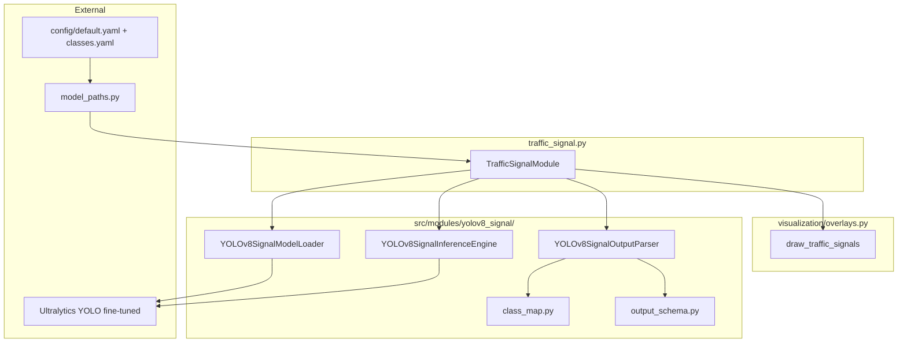
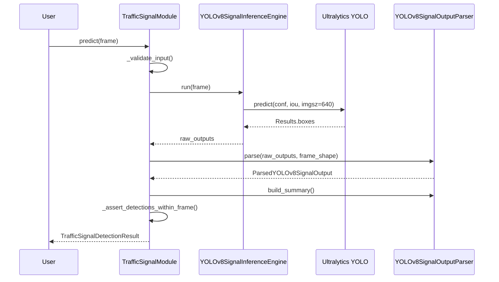

# Traffic Signal Detection Module — Design Report

**Repository:** Autonomous Driving Car  
**Date:** June 2026  
**Status:** Design only — **no implementation in this document**  
**Author basis:** Static analysis of `src/modules/traffic_signal.py`, implemented `VehicleDetectionModule` / `TrafficSignModule` / `yolov8/` / `yolov8_sign/` patterns, `config/default.yaml`, `config/classes.yaml`, and `docs/traffic_sign_detection_design.md`

---

## Executive answers (read this first)

| Question | Design answer |
|----------|---------------|
| **Which model?** | **YOLOv8n** (default), fine-tuned for 3-class traffic-light **state** detection; Ultralytics API (same stack as vehicle + sign modules) |
| **Why that model?** | Replaces CNN two-stage stub with unified detector; localizes + classifies R/Y/G in one pass; shares loader/inference/parser pattern already proven in repo |
| **Dataset?** | **Bdd100K** traffic-light boxes (primary); optional **Bosch Small Traffic Lights Dataset (BSTLD)** / **LISA** for state labels; synthetic paste for bootstrap |
| **Classes?** | v1: `red_light`, `yellow_light`, `green_light` — replaces legacy `red` / `yellow` / `green` in `classes.yaml` |
| **Folder structure?** | `traffic_signal.py` orchestrator + `src/modules/yolov8_signal/` subpackage (loader, inference, parser, schema, class_map) |
| **Output schema?** | `TrafficSignalDetectionResult` with `list[DetectedSignal]`, bbox + state label + confidence + derived stop/proceed flags |
| **Inference pipeline?** | Frame → validate → YOLOv8 fine-tuned forward → parse → filter signal classes → frame-space boxes → summary → result |
| **Testing plan?** | Stub loader/engine in `conftest.py`; `tests/test_traffic_signal_pipeline.py`; `scripts/verify_traffic_signal_detection.py` |
| **Evaluation metrics?** | mAP@0.5 per state, per-class P/R/F1, state-confusion matrix; temporal stability (flicker rate) on video |

---

## Table of Contents

1. [A. Current Repository Compatibility Analysis](#a-current-repository-compatibility-analysis)
2. [B. Model Selection](#b-model-selection)
3. [C. Dataset Strategy](#c-dataset-strategy)
4. [D. Class Design](#d-class-design)
5. [E. Recommended Architecture & Folder Structure](#e-recommended-architecture--folder-structure)
6. [F. Data Flow & Inference Pipeline](#f-data-flow--inference-pipeline)
7. [G. Output Schema](#g-output-schema)
8. [H. Dependencies & Configuration](#h-dependencies--configuration)
9. [I. Visualization Strategy](#i-visualization-strategy)
10. [J. Error Handling](#j-error-handling)
11. [K. Testing Plan](#k-testing-plan)
12. [L. Evaluation Metrics & Scripts](#l-evaluation-metrics--scripts)
13. [M. Future Decision Engine Integration](#m-future-decision-engine-integration)
14. [N. Alternatives Considered](#n-alternatives-considered)
15. [O. Estimated Implementation Complexity](#o-estimated-implementation-complexity)
16. [P. Files to Create / Modify](#p-files-to-create--modify)

---

## A. Current Repository Compatibility Analysis

### A.1 Existing stub: `TrafficSignalModule`

`src/modules/traffic_signal.py` is a **stub** (33 lines):

- Docstring: **CNN classifier** for red/yellow/green state
- `predict()` returns `{}`
- `initialize()`, `cleanup()` are `pass`
- `visualize()` returns `frame.copy()` only
- Implies two-stage design: detect ROI → classify state (not implemented)

### A.2 Configuration (as-is)

| Setting | Value | File |
|---------|-------|------|
| Model name | `CNN` | `config/default.yaml` → `models.traffic_signal` |
| Weights | `traffic_light_cnn.pt` | `weight_files.traffic_light_cnn` |
| Weight location | `trained` | `weight_locations.traffic_light_cnn` |
| Confidence | `0.5` | `thresholds.traffic_light_confidence` |
| Class placeholders | `red`, `yellow`, `green` | `config/classes.yaml` → `traffic_light_classes` |

`get_traffic_light_cnn_path()` exists in `src/utils/model_paths.py` but is **unused** by stub code.

### A.3 Reference implementations in repo

| Module | Status | Pattern to mirror |
|--------|--------|-------------------|
| Lane detection | Implemented | `lane_detection.py` + `yolop/` |
| Vehicle detection | Implemented | `vehicle_detection.py` + `yolov8/` |
| Traffic sign | Implemented | `traffic_sign.py` + `yolov8_sign/` |
| **Traffic signal** | **Stub** | Should follow same decomposition |

`BaseModule` contract (`src/modules/base.py`): `initialize`, `predict`, `visualize`, `cleanup`.

### A.4 Pipeline position

`src/pipeline/orchestrator.py` (comments only):

```
Lane Detection → Object Detection → Traffic Sign Recognition → Traffic Signal → Segmentation → Decision
```

Traffic signal runs **after** traffic sign recognition in the planned orchestration. No hard v1 dependency on lane/vehicle/sign outputs, but decision rules will eventually combine them.

### A.5 Deliberate separations

| Module | Detects | Why separate |
|--------|---------|--------------|
| Vehicle detection (YOLOv8) | COCO road users | Dynamic obstacles |
| Traffic sign (YOLOv8 sign) | Regulatory/warning **signs** | Static traffic rules |
| **Traffic signal (this module)** | Red / yellow / green **light state** | Temporal signal semantics; different object + decision logic |
| Segmentation (U-Net stub) | Drivable surface | Scene context |

COCO class `traffic light` (id **9**) exists in generic YOLOv8 but provides **no R/Y/G state** — insufficient for ADAS stop/go decisions. A dedicated fine-tuned head is required.

### A.6 Migration from CNN stub design

| Legacy (config/stub) | Proposed (this design) |
|----------------------|-------------------------|
| `traffic_light_cnn.pt` | `yolov8_signal/traffic_signals_yolov8n.pt` |
| Two-stage detect + classify | Single-stage YOLOv8 detect + classify |
| `traffic_light_classes: [red, yellow, green]` | `traffic_signal_classes: [red_light, yellow_light, green_light]` |
| `models.traffic_signal: "CNN"` | `models.traffic_signal: "YOLOv8"` |

---

## B. Model Selection

### B.1 Recommended model: **YOLOv8n** (fine-tuned)

| Variant | Recommendation |
|---------|----------------|
| **yolov8n** | **Default** — only 3 classes; lights are small but fewer than sign classes; lowest latency when chained with YOLOP + vehicle + sign |
| yolov8s | Fallback if recall on distant / sun-glare lights is poor after evaluation |
| yolov8m | Not recommended for Colab quad-model sequential inference |

**Weight artifact (proposed):**

```
{data_root}/models/trained/yolov8_signal/traffic_signals_yolov8n.pt
```

Config migration: add `yolov8_signal` weight key; deprecate `traffic_light_cnn.pt` (keep `get_traffic_light_cnn_path()` as legacy alias during transition).

### B.2 Why YOLOv8 detection instead of CNN classifier

| Factor | CNN classifier (stub/config) | YOLOv8n (recommended) |
|--------|------------------------------|------------------------|
| Localization | Requires separate ROI detector (never implemented) | **BBox + state in one forward pass** |
| Repo stack | New training/export path for custom CNN | **`ultralytics` already required** (vehicle + sign) |
| Architecture parity | Different from vehicle/sign modules | **Same loader/inference/parser pattern** |
| Multi-light scenes | ROI selection ambiguous | Multiple detections + summary heuristics |
| Maintenance | Custom CNN + detector glue | Active Ultralytics v8 train/export |

**Decision:** Replace the CNN stub with **Ultralytics YOLOv8n** fine-tuned on traffic-light **state** labels. Update `config/default.yaml` `models.traffic_signal: "YOLOv8"` during implementation.

### B.3 Why not COCO pretrained YOLOv8 only?

| COCO capability | Gap for ADAS |
|-----------------|--------------|
| Detects generic `traffic light` (id 9) | Does **not** classify illuminated state |
| Vehicle module filters to 6 road-user classes | Traffic light class intentionally **excluded** |
| No red/yellow/green head | Cannot drive stop/go rules |

Fine-tuning on state-labeled boxes is **mandatory**.

### B.4 Interview rationale (one paragraph)

Traffic signals require knowing **both where** the light is and **which state** is active (red, yellow, green). A CNN-on-crop design adds detector latency and failure modes without a implemented ROI stage. YOLOv8n provides **single-pass localization + state classification**, reuses the **Ultralytics stack** already integrated for vehicles and signs, and keeps the **modular ADAS pattern** (orchestrator + injectable loader/engine/parser). Fine-tuning on Bdd100K-style annotations with mapped `red_light` / `yellow_light` / `green_light` labels is required regardless of backbone choice.

---

## C. Dataset Strategy

### C.1 Primary dataset: **Bdd100K** traffic lights

- Bdd100K includes **traffic light** category with box annotations in dashcam frames
- State labels (red/yellow/green) available in subsets and derived pipelines
- Aligns with project's existing video/driving context (`paths.videos`, Colab Drive layout)
- Proposed config path (new):

```yaml
paths:
  bdd100k: "${data_root}/datasets/bdd100k"
```

### C.2 Supplementary datasets

| Dataset | Use |
|---------|-----|
| **BSTLD** (Bosch Small Traffic Lights) | Small-object / night / glare robustness |
| **LISA Traffic Light Dataset** | Additional state-labeled crops and sequences |
| **Synthetic paste** | Bootstrap when Drive weights unavailable — paste light assets on `road_sample.jpg` |

### C.3 v1 label mapping

Map source annotations → `config/classes.yaml` labels:

| ADAS label (`classes.yaml`) | Source mapping (finalize in `class_map.py`) |
|-----------------------------|---------------------------------------------|
| `red_light` | Bdd100K `red` / BSTLD red bulb state |
| `yellow_light` | Bdd100K `yellow` / amber state |
| `green_light` | Bdd100K `green` state |

**Config migration:** Rename `traffic_light_classes` → `traffic_signal_classes` with explicit `_light` suffix to avoid collision with future color-only classifiers and to match detection naming convention (`red_light` not `red`).

### C.4 Training strategy

| Approach | Pros | Cons |
|----------|------|------|
| **A. Bdd100K full-frame boxes** | Real scene context | Label noise on occluded lights |
| **B. BSTLD + Bdd100K merge** | Better small-object coverage | Harmonization effort |
| **C. Synthetic composite** | Fast CI bootstrap | Domain gap |

**Recommended v1:** Train on **Bdd100K traffic-light annotations** mapped to 3 ADAS classes; augment with BSTLD if available on Drive. Document chosen approach in training README.

### C.5 Evaluation split

- Hold out **20% Bdd100K val** frames with traffic lights
- Separate **dashcam clip set** under `paths.videos` for end-to-end flicker/stability demos
- `data/raw/` and `data/samples/` remain empty in repo — **no bundled training data**

### C.6 Dataset limitations (document for viva)

- US/EU light geometry and aspect ratios differ from some regions (e.g. horizontal bar lights)
- Night glare and LED flicker cause **temporal instability** — parser/decision layer should plan smoothing (v2)
- Yellow often short-duration — recall weighted heavily in safety scoring

---

## D. Class Design

### D.1 v1 detection classes (proposed `config/classes.yaml`)

```yaml
traffic_signal_classes:
  - red_light
  - yellow_light
  - green_light
```

**Total: 3 classes** for first implementation.

### D.2 Class index convention (model internal)

| `class_id` | `signal_label` | ADAS meaning |
|------------|----------------|--------------|
| 0 | `red_light` | Stop / do not proceed |
| 1 | `yellow_light` | Caution / prepare to stop |
| 2 | `green_light` | Proceed if clear |

Stored in `src/modules/yolov8_signal/class_map.py` as `SIGNAL_CLASS_ID_TO_LABEL` (mirror of `SIGN_CLASS_ID_TO_LABEL` in sign parser).

### D.3 Derived fields (parser enrichment)

| Field | Source | Example |
|-------|--------|---------|
| `is_stop_state` | `signal_label == "red_light"` | `True` |
| `is_caution_state` | `signal_label == "yellow_light"` | `True` |
| `is_proceed_state` | `signal_label == "green_light"` | `True` |
| `state_priority` | Static map for conflict resolution | red=3, yellow=2, green=1 |

When multiple lights appear in one frame, **red wins** for conservative ADAS behavior until temporal smoothing is added.

### D.4 Legacy alias support

During config migration, `class_map.py` may expose:

```python
LEGACY_LABEL_ALIASES = {"red": "red_light", "yellow": "yellow_light", "green": "green_light"}
```

Parser accepts legacy model heads only if training artifacts still emit old names — v1 training should use `_light` suffix exclusively.

### D.5 Excluded from this module

- **Traffic signs** (stop sign, speed limits) → `TrafficSignModule`
- **COCO generic traffic light** → wrong label set; not used from vehicle YOLOv8
- **Arrow / pedestrian signal phases** → Phase 2 expansion

---

## E. Recommended Architecture & Folder Structure

### E.1 High-level structure

```
src/modules/
├── traffic_signal.py              # Orchestrator: TrafficSignalModule
└── yolov8_signal/
    ├── __init__.py                # Public exports
    ├── model_loader.py            # YOLOv8SignalModelLoader
    ├── inference.py               # YOLOv8SignalInferenceEngine
    ├── output_parser.py           # Class filter + bbox clip + state flags
    ├── output_schema.py           # TrafficSignalDetectionResult dataclasses
    └── class_map.py               # class_id ↔ label, Bdd100K mapping helpers
```

**Why `yolov8_signal/` not `yolov8/`:** Distinguishes fine-tuned signal weights from vehicle COCO detector and sign head; avoids overwriting existing packages.

### E.2 Architecture diagram



### E.3 Logical class diagram

```
BaseModule
    └── TrafficSignalModule
            ├── YOLOv8SignalModelLoader
            ├── YOLOv8SignalInferenceEngine
            └── YOLOv8SignalOutputParser

TrafficSignalDetectionResult
    └── list[DetectedSignal]
            └── SignalBoundingBoxData
    └── TrafficSignalSummary
```

### E.4 Injectable dependencies (match vehicle/sign modules)

```python
TrafficSignalModule(
    weights_path=None,
    model_loader=None,
    inference_engine=None,
    output_parser=None,
    device="cpu",
    model_variant="n",
    confidence_threshold=0.5,
    iou_threshold=0.45,
    imgsz=640,
)
```

---

## F. Data Flow & Inference Pipeline

### F.1 Step-by-step execution

| Step | Action | File | Method |
|------|--------|------|--------|
| 1 | Receive BGR frame | `traffic_signal.py` | `predict(frame)` |
| 2 | Auto-init if needed | `traffic_signal.py` | `initialize()` |
| 3 | Validate frame | `traffic_signal.py` | `_validate_input()` |
| 4 | Forward pass | `inference.py` | `YOLOv8SignalInferenceEngine.run()` |
| 5 | Ultralytics predict | `inference.py` | `_model.predict(source=frame, ...)` |
| 6 | Extract tensors | `inference.py` | `_build_raw_output()` → `boxes_xyxy`, `conf`, `cls` |
| 7 | Parse outputs | `output_parser.py` | `YOLOv8SignalOutputParser.parse(raw, frame_shape)` |
| 8 | Filter signal classes | `output_parser.py` | `ALLOWED_SIGNAL_CLASS_IDS` |
| 9 | Confidence filter | `output_parser.py` | `ParserConfig.confidence_threshold` |
| 10 | Clip bbox to frame | `output_parser.py` | `_clip_bbox_to_frame()` |
| 11 | Enrich state flags | `output_parser.py` | `_enrich_state_flags()` |
| 12 | Build summary | `output_parser.py` | `build_summary()` |
| 13 | Assemble result | `traffic_signal.py` | `TrafficSignalDetectionResult(...)` |
| 14 | Assert in-frame | `traffic_signal.py` | `_assert_detections_within_frame()` |
| 15 | Return | `traffic_signal.py` | `TrafficSignalDetectionResult` |

### F.2 Initialization flow

| Step | File | Method |
|------|------|--------|
| Resolve weights | `model_paths.py` | `get_traffic_signal_weights_path()` (new) |
| Load model | `model_loader.py` | `YOLOv8SignalModelLoader.load_model()` |
| Package | `model_loader.py` | `get_model()` |
| Attach | `inference.py` | `attach_model()` |

### F.3 Inference configuration

```python
@dataclass(frozen=True)
class YOLOv8SignalInferenceConfig:
    imgsz: int = 640
    confidence_threshold: float = 0.5   # thresholds.signal_confidence (proposed rename)
    iou_threshold: float = 0.45         # thresholds.signal_iou (proposed)
    device: str = "cpu"
    max_det: int = 20                   # lights per frame typically < 5
    half: bool = False
```

**Coordinate space:** All boxes in **original frame pixels** (Ultralytics returns image-space `xyxy` when `source` is numpy BGR).

### F.4 Sequence diagram



---

## G. Output Schema

### G.1 `SignalBoundingBoxData`

Mirror `SignBoundingBoxData` from `src/modules/yolov8_sign/output_schema.py`:

| Field | Type | Purpose |
|-------|------|---------|
| `x1`, `y1`, `x2`, `y2` | `int` | Inclusive frame-space corners |
| `width`, `height` | `int` | Derived dimensions |
| `center_x`, `center_y` | `float` | Box center |
| `area` | `int` | Pixel area |

Factory: `SignalBoundingBoxData.from_xyxy(...)`

### G.2 `DetectedSignal`

| Field | Type | Purpose | Example |
|-------|------|---------|---------|
| `signal_label` | `str` | ADAS state name | `"red_light"` |
| `class_id` | `int` | Model class index 0–2 | `0` |
| `confidence` | `float` | Detection score | `0.89` |
| `bbox` | `SignalBoundingBoxData` | Light location | `[600, 40, 640, 120]` |
| `is_stop_state` | `bool` | Red → stop | `True` |
| `is_caution_state` | `bool` | Yellow → caution | `False` |
| `is_proceed_state` | `bool` | Green → proceed | `False` |
| `track_id` | `int \| None` | Reserved for temporal tracker | `None` |

### G.3 `TrafficSignalSummary`

| Field | Type | Purpose |
|-------|------|---------|
| `count_by_label` | `dict[str, int]` | e.g. `{"red_light": 1}` |
| `total_count` | `int` | Total lights detected |
| `nearest_signal` | `DetectedSignal \| None` | Max `center_y` (closest in image) |
| `highest_confidence` | `DetectedSignal \| None` | Max confidence |
| `controlling_signal` | `DetectedSignal \| None` | Signal governing ego (see heuristic below) |
| `dominant_state` | `str \| None` | `red_light` / `yellow_light` / `green_light` / `None` |
| `has_stop_state` | `bool` | Any `red_light` above threshold |
| `has_proceed_state` | `bool` | Any `green_light` above threshold |

**`controlling_signal` heuristic (v1):** Among detections in the **upper 60%** of the frame (typical signal mounting), pick the one with highest `center_y` (lowest on screen = nearest intersection light), breaking ties by confidence. If none in upper region, fall back to `nearest_signal`.

**`dominant_state` heuristic:** State of `controlling_signal`, or if absent the highest `state_priority` among all detections (red > yellow > green).

### G.4 `TrafficSignalDetectionResult`

| Field | Type | Purpose |
|-------|------|---------|
| `detections` | `list[DetectedSignal]` | All filtered lights |
| `summary` | `TrafficSignalSummary` | Aggregates |
| `frame_shape` | `(H, W) \| None` | Input dimensions |
| `inference_time_ms` | `float \| None` | Timing |
| `model_variant` | `str` | `"n"` default |
| `confidence_threshold` | `float` | Applied threshold |
| `raw_status` | `str` | `ok`, `stub`, `init_failed`, etc. |

**Methods:**

- `to_prediction_dict()` — orchestrator JSON contract
- `empty(raw_status)` — error factory

### G.5 `TRAFFIC_SIGNAL_OUTPUT_KEYS`

```python
TRAFFIC_SIGNAL_OUTPUT_KEYS = (
    "detections",
    "count_by_label",
    "total_count",
    "nearest_signal",
    "controlling_signal",
    "dominant_state",
    "has_stop_state",
    "has_proceed_state",
    "raw_status",
)
```

### G.6 Serialized detection example

```json
{
  "signal_label": "red_light",
  "class_id": 0,
  "confidence": 0.91,
  "bbox": [612, 48, 648, 128],
  "is_stop_state": true,
  "is_caution_state": false,
  "is_proceed_state": false
}
```

---

## H. Dependencies & Configuration

### H.1 Python packages

| Package | Status | Notes |
|---------|--------|-------|
| `ultralytics` | **Already required** | Shared with vehicle + sign detection |
| `torch`, `opencv-python`, `numpy` | Present | No new core deps |

### H.2 Proposed `config/default.yaml` changes

```yaml
weight_files:
  yolov8_signal: "yolov8_signal/traffic_signals_yolov8n.pt"

weight_locations:
  yolov8_signal: "trained"

models:
  traffic_signal: "YOLOv8"

thresholds:
  signal_confidence: 0.5          # rename from traffic_light_confidence
  signal_iou: 0.45                # new

yolov8_signal:
  model_variant: "n"
  imgsz: 640
  device: "cpu"
  max_detections: 20
  num_classes: 3
```

Keep `traffic_light_cnn` keys temporarily for backward-compatible path resolution; mark deprecated in comments.

### H.3 Proposed `config/classes.yaml` changes

```yaml
traffic_signal_classes:
  - red_light
  - yellow_light
  - green_light
```

Remove or deprecate `traffic_light_classes` after migration.

### H.4 `model_paths.py` additions

- `get_traffic_signal_weights_path()`
- `get_yolov8_signal_config()` — merge YAML + `classes.yaml` signal list
- Deprecation note on `get_traffic_light_cnn_path()` → alias or redirect

---

## I. Visualization Strategy

### I.1 Module `visualize()`

```python
def visualize(self, frame, results) -> Frame:
    from ..visualization.overlays import draw_traffic_signals
    payload = results.to_prediction_dict() if dataclass else results
    return draw_traffic_signals(frame, payload)
```

### I.2 `draw_traffic_signals()` in `overlays.py` (new)

| Element | Implementation |
|---------|----------------|
| Boxes | `cv2.rectangle`, color per state |
| Labels | `f"{signal_label} {confidence:.2f}"` |
| Controlling signal | Thicker border (match vehicle/sign nearest pattern) |
| State banner | Top-center: `SIGNAL: RED` / `YELLOW` / `GREEN` / `NONE` from `dominant_state` |
| HUD | Top-right: `Lights: N (red_light=1, ...)` |

**Proposed BGR colors:**

| Label | Color | Rationale |
|-------|-------|-----------|
| `red_light` | `(0, 0, 255)` | Standard red |
| `yellow_light` | `(0, 255, 255)` | Yellow |
| `green_light` | `(0, 255, 0)` | Green |

**Controlling signal highlight:** Cyan `(255, 255, 0)` border at thickness 4.

### I.3 Overlap with traffic sign overlays

Sign and signal HUD positions should not collide:

| Overlay | Position |
|---------|----------|
| Traffic signs | Top-left (`draw_traffic_signs`) |
| Traffic signals | Top-center banner + top-right count |
| Vehicles | Top-right offset (existing) |

---

## J. Error Handling

Mirror `TrafficSignModule` / `VehicleDetectionModule` patterns:

| Scenario | Behavior |
|----------|----------|
| Fine-tuned weights missing at configured path | `WeightsNotFoundError` on init — **no public COCO fallback** |
| `ultralytics` not installed | `WeightsLoadError` on init |
| `predict()` before init, init fails | `TrafficSignalDetectionResult.empty(raw_status="init_failed")` |
| Invalid frame | `ValueError` from `_validate_input()` |
| Inference failure | `empty(raw_status="pipeline_error")` |
| Engine not ready | `empty(raw_status="inference_not_ready")` |
| Invalid bbox after clip | Drop detection + log warning |
| Bbox outside frame post-parse | `RuntimeError` from `_assert_detections_within_frame()` |
| Conflicting states (red + green) | Parser sets `dominant_state` via priority; log warning |

**Important:** Like sign detection, the signal model **cannot** fall back to downloading generic COCO weights — fine-tuned `traffic_signals_yolov8n.pt` is **required** for meaningful state output.

---

## K. Testing Plan

### K.1 Unit tests (proposed files)

| File | Tests |
|------|-------|
| `tests/test_yolov8_signal_output_parser.py` | Class filter, confidence, bbox clip, state flags, `controlling_signal` |
| `tests/test_yolov8_signal_class_map.py` | Bdd100K mapping, label ↔ id roundtrip, legacy aliases |
| `tests/test_yolov8_signal_output_schema.py` | `to_prediction_dict()`, `empty()` |

### K.2 Integration tests: `tests/test_traffic_signal_pipeline.py`

| Test | Validates |
|------|-----------|
| `test_module_initializes_with_stub_loader` | `is_initialized`, loader, engine ready |
| `test_end_to_end_predict_pipeline` | `road_frame` → `red_light` stub detection |
| `test_predict_auto_inits` | Auto-initialize path |
| `test_visualize_returns_annotated_frame` | Shape, dtype, pixels changed |
| `test_only_allowed_signal_classes` | Labels ⊆ `traffic_signal_classes` |
| `test_controlling_signal_in_summary` | Upper-frame heuristic picks expected light |
| `test_dominant_state_priority` | Red wins when red + green stubs present |

### K.3 `conftest.py` fixtures

```python
@pytest.fixture
def stub_yolov8_signal_inference_engine():
    # Returns one "red_light" box at upper-center, conf=0.90

@pytest.fixture
def stub_yolov8_signal_model_loader():
    # Skips Ultralytics

@pytest.fixture
def traffic_signal_module(...):
    # Initialized TrafficSignalModule
```

### K.4 Gate script: `scripts/verify_traffic_signal_detection.py`

| Mode | Behavior |
|------|----------|
| Default (stub) | No weights; inject fake `red_light`; PASS |
| `--real` | Load fine-tuned weights; run on road fixture or Bdd100K sample |

**Gate checks (mirror sign script):**

1. `TrafficSignalModule` importable
2. `yolov8_signal/` package files present
3. `initialize()` succeeds (stub or real)
4. `predict()` returns `TrafficSignalDetectionResult`
5. At least one detection (stub) or graceful zero (real on empty scene)
6. All bboxes within frame bounds
7. `visualize()` mutates frame
8. `cleanup()` resets `is_initialized`

### K.5 CI policy

- **Stub tests always pass** without trained weights
- Real-weight test: `@pytest.mark.slow`, skip if `traffic_signals_yolov8n.pt` missing

---

## L. Evaluation Metrics & Scripts

### L.1 Proposed script

`evaluation/evaluation_traffic_signal_detection.py` (new — mirror intent of sign eval)

### L.2 Detection + state metrics

| Metric | Definition | Target (v1 aspirational) |
|--------|------------|--------------------------|
| **mAP@0.5** | Mean AP at IoU 0.5 per state class | ≥ 0.65 on Bdd100K val |
| **mAP@0.5:0.95** | COCO-style strict mAP | Report only |
| **Precision** | TP / (TP + FP) | Per-class and macro |
| **Recall** | TP / (TP + FN) | **Critical for `red_light`** |
| **F1** | Harmonic mean | Per-class |
| **State confusion matrix** | red vs green errors | Safety-critical metric |

### L.3 Temporal metrics (video eval — v1.1)

| Metric | Use |
|--------|-----|
| Flicker rate | % frames where `dominant_state` changes without GT change |
| Red hold stability | Consecutive frames agreeing on stop state at intersection |
| Yellow miss rate | False green/red on yellow phases |

### L.4 Pipeline-level metrics

| Metric | How measured |
|--------|--------------|
| End-to-end latency | `inference_time_ms` in result |
| Frame validity rate | % frames with `raw_status == "ok"` |
| False proceed rate | Green dominant when GT is red (safety KPI) |

### L.5 Evaluation procedure

1. Prepare Bdd100K val subset with mapped `red_light` / `yellow_light` / `green_light` boxes
2. Run `TrafficSignalModule.predict()` per frame
3. Match predictions to GT with IoU ≥ 0.5, same class
4. Compute per-class P/R/F1 + confusion matrix
5. Write report to `docs/traffic_signal_evaluation_report.md`

### L.6 Safety priority weighting

Weight **`red_light` recall** highest in aggregate scoring — false proceed is worse than false stop.

---

## M. Future Decision Engine Integration

### M.1 `SceneState` field (proposed extension)

```python
@dataclass
class SceneState:
    lane: LaneDetectionResult | None = None
    vehicles: VehicleDetectionResult | None = None
    signs: TrafficSignDetectionResult | None = None
    signals: TrafficSignalDetectionResult | None = None   # NEW
```

### M.2 Decision fields consumed from `TrafficSignalSummary`

| Field | Decision use |
|-------|--------------|
| `dominant_state` | Primary stop / caution / proceed input |
| `controlling_signal` | Spatial context for intersection rules |
| `has_stop_state` | Hard stop rule trigger |
| `has_proceed_state` | Release stop hold when sign also clear |
| `nearest_signal.bbox.center_y` | Distance proxy (lower on screen = closer) |
| `nearest_signal.confidence` | Gating threshold for rules |

### M.3 Example rules (`decision/rules.py` — future)

| Rule | Input |
|------|-------|
| **STOP** | `dominant_state == "red_light"` and `controlling_signal.confidence > 0.7` |
| **CAUTION** | `dominant_state == "yellow_light"` |
| **PROCEED** | `dominant_state == "green_light"` and no `has_stop_state` |
| **STOP (sign override)** | `stop` sign from sign module + red or unknown signal |
| **DO NOT PROCEED** | Red signal even if green sign (signal takes precedence at intersection) |

### M.4 Cross-module precedence

| Condition | Precedence |
|-----------|------------|
| Red traffic light vs green light detection | **Red wins** (conservative) |
| Traffic signal vs traffic sign at intersection | **Signal state** for proceed/stop; signs for speed/turn context |
| Vehicle pedestrian in crosswalk + red light | Both trigger stop (combine in orchestrator) |

### M.5 Temporal smoothing (v2 — not v1 scope)

| Mechanism | Purpose |
|-----------|---------|
| `deque` of last N `dominant_state` values | Majority vote / hysteresis |
| Minimum red hold frames | Prevent single-frame green flash |
| Track ID on `DetectedSignal` | Associate lights across frames |

Document as follow-up; v1 returns per-frame state only.

---

## N. Alternatives Considered

| Alternative | Rejected because |
|-------------|------------------|
| **CNN classifier (current stub)** | No ROI detector implemented; two-stage latency; inconsistent with repo pattern |
| **COCO YOLOv8 traffic light only** | No R/Y/G state |
| **Reuse vehicle YOLOv8 weights** | Wrong class head; road users only |
| **Reuse sign YOLOv8 weights** | Signs ≠ illuminated signal states |
| **Color thresholding in HSV** | Fails on glare, night, white balance |
| **Single multi-task model for sign+signal** | Out of scope; modular ADAS design |

---

## O. Estimated Implementation Complexity

| Work item | Effort |
|-----------|--------|
| `yolov8_signal/` package (5 files + class_map) | 2 days |
| `traffic_signal.py` orchestrator | 1 day |
| Config + `model_paths` + `classes.yaml` migration | 0.25 day |
| `draw_traffic_signals()` | 0.5 day |
| Unit + integration tests + conftest | 1.5 days |
| `verify_traffic_signal_detection.py` | 0.25 day |
| **Training pipeline / Bdd100K prep** (if weights needed) | 3–5 days |
| Evaluation script + first metrics run | 1–2 days |
| Temporal smoothing (v2) | 1–2 days |
| **Total (code only)** | **~6–7 developer days** |
| **Total (with training)** | **~10–12 developer days** |

Assumes `TrafficSignModule` / `yolov8_sign/` implementation as template — significant copy-adapt savings.

---

## P. Files to Create / Modify

### Create

| Path |
|------|
| `src/modules/yolov8_signal/__init__.py` |
| `src/modules/yolov8_signal/model_loader.py` |
| `src/modules/yolov8_signal/inference.py` |
| `src/modules/yolov8_signal/output_parser.py` |
| `src/modules/yolov8_signal/output_schema.py` |
| `src/modules/yolov8_signal/class_map.py` |
| `tests/test_traffic_signal_pipeline.py` |
| `tests/test_yolov8_signal_output_parser.py` |
| `scripts/verify_traffic_signal_detection.py` |
| `evaluation/evaluation_traffic_signal_detection.py` |

### Modify

| Path |
|------|
| `src/modules/traffic_signal.py` |
| `src/modules/__init__.py` |
| `src/utils/model_paths.py` |
| `src/visualization/overlays.py` |
| `config/default.yaml` |
| `config/classes.yaml` |
| `tests/conftest.py` |

### Do not modify (v1)

| Path | Reason |
|------|--------|
| `src/modules/yolop/*` | Lane pipeline stable |
| `src/modules/lane_detection.py` | Stable |
| `src/modules/vehicle_detection.py` | Stable |
| `src/modules/yolov8/*` | Vehicle-specific |
| `src/modules/traffic_sign.py` | Stable after sign PR |
| `src/modules/yolov8_sign/*` | Sign-specific |

---

## Implementation Checklist (next PR)

- [ ] Finalize Bdd100K → 3-class label mapping in `class_map.py`
- [ ] Migrate `classes.yaml` to `traffic_signal_classes` with `_light` suffix
- [ ] Train or obtain `traffic_signals_yolov8n.pt`
- [ ] Implement `yolov8_signal/` package
- [ ] Implement `TrafficSignalModule` orchestrator
- [ ] Add config paths and `draw_traffic_signals()` visualization
- [ ] Add stub-based tests + gate script
- [ ] Implement evaluation script with mAP / P/R/F1 / confusion matrix
- [ ] Update README module 4 (still lists CNN)
- [ ] Plan v2 temporal smoothing for decision engine

---

## READY FOR IMPLEMENTATION

This design is **complete**. It specifies model (**YOLOv8n** fine-tuned), dataset (**Bdd100K** + supplementary BSTLD/LISA), classes (`red_light`, `yellow_light`, `green_light`), folder structure (`yolov8_signal/`), output schema (`TrafficSignalDetectionResult`, `DetectedSignal`, `TrafficSignalSummary`), inference pipeline, visualization, testing plan, verification script, decision-engine fields, and implementation effort — consistent with `BaseModule`, `VehicleDetectionModule`, `TrafficSignModule`, and repository conventions. **No code changes are included in this document.** Implementation should begin only after fine-tuned weights exist or a stub-training plan is accepted.

---

*End of Traffic Signal Detection Design Report.*
