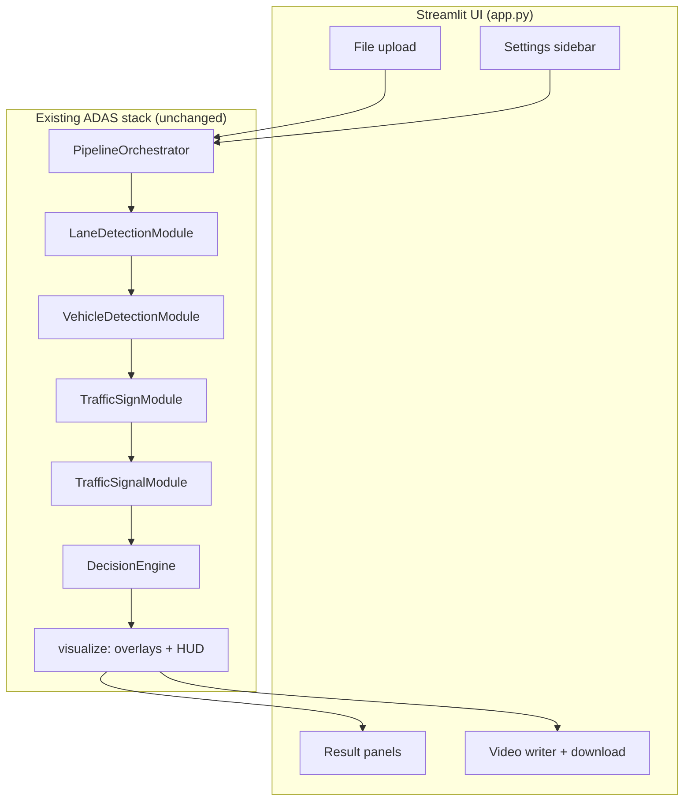

# ADAS Streamlit UI — Architecture

**Component:** `app.py` (project root)  
**Layer:** Presentation only — no changes to perception modules or decision logic  
**Pipeline backend:** `PipelineOrchestrator` (`src/pipeline/orchestrator.py`)

---

## 1. Purpose

The Streamlit application is a thin **presentation layer** on top of the existing ADAS stack. It lets users:

1. Upload a **single image** and see the full annotated pipeline output with per-module summaries and the final decision.
2. Upload a **video**, process it **frame-by-frame**, save an annotated output file, and review **aggregate statistics**.

No models are trained, and no detection or decision modules are modified. All inference flows through the same orchestrator used by `scripts/verify_pipeline.py` and integration tests.

---

## 2. High-Level Architecture



### Separation of concerns

| Layer | Responsibility | Location |
|-------|----------------|----------|
| **Presentation** | Uploads, layout, metrics, charts, file I/O | `app.py` |
| **Orchestration** | Module order, timing, scene aggregation | `src/pipeline/orchestrator.py` |
| **Perception** | Lane / vehicle / sign / signal inference | `src/modules/` |
| **Decision** | Rule evaluation, arbitration | `src/decision/` |
| **Visualization** | Bounding boxes, lane overlays, HUD | `src/visualization/` |

---

## 3. Data Flow

### 3.1 Image path

```
User uploads image (JPEG/PNG/…)
    → cv2.imdecode → BGR ndarray (H, W, 3)
    → PipelineOrchestrator.run_frame(frame)
        → LaneDetectionModule.predict()
        → VehicleDetectionModule.predict()
        → TrafficSignModule.predict()
        → TrafficSignalModule.predict()
        → SceneState.from_perception()
        → DecisionEngine.evaluate()
    → PipelineOrchestrator.visualize(frame, result)
    → RGB conversion for st.image()
    → Panel renderers read SceneState + DecisionResult
    → Optional save to outputs/streamlit/image_<timestamp>.jpg
```

### 3.2 Video path

```
User uploads video (MP4/AVI/…)
    → Temp file on disk
    → cv2.VideoCapture loop:
        for each frame:
            run_frame(frame_index, timestamp_ms)
            visualize() → annotated BGR frame
            VideoWriter.write(annotated)
            accumulate recommendation counts + timing
    → outputs/streamlit/video_<timestamp>_annotated.mp4
    → Summary metrics + st.video() + download button
    → Delete temp input file
```

Frame timestamps are derived as `frame_index * (1000 / fps)` so the decision layer receives consistent temporal metadata.

---

## 4. Orchestrator Lifecycle

The UI caches a single initialized orchestrator per **(weight mode, device)** pair using `@st.cache_resource`:

```python
load_orchestrator(use_real_weights: bool, device: str) -> PipelineOrchestrator
```

| Mode | Factory | When used |
|------|---------|-----------|
| **Real weights** | `create_default_orchestrator(device=…)` | All four weight files exist under config paths |
| **Demo (stub)** | `build_stub_orchestrator()` from `scripts/verify_pipeline.py` | Weights missing, or user selects demo mode |

Weight availability is checked via:

- `get_yolop_weights_path()`
- `get_yolov8_weights_path()`
- `get_traffic_sign_weights_path()`
- `get_traffic_signal_weights_path()`

Set the `ADAS_DATA_ROOT` environment variable to point at a directory containing `models/pretrained/` and `models/trained/` (see `config/default.yaml`).

`PipelineConfig` used by the UI:

- `auto_initialize=False` — explicit `initialize()` inside the cached loader
- `collect_timing=True` — per-frame `total_time_ms` for metrics

---

## 5. UI Layout

### Sidebar

| Control | Effect |
|---------|--------|
| Weight mode | Real vs demo stub orchestrator |
| Device | `cpu` or `cuda` (real mode only) |
| Show decision HUD | Passed to `orchestrator.visualize(show_hud=…)` |

### Image tab

| Section | Content |
|---------|---------|
| Upload + Run | Triggers full pipeline on demand |
| Annotated output | Full composite visualization (lanes, boxes, HUD) |
| Lane detection | Center, offset, departure, polyline point counts |
| Vehicle detection | Counts, nearest object, inference time |
| Traffic sign detection | Speed limit, label counts, nearest sign |
| Traffic signal detection | Dominant state, stop/proceed flags, controlling signal |
| Final decision | Recommendation banner, fired rules, pipeline timing |
| Module health | Per-module `raw_status` and OK flags |

### Video tab

| Section | Content |
|---------|---------|
| Upload + Process | Frame loop with progress bar |
| Summary statistics | Frame count, duration, FPS, resolution |
| Timing | Avg / min / max pipeline ms per frame |
| Recommendations | Bar chart + JSON counts; dominant recommendation |
| Output | Inline `st.video`, local path, download button |

---

## 6. Output Artifacts

All UI-generated files are written under:

```
outputs/streamlit/
├── image_YYYYMMDD_HHMMSS.jpg
└── video_YYYYMMDD_HHMMSS_annotated.mp4
```

Uploaded videos are stored in a **temporary file** during processing and removed afterward. Annotated videos use OpenCV `mp4v` fourcc.

---

## 7. Session State

Streamlit `st.session_state` holds results between reruns:

| Key | Type | Tab |
|-----|------|-----|
| `image_result` | `PipelineResult` | Image |
| `image_annotated` | `np.ndarray` | Image |
| `image_source_name` | `str` | Image |
| `video_summary` | `VideoSummary` | Video |

This avoids re-running inference on every widget interaction after the user clicks **Run** or **Process**.

---

## 8. Dependencies

Added for the UI layer:

```
streamlit>=1.28,<2.0
```

Existing project dependencies (`opencv-python`, `numpy`, `torch`, `ultralytics`, etc.) are unchanged and shared with the pipeline.

---

## 9. Running the Application

From the repository root:

```bash
pip install -r requirements.txt
streamlit run app.py
```

Optional — use real model weights on a local machine:

```bash
# Windows PowerShell
$env:ADAS_DATA_ROOT = "C:\path\to\adas-data"
streamlit run app.py
```

Without weights, the app automatically falls back to **demo stub** engines (same behavior as `python scripts/verify_pipeline.py` without `--real`).

---

## 10. Non-Goals (by design)

The UI intentionally does **not**:

- Retrain or fine-tune models
- Modify `src/modules/*` or `src/decision/*`
- Implement semantic segmentation (still stubbed in config)
- Provide real-time webcam streaming (upload-only for v1)
- Replace the planned Gradio stub in `src/app.py` (Streamlit is the active demo entry point)

---

## 11. Extension Points

Future UI work can hook into existing APIs without touching perception code:

| Feature | Integration point |
|---------|-------------------|
| Webcam live feed | `orchestrator.run_frame()` in a `st.camera_input` loop |
| Toggle overlay layers | `orchestrator.visualize(..., show_lane=, show_vehicles=, …)` |
| Export JSON per frame | `result.scene_state.to_dict()`, `result.decision.to_dict()` |
| Batch image folder | Loop over paths, reuse `run_pipeline_on_frame()` |
| GPU auto-detect | `torch.cuda.is_available()` in sidebar default |

---

## 12. Related Documentation

| Document | Topic |
|----------|-------|
| `docs/final_project_status.md` | Overall project completion |
| `docs/decision_engine_design.md` | Rules R01–R12, arbitration |
| `scripts/verify_pipeline.py` | CLI gate script and stub orchestrator factory |
| `config/default.yaml` | Paths, thresholds, pipeline flags |
