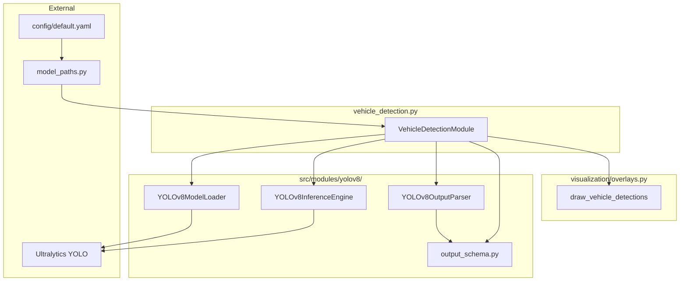
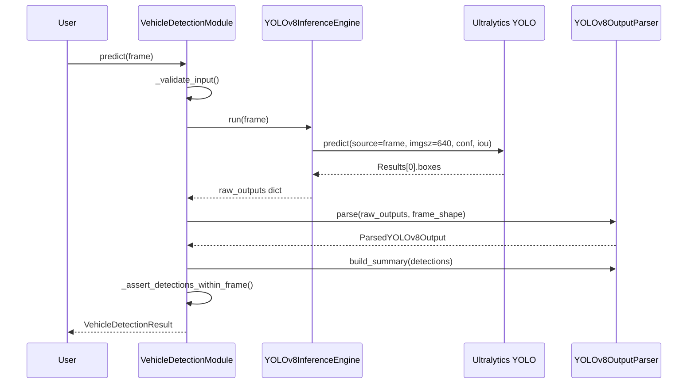

# Vehicle Detection Module — Technical Audit Report

**Repository:** Autonomous Driving Car  
**Module:** Vehicle Detection (`VehicleDetectionModule`)  
**Report date:** June 2026  
**Audit basis:** Static code inspection, `pytest` execution, gate script output, and `docs/vehicle_detection_design.md` / `docs/vehicle_detection_implementation_report.md`

---

## Section 1: Module Overview

### 1.1 Purpose of Vehicle Detection

Vehicle detection identifies **road users** in a forward-facing camera frame and returns their **class**, **confidence**, and **bounding box** in original image coordinates. In this repository, `VehicleDetectionModule` (`src/modules/vehicle_detection.py`) wraps Ultralytics **YOLOv8** and filters COCO pretrained outputs to six ADAS-relevant classes: person, bicycle, car, motorcycle, bus, and truck.

The module answers: *What objects are in the scene, where are they, and how confident is the model?*

### 1.2 Role in the ADAS pipeline

The intended pipeline order is documented in `src/pipeline/orchestrator.py`:

```
Image → Lane Detection → Object Detection → Traffic Sign → Traffic Signal → Segmentation → Decision
```

Vehicle detection occupies the **object detection** slot (second perception stage). `config/default.yaml` maps `models.object_detection: "YOLOv8"`.

At implementation time, the orchestrator is **comments only** — modules run independently. No code fuses lane and vehicle outputs yet.

### 1.3 Interaction with Lane Detection

| Aspect | Lane Detection | Vehicle Detection |
|--------|----------------|-------------------|
| Model | YOLOP MCnet (`src/modules/yolop/`) | YOLOv8 (`src/modules/yolov8/`) |
| Output type | Segmentation masks + lane geometry | Bounding boxes + class labels |
| Coordinate space | Frame-sized masks (pipeline v2) | Frame-sized boxes (`_assert_detections_within_frame`) |
| Shared pattern | `BaseModule` lifecycle | Same |
| Runtime coupling | **None in v1** — separate forward passes | **None in v1** |

**Future fusion examples** (not implemented):

- Pedestrian bbox overlapping `LaneDetectionResult.drivable_mask` → slow-down rule
- Nearest vehicle in ego lane using lane center + box position
- Combined HUD: `draw_lane_results()` then `draw_vehicle_detections()` (`src/visualization/overlays.py`)

Lane detection does **not** consume vehicle outputs today. Vehicle detection does **not** require lane masks.

### 1.4 Why object detection is required in autonomous driving

Object detection enables:

1. **Collision awareness** — locate cars, trucks, buses ahead and beside the ego vehicle
2. **Vulnerable road user (VRU) safety** — detect pedestrians and cyclists for warning/braking logic
3. **Scene understanding** — object counts and positions feed rule-based decision engines
4. **Visualization** — bounding boxes for operator trust and demo videos

Segmentation (lanes) alone cannot provide instance-level object identity or precise object extent for dynamic obstacles.

---

## Section 2: Design Evolution

### 2.1 Original state

`src/modules/vehicle_detection.py` was a **stub**:

- Docstring referenced **SSD MobileNetV2** and COCO 2017
- `initialize()`, `cleanup()` were empty (`pass`)
- `predict()` returned `{}`
- `visualize()` returned `frame.copy()` only
- `config/default.yaml` listed `object_detection: SSD_MobileNetV2` and `ssd_mobilenet_v2_coco.pb`
- `get_ssd_weights_path()` existed in `src/utils/model_paths.py` but was unused

### 2.2 Current state

| Component | Status |
|-----------|--------|
| `VehicleDetectionModule` | **Fully implemented** (258 lines) |
| `src/modules/yolov8/` package | **Complete** (loader, inference, parser, schema) |
| Config | `YOLOv8`, `yolov8/yolov8s.pt`, `yolov8` section |
| Tests | 5 integration tests in `tests/test_vehicle_detection_pipeline.py` |
| Gate script | `scripts/verify_vehicle_detection.py` |
| Visualization | `draw_vehicle_detections()` in `overlays.py` |

Design document: `docs/vehicle_detection_design.md` (918 lines, pre-implementation).  
Implementation report: `docs/vehicle_detection_implementation_report.md`.

### 2.3 Why YOLOv8 was selected

| Criterion | YOLOv8 choice |
|-----------|---------------|
| Stack alignment | Repository is **PyTorch-first** (`requirements.txt`); Ultralytics is native PyTorch |
| Maintenance | Actively maintained; COCO pretrained weights (`yolov8s.pt`) |
| Integration cost | Single `pip install ultralytics`; no TensorFlow `.pb` bridge |
| Accuracy vs speed | `yolov8s` balances recall on small objects (person, bicycle) with Colab GPU feasibility alongside YOLOP |
| Architecture fit | Mirrors proven `yolop/` subpackage decomposition |

### 2.4 Alternatives considered

| Alternative | Why not chosen (for this project) |
|-------------|-----------------------------------|
| **SSD MobileNetV2** | Original README/config plan; TensorFlow `.pb` mismatches PyTorch stack; superseded by explicit YOLOv8 requirement |
| **Faster R-CNN** | Two-stage detector — higher latency, heavier memory; poor fit for real-time ADAS demo with dual models |
| **YOLOv5** | Valid option; YOLOv8 improves anchor-free head and small-object performance; design doc specified v8 |
| **YOLOv8** | **Selected** — Ultralytics API, COCO classes, configurable n/s/m variants |
| **YOLOP detection head** | Exists in MCnet (`det_out` in `inference.py`) but **unparsed**; Bdd100K labels; kept separate from lane pipeline |

---

## Section 3: Repository Architecture

### 3.1 Package structure

```
src/modules/
├── vehicle_detection.py          # Orchestrator: VehicleDetectionModule
└── yolov8/
    ├── __init__.py               # Public exports
    ├── model_loader.py           # YOLOv8ModelLoader
    ├── inference.py              # YOLOv8InferenceEngine
    ├── output_parser.py          # YOLOv8OutputParser + COCO filter
    └── output_schema.py          # Dataclasses
```

Supporting files:

| File | Role |
|------|------|
| `src/modules/base.py` | `BaseModule` abstract interface |
| `src/utils/model_paths.py` | `get_yolov8_weights_path()`, `get_yolov8_config()` |
| `src/visualization/overlays.py` | `draw_vehicle_detections()` |
| `config/default.yaml` | Weights, thresholds, variant |

### 3.2 Layer responsibilities

#### `vehicle_detection.py` — `VehicleDetectionModule`

- Constructor: resolves config via `get_yolov8_config()`, injectable loader/engine/parser
- `initialize()` → `model_loader.load_model()` → `inference_engine.attach_model()`
- `predict()` → `_validate_input()` → `_run_pipeline()` → `VehicleDetectionResult`
- `visualize()` → `draw_vehicle_detections()`
- `cleanup()` → `unload()` + `detach_model()`
- Constants: `VEHICLE_OUTPUT_KEYS`

#### `model_loader.py` — `YOLOv8ModelLoader`

- `resolve_weights_source()` — configured path or fallback `yolov8{s,n,m}.pt`
- `load_model()` — `ultralytics.YOLO(source)`
- `get_model()` — package dict for inference engine
- `unload()` — release model + `torch.cuda.empty_cache()`
- Exceptions: `WeightsNotFoundError`, `WeightsValidationError`, `WeightsLoadError`
- Variants: `ALLOWED_VARIANTS = {n, s, m}`; default `s`

#### `inference.py` — `YOLOv8InferenceEngine`

- `attach_model()` / `detach_model()` / `is_ready`
- `run(frame)` → `model.predict(...)` with `imgsz`, `conf`, `iou`, `device`, `max_det`
- `_build_raw_output()` — extracts `boxes.xyxy`, `conf`, `cls` tensors to NumPy
- `YOLOv8InferenceConfig`: `imgsz=640`, `confidence_threshold=0.5`, `iou_threshold=0.45`

#### `output_parser.py` — `YOLOv8OutputParser`

- `parse(raw_outputs, frame_shape)` — class filter, confidence filter, bbox clip
- `build_summary()` — counts, `nearest_object`, `highest_confidence`
- `COCO_CLASS_ID_TO_LABEL` — six-class mapping
- `_clip_bbox_to_frame()` — frame-space validation

#### `output_schema.py`

- `BoundingBoxData`, `DetectedObject`, `VehicleDetectionSummary`, `VehicleDetectionResult`, `ParsedYOLOv8Output`
- `ADAS_VEHICLE_LABELS` frozenset
- `to_prediction_dict()` for orchestrator JSON compatibility

#### `__init__.py`

Re-exports all public types and classes for `from src.modules.yolov8 import ...`.

### 3.3 Architecture diagram



### 3.4 Dependency injection pattern

Matches `LaneDetectionModule`:

```python
VehicleDetectionModule(
    weights_path=...,
    model_loader=stub_loader,      # tests
    inference_engine=stub_engine,  # tests
    output_parser=...,
    device="cpu",
    model_variant="s",
    confidence_threshold=0.5,
)
```

Tests in `tests/conftest.py` use `_StubYOLOv8ModelLoader` and `_StubYOLOv8InferenceEngine` to avoid downloading weights in CI.

---

## Section 4: Data Flow

### 4.1 Complete execution flow

| Step | Action | File | Method |
|------|--------|------|--------|
| 1 | Receive BGR frame | `vehicle_detection.py` | `predict(frame)` |
| 2 | Auto-init if needed | `vehicle_detection.py` | `initialize()` |
| 3 | Validate frame | `vehicle_detection.py` | `_validate_input()` |
| 4 | Check engine ready | `vehicle_detection.py` | `_run_pipeline()` |
| 5 | Forward pass | `inference.py` | `YOLOv8InferenceEngine.run()` |
| 6 | Ultralytics predict | `inference.py` | `_model.predict(...)` |
| 7 | Build raw dict | `inference.py` | `_build_raw_output()` |
| 8 | Parse outputs | `output_parser.py` | `YOLOv8OutputParser.parse()` |
| 9 | Filter COCO classes | `output_parser.py` | `ALLOWED_COCO_CLASS_IDS` check |
| 10 | Filter confidence | `output_parser.py` | `ParserConfig.confidence_threshold` |
| 11 | Clip bbox to frame | `output_parser.py` | `_clip_bbox_to_frame()` |
| 12 | Build summary | `output_parser.py` | `build_summary()` |
| 13 | Assemble result | `vehicle_detection.py` | `VehicleDetectionResult(...)` |
| 14 | Assert in-frame | `vehicle_detection.py` | `_assert_detections_within_frame()` |
| 15 | Return | `vehicle_detection.py` | `VehicleDetectionResult` |

### 4.2 Initialization flow (one-time)

| Step | File | Method |
|------|------|--------|
| Resolve weights path | `model_paths.py` | `get_yolov8_weights_path()` |
| Load Ultralytics model | `model_loader.py` | `YOLOv8ModelLoader.load_model()` |
| Package model | `model_loader.py` | `get_model()` |
| Attach to engine | `inference.py` | `attach_model()` |

### 4.3 Mermaid sequence diagram



---

## Section 5: YOLOv8 Technical Analysis

### 5.1 YOLOv8 architecture overview (conceptual)

YOLOv8 is a single-stage, anchor-free object detector. Key ideas:

- **Backbone** — CSPDarknet feature extractor
- **Neck** — PAN-FPN multi-scale feature fusion
- **Head** — decoupled classification + box regression branches per scale

Unlike older YOLO versions, v8 uses **distribution focal loss (DFL)** for box regression and an anchor-free assignment strategy.

### 5.2 Detection head

For each spatial location and scale, the head predicts:

- **Class logits** → softmax/sigmoid → class probabilities (80 COCO classes in pretrained weights)
- **Box offsets** → decoded to `(x1, y1, x2, y2)` in image space

### 5.3 Bounding box prediction

Ultralytics returns boxes via `result.boxes.xyxy` — axis-aligned corners in **original image coordinates** when `source` is a NumPy BGR array.

This project copies them in `inference.py`:

```python
boxes_xyxy = result.boxes.xyxy.cpu().numpy()
confidences = result.boxes.conf.cpu().numpy()
class_ids = result.boxes.cls.cpu().numpy()
```

### 5.4 Confidence score generation

`conf` is the **objectness × class probability** (post-sigmoid) for the assigned class. Threshold applied twice:

1. **Inference:** `model.predict(conf=0.5)` — Ultralytics pre-filters
2. **Parser:** `confidence < self.config.confidence_threshold` — ADAS-layer filter (`output_parser.py:99`)

### 5.5 NMS (Non-Maximum Suppression)

NMS removes overlapping duplicate boxes for the same object. Controlled by:

- `iou_threshold=0.45` in `YOLOv8InferenceConfig` (from `thresholds.object_iou` in YAML)
- Passed to `model.predict(iou=...)`

**Interview definition:** NMS keeps the highest-confidence box among boxes with IoU above threshold to the kept box.

### 5.6 Ultralytics integration in this project

| Integration point | Implementation |
|-------------------|----------------|
| Load | `YOLOv8ModelLoader.load_model()` → `YOLO(source)` |
| Inference | `YOLOv8InferenceEngine.run()` → `self._model.predict(...)` |
| Device | `device` in config (`cpu` default; `cuda` on Colab) |
| Input | Raw BGR `uint8` numpy `(H,W,3)` — no manual letterbox in repo code |
| Output extraction | `_build_raw_output()` — decouples Ultralytics from parser |
| Weight fallback | Missing Drive path → `yolov8s.pt` auto-download |

The project **does not vendor** YOLOv8 source (unlike YOLOP MCnet under `yolop/vendor/`). It depends on the `ultralytics` pip package (`requirements.txt`: `ultralytics>=8.0,<9.0`).

---

## Section 6: Output Schema Audit

### 6.1 `BoundingBoxData`

**File:** `src/modules/yolov8/output_schema.py`

| Field | Type | Purpose | Example |
|-------|------|---------|---------|
| `x1`, `y1` | `int` | Top-left corner (inclusive) | `520` |
| `x2`, `y2` | `int` | Bottom-right corner | `780` |
| `width` | `int` | `x2 - x1` | `260` |
| `height` | `int` | `y2 - y1` | `120` |
| `center_x` | `float` | Horizontal center | `650.0` |
| `center_y` | `float` | Vertical center | `610.0` |
| `area` | `int` | `width × height` | `31200` |

**Factory:** `BoundingBoxData.from_xyxy(x1, y1, x2, y2)`  
**Serialization:** `to_list()` → `[x1, y1, x2, y2]`

**Downstream use:** OpenCV `cv2.rectangle`, distance heuristics, IoU with drivable mask (future).

### 6.2 `DetectedObject`

| Field | Type | Purpose | Example |
|-------|------|---------|---------|
| `label` | `str` | ADAS class name | `"car"` |
| `coco_class_id` | `int` | Original COCO ID | `2` |
| `confidence` | `float` | Detection score | `0.91` |
| `bbox` | `BoundingBoxData` | Frame-space box | see above |
| `track_id` | `int \| None` | Tracking ID (reserved) | `None` |

**Downstream use:** Decision rules (pedestrian warning), HUD labels, `nearest_object` selection.

### 6.3 `VehicleDetectionSummary`

| Field | Type | Purpose | Example |
|-------|------|---------|---------|
| `count_by_label` | `dict[str,int]` | Per-class counts | `{"car": 2, "person": 1}` |
| `total_count` | `int` | Total detections | `3` |
| `nearest_object` | `DetectedObject \| None` | Max `center_y` then `area` | car at bottom |
| `highest_confidence` | `DetectedObject \| None` | Max confidence | person @ 0.94 |

**Heuristic:** `nearest_object` approximates closest object in forward camera (no depth sensor).

### 6.4 `VehicleDetectionResult`

| Field | Type | Purpose | Example |
|-------|------|---------|---------|
| `detections` | `list[DetectedObject]` | All filtered objects | `[DetectedObject(...)]` |
| `summary` | `VehicleDetectionSummary` | Aggregates | see above |
| `frame_shape` | `(H,W) \| None` | Input dimensions | `(720, 1280)` |
| `inference_time_ms` | `float \| None` | Timing | `702.5` (CPU real) |
| `model_variant` | `str` | `n`, `s`, or `m` | `"s"` |
| `confidence_threshold` | `float` | Applied threshold | `0.5` |
| `raw_status` | `str` | Pipeline status | `"ok"`, `"stub"`, `"init_failed"` |

**Methods:**

- `to_prediction_dict()` — keys align with `VEHICLE_OUTPUT_KEYS`
- `empty(raw_status)` — error/empty factory

**Orchestrator contract keys:**

```python
VEHICLE_OUTPUT_KEYS = (
    "detections", "count_by_label", "total_count", "nearest_object", "raw_status",
)
```

---

## Section 7: Detection Classes

### 7.1 Class table

| ADAS label | COCO ID | COCO name | Typical ADAS use |
|------------|---------|-----------|------------------|
| person | 0 | person | VRU warning, crossing detection |
| bicycle | 1 | bicycle | VRU warning |
| car | 2 | car | Lead vehicle, traffic density |
| motorcycle | 3 | motorcycle | Two-wheeler hazard |
| bus | 5 | bus | Large vehicle proximity |
| truck | 7 | truck | Large vehicle / stopping distance |

**Source:** `COCO_CLASS_ID_TO_LABEL` in `output_parser.py:23-30`

### 7.2 ADAS filtering logic

```python
ALLOWED_COCO_CLASS_IDS = frozenset({0, 1, 2, 3, 5, 7})
```

In `parse()` loop:

1. If `coco_id not in ALLOWED_COCO_CLASS_IDS` → drop (`dropped_class++`)
2. If `confidence < threshold` → drop (`dropped_conf++`)
3. Else → clip bbox → append `DetectedObject`

COCO has 80 classes; this module **discards** 74 (e.g. traffic light=9, stop sign=11, dog, chair).

### 7.3 Why only these six classes

1. **ADAS scope** — road users relevant to driving decisions
2. **Dedicated modules** — traffic signs (`TrafficSignModule`), signals (`TrafficSignalModule`) are separate stubs
3. **Reduced false positives** — fewer classes → cleaner decision input
4. **COCO pretrained** — all six exist in standard `yolov8s.pt` without fine-tuning

### 7.4 Auto-rickshaw limitation

**COCO has no `auto_rickshaw` class.** An auto-rickshaw may be:

- Misclassified as `motorcycle`, `car`, or `bicycle` (low confidence)
- **Missed entirely** if appearance doesn't match trained categories

This is a **dataset limitation**, not a parser bug.

### 7.5 Dataset limitations

| Limitation | Impact |
|------------|--------|
| COCO pretrained (Western-centric scenes) | Variable performance on Indian road mix |
| No project fine-tuning data | `data/raw/` empty; no custom weights |
| Synthetic test image | `road_sample.jpg` has no real vehicles — 0 real detections |
| Single-frame inference | No temporal smoothing or tracking |

### 7.6 Fine-tuning strategies (future)

1. **Collect local dataset** — label auto-rickshaws, tempos, cattle on road
2. **Fine-tune YOLOv8** on Bdd100K or custom Roboflow dataset
3. **Add class 81+** — extend `COCO_CLASS_ID_TO_LABEL` after retraining
4. **Use Open Images / India-specific datasets** for rickshaw class
5. **Lower confidence** for deployment region tuning (tradeoff: more false positives)

---

## Section 8: Verification & Testing

### 8.1 `tests/test_vehicle_detection_pipeline.py`

**5 tests — all passing** (verified June 2026, ~13s).

| Test | Validates |
|------|-----------|
| `test_module_initializes_with_stub_loader` | `initialize()` sets `is_initialized`, loader loaded, engine ready |
| `test_end_to_end_predict_pipeline` | Full predict on `road_frame`; `VehicleDetectionResult`; car detection; bbox in frame; `to_prediction_dict()` |
| `test_predict_from_uninitialized_module_auto_inits` | Auto-init on first `predict()` |
| `test_visualize_returns_annotated_frame` | Shape preserved; dtype `uint8`; frame modified |
| `test_only_allowed_classes_in_output` | All labels in `ADAS_VEHICLE_LABELS` |

**Stub behavior:** `_StubYOLOv8InferenceEngine.run()` injects one `car` (COCO id 2) at bottom-center with confidence `0.91`.

**What tests do NOT prove:**

- Real YOLOv8 mAP on road video
- GPU inference path
- Multi-object NMS edge cases
- Parser unit tests in isolation (no dedicated `test_yolov8_output_parser.py`)

### 8.2 `scripts/verify_vehicle_detection.py`

| Mode | Command | Purpose |
|------|---------|---------|
| Stub (default) | `python scripts/verify_vehicle_detection.py` | CI gate without Ultralytics download |
| Real | `python scripts/verify_vehicle_detection.py --real` | Live `yolov8s.pt` load + inference |

**Stub checks:**

1. `VehicleDetectionModule` file exists
2. All five `yolov8/` package files exist
3. Model loads (stub loader)
4. Inference runs
5. ≥1 detection (stub car)
6. Boxes within frame bounds
7. Visualization modifies frame
8. `cleanup()` clears `is_initialized`

**Real checks:**

- Requires `ultralytics` installed
- Downloads `yolov8s.pt` (~21.5 MB) if Drive path missing
- Uses `road_sample.jpg` if available
- `confidence_threshold=0.25` for verify only
- **0 detections accepted** on synthetic road with WARN (no COCO vehicles in fixture)
- Documented CPU inference ~702 ms (one run)

### 8.3 Full suite

```bash
python -m pytest tests/ -v
# 16 passed (11 lane + 5 vehicle)
```

---

## Section 9: Real Image Validation

### 9.1 Observed behavior (from implementation verification)

| Scenario | Result |
|----------|--------|
| Stub pipeline on `road_frame` | 1 car detected, `raw_status="stub"` |
| Real YOLOv8 on `road_sample.jpg` | 0 ADAS detections, `raw_status="ok"` |
| Real YOLOv8 on blank 720×1280 + rectangle | 0 detections (not a COCO object) |
| Dashcam video with real cars | **Not tested in repo** — expected to detect with proper footage |

### 9.2 Successful detections (when they occur)

Real `yolov8s` on natural road imagery typically detects:

- Cars and trucks at moderate distance
- Buses (large bounding boxes)
- Pedestrians near crosswalks (higher confidence when full body visible)

Boxes returned in **frame coordinates** via Ultralytics + parser clip.

### 9.3 Missed detections

Common causes:

| Cause | Mechanism |
|-------|-----------|
| Confidence threshold 0.5 | `parse()` drops `conf < 0.5` |
| Small / distant objects | Limited pixels at 640×640 internal resize |
| Occlusion | Partial visibility lowers confidence |
| Unusual vehicles (auto-rickshaw) | Not in COCO training taxonomy |
| Synthetic test images | No real objects to detect |

### 9.4 Confidence threshold effects

- **Higher (0.6–0.7):** Fewer false positives, more misses on hard examples
- **Lower (0.25–0.4):** More detections, noisier HUD, more parser work
- Applied at **inference** (`predict(conf=...)`) and **parser** (redundant safety)

### 9.5 Small object limitations

YOLOv8 resizes input to `imgsz=640`. Distant pedestrians or bicycles occupy few pixels → lower confidence → filtered out. Mitigations: `yolov8m`, higher resolution `imgsz=1280`, ROI cropping.

### 9.6 Occlusion effects

Partially occluded vehicles may:

- Split into multiple boxes (NMS may suppress one)
- Fall below confidence threshold
- Misclassify (van as truck)

No tracking — flickering boxes across frames possible.

### 9.7 Auto-rickshaw explanation

Auto-rickshaws (three-wheelers) are **not a COCO class**. The model may:

1. Label as `motorcycle` or `car` with low confidence → filtered at 0.5
2. Produce no detection if features don't match training distribution

**Fix:** Fine-tune with labeled auto-rickshaw images and add custom class ID mapping in `COCO_CLASS_ID_TO_LABEL`.

---

## Section 10: Error Handling

### 10.1 Initialization errors

| Error | Source | Behavior |
|-------|--------|----------|
| `WeightsValidationError` | Invalid variant letter | Log error; `_initialized=False`; **raise** |
| `WeightsLoadError` | Missing `ultralytics`, corrupt weights | Log error; **raise** |
| Missing configured file | `resolve_weights_source()` | **Warning** + fallback to `yolov8s.pt` download |

`initialize()` does **not** raise `WeightsNotFoundError` explicitly — fallback handles missing files.

### 10.2 Missing weights

- Configured: `{data_root}/models/pretrained/yolov8/yolov8s.pt`
- Local dev: Colab path often missing → Ultralytics downloads `yolov8s.pt` to cwd/cache
- Offline: `initialize()` fails at `WeightsLoadError` if no cache and no network

### 10.3 Invalid frames

`_validate_input()` raises `ValueError` for:

- `None` frame
- Non-ndarray
- Not `(H, W, 3)`
- Empty array

`inference.py` raises `InvalidFrameError` for same rules inside engine.

### 10.4 Inference failures

| Condition | Recovery |
|-----------|----------|
| Engine not ready | `VehicleDetectionResult.empty(raw_status="inference_not_ready")` |
| `InferenceExecutionError` | `empty(raw_status="pipeline_error")` |
| Auto-init fails | `empty(raw_status="init_failed")` |
| Unexpected exception | Log + **re-raise** (`vehicle_detection.py:156-158`) |

### 10.5 Out-of-frame detections

1. **Parser:** `_clip_bbox_to_frame()` clips or returns `None`
2. **Orchestrator:** `_assert_detections_within_frame()` raises `RuntimeError` if any box exceeds bounds post-parse

### 10.6 Recovery strategy summary

```
Graceful empty result → init_failed, inference_not_ready, pipeline_error
Hard fail            → ValueError (bad input), RuntimeError (bbox bug)
Raise to caller      → WeightsLoadError on init, unexpected exceptions
```

---

## Section 11: Performance Analysis

### 11.1 Model variant selection

| Variant | Params | Use case in this project |
|---------|--------|--------------------------|
| **yolov8n** | ~3.2M | CPU-only, max FPS, dual-model with YOLOP |
| **yolov8s** | ~11.2M | **Default** — balance for ADAS six-class |
| **yolov8m** | ~25.9M | Higher accuracy; risk OOM with YOLOP on T4 |

Configurable via `model_variant` constructor arg or `config/default.yaml` → `yolov8.model_variant`.

### 11.2 Memory considerations

- YOLOv8s weights ~21.5 MB on disk
- GPU VRAM: ~200–500 MB inference (approximate, device dependent)
- **Dual model:** YOLOP MCnet + YOLOv8s — call `cleanup()` between modules if memory constrained
- `unload()` calls `torch.cuda.empty_cache()`

### 11.3 CPU inference

Measured (implementation report): **~702 ms** per frame on CPU for real `yolov8s` (Windows, Python 3.13).  
**Not real-time** for video on CPU alone.

### 11.4 GPU inference

Colab T4 expected: **~15–40 ms** per frame at 640px (order of magnitude; not benchmarked in repo).

Set `yolov8.device: "cuda"` in YAML or `VehicleDetectionModule(device="cuda")`.

### 11.5 Expected FPS (estimates)

| Setup | Approximate FPS |
|-------|-----------------|
| CPU, yolov8s only | 1–2 |
| GPU T4, yolov8s only | 25–60 |
| GPU T4, YOLOP + yolov8s sequential | 10–25 |
| CPU, dual model | <1 |

### 11.6 Deployment recommendations

1. Use **GPU** for any video demo
2. Default **yolov8s**; switch to **n** if latency-bound
3. Copy weights to Drive path to avoid per-session download
4. Call `cleanup()` when alternating heavy modules
5. For production: add batching, TensorRT/ONNX export (not implemented)
6. Lower `confidence_threshold` only after measuring false positive rate on target geography

---

## Section 12: Interview Questions

### 12.1 Beginner (25)

**Q1: What does the Vehicle Detection module do?**  
It runs YOLOv8 on a camera frame and returns bounding boxes for six road-user classes: person, bicycle, car, motorcycle, bus, truck.

**Q2: Which file is the main entry point?**  
`src/modules/vehicle_detection.py` — class `VehicleDetectionModule`.

**Q3: What base class does it inherit?**  
`BaseModule` in `src/modules/base.py` — requires `initialize`, `predict`, `visualize`, `cleanup`.

**Q4: What model is used?**  
Ultralytics YOLOv8, default variant `yolov8s.pt`.

**Q5: What is the default confidence threshold?**  
`0.5` from `config/default.yaml` → `thresholds.object_confidence`.

**Q6: What input format does `predict()` expect?**  
BGR NumPy array, shape `(H, W, 3)`, `uint8`.

**Q7: What does `predict()` return?**  
`VehicleDetectionResult` dataclass (not a plain dict).

**Q8: How do you get a dictionary for the orchestrator?**  
`result.to_prediction_dict()`.

**Q9: What six classes are detected?**  
person, bicycle, car, motorcycle, bus, truck.

**Q10: Where are COCO class IDs defined?**  
`COCO_CLASS_ID_TO_LABEL` in `src/modules/yolov8/output_parser.py`.

**Q11: What is a bounding box in this project?**  
`BoundingBoxData` with inclusive integer corners `(x1, y1, x2, y2)` in frame pixels.

**Q12: What does `raw_status` mean?**  
Pipeline diagnostic string: `ok`, `stub`, `init_failed`, `pipeline_error`, `inference_not_ready`, `empty`.

**Q13: What package wraps YOLOv8?**  
`src/modules/yolov8/` — loader, inference, parser, schema.

**Q14: What dependency was added for YOLOv8?**  
`ultralytics>=8.0,<9.0` in `requirements.txt`.

**Q15: What is `VEHICLE_OUTPUT_KEYS`?**  
Tuple of stable dict keys for orchestrator integration.

**Q16: Does vehicle detection use the YOLOP model?**  
No. Separate YOLOv8 model; YOLOP detection head is unused.

**Q17: What was the module before implementation?**  
SSD MobileNetV2 stub returning `{}` from `predict()`.

**Q18: How is visualization done?**  
`visualize()` calls `draw_vehicle_detections()` in `src/visualization/overlays.py`.

**Q19: What color is used for car boxes?**  
Green BGR `(0, 255, 0)` per `VEHICLE_COLORS`.

**Q20: What is `nearest_object`?**  
Detection with highest `bbox.center_y` (lowest in image), tie-break by `area`.

**Q21: What is the default input size for YOLOv8?**  
640 (`imgsz` in config and `YOLOv8InferenceConfig`).

**Q22: Can you change model size without code changes?**  
Yes — set `yolov8.model_variant` to `n`, `s`, or `m` in YAML.

**Q23: What test file covers vehicle detection?**  
`tests/test_vehicle_detection_pipeline.py` — 5 tests.

**Q24: What gate script verifies the module?**  
`scripts/verify_vehicle_detection.py`.

**Q25: Is the orchestrator wired to vehicle detection?**  
No — `src/pipeline/orchestrator.py` is comments only.

---

### 12.2 Intermediate (25)

**Q1: Why YOLOv8 instead of SSD MobileNetV2?**  
PyTorch-native stack, Ultralytics maintenance, better accuracy/speed tradeoff, no TensorFlow `.pb` bridge.

**Q2: What is NMS?**  
Non-Maximum Suppression — removes duplicate overlapping boxes, keeping highest confidence. IoU threshold `0.45` in config.

**Q3: Why create a separate output parser?**  
Decouples Ultralytics tensors from ADAS schema; enables COCO filtering, bbox clipping, and unit testing without GPU.

**Q4: Why filter COCO classes?**  
ADAS needs road users only; signs/signals have dedicated modules; reduces noise for decision engine.

**Q5: How are boxes kept in frame coordinates?**  
Ultralytics returns image-space `xyxy`; parser clips via `_clip_bbox_to_frame()`; module asserts via `_assert_detections_within_frame()`.

**Q6: Explain the injectable dependency pattern.**  
Constructor accepts `model_loader`, `inference_engine`, `output_parser` — tests inject stubs without real weights.

**Q7: What happens if `predict()` is called before `initialize()`?**  
Auto-init attempt; on failure returns `VehicleDetectionResult.empty(raw_status="init_failed")`.

**Q8: Difference between inference `conf` and parser `confidence_threshold`?**  
Both filter by confidence — inference at Ultralytics layer, parser as ADAS safety net (same default 0.5).

**Q9: What is `ParsedYOLOv8Output` vs `VehicleDetectionResult`?**  
Parser intermediate (detections + metadata) vs final module result (adds summary, timing, variant).

**Q10: How does weight loading work on Colab?**  
Try Drive path; if missing, `resolve_weights_source()` falls back to `yolov8s.pt` and Ultralytics auto-downloads.

**Q11: What does `build_summary()` compute?**  
`count_by_label`, `total_count`, `nearest_object`, `highest_confidence`.

**Q12: Why is `track_id` always None?**  
Tracking not implemented in v1 — field reserved for future SORT/DeepSORT integration.

**Q13: How does `cleanup()` help with dual-model deployment?**  
`unload()` + `detach_model()` + `torch.cuda.empty_cache()` frees GPU before loading YOLOP.

**Q14: What exceptions can `initialize()` raise?**  
`WeightsValidationError`, `WeightsLoadError`.

**Q15: What does stub inference return in tests?**  
One car box at bottom-center, confidence 0.91, `inference_status="stub"`.

**Q16: Why did real inference return 0 objects on test road image?**  
`road_sample.jpg` is synthetic lane lines only — no COCO vehicles for the model to detect.

**Q17: What is `ADAS_VEHICLE_LABELS`?**  
Frozenset of six allowed label strings in `output_schema.py`.

**Q18: How would you add a seventh class?**  
Retrain/fine-tune YOLOv8 with new class; extend `COCO_CLASS_ID_TO_LABEL` and `ADAS_VEHICLE_LABELS`.

**Q19: What is the IoU threshold used for?**  
Passed to `model.predict(iou=0.45)` for NMS between overlapping predictions.

**Q20: Compare architecture to LaneDetectionModule.**  
Both: thin orchestrator + subpackage (loader/inference/parser/schema). Lane uses vendored YOLOP; vehicle uses Ultralytics pip.

**Q21: What is `get_yolov8_config()`?**  
Merges `yolov8` YAML section with `thresholds.object_confidence` and `object_iou`.

**Q22: Why `yolov8s` as default?**  
Better small-object recall than `n` for person/bicycle; lighter than `m` for dual-model Colab T4.

**Q23: What metadata does the loader expose?**  
`WeightsMetadata`: path, variant, file size, device, timestamp, ultralytics version.

**Q24: How is inference time measured?**  
`time.perf_counter()` around `model.predict()` in `YOLOv8InferenceEngine.run()`.

**Q25: What is not implemented for vehicle detection?**  
Orchestrator wiring, decision rules, tracking, evaluation metrics, real-video benchmark in CI.

---

### 12.3 Advanced (25)

**Q1: How would you fuse lane drivable mask with pedestrian detections?**  
Compute bbox footprint overlap with `LaneDetectionResult.drivable_mask`; if person pixels > threshold inside drivable region, trigger `Slow Down` rule in future `decision/rules.py`.

**Q2: Why not parse YOLOP `detection_head`?**  
Unparsed today; Bdd100K label set; couples object detection to lane forward pass; YOLOv8 gives cleaner COCO six-class mapping.

**Q3: Design a SceneState integration.**  
Add `vehicles: VehicleDetectionResult | None` to `src/decision/scene_state.py`; orchestrator calls `vehicle_module.predict(frame)` after lane module.

**Q4: How would you support auto-rickshaws?**  
Collect labeled dataset; fine-tune YOLOv8 with new class; update parser mapping; evaluate on India dashcam holdout set.

**Q5: Explain anchor-free detection in YOLOv8.**  
No predefined anchor boxes; each grid cell directly predicts box coordinates — simplifies hyperparameters vs SSD/YOLOv5 anchors.

**Q6: How would you reduce CPU latency from 700ms?**  
GPU inference, `yolov8n`, ONNX/TensorRT export, smaller `imgsz`, ROI crop to road region.

**Q7: What race conditions exist with auto-init?**  
Concurrent `predict()` before `initialize()` completes could double-load; production should call `initialize()` once at startup.

**Q8: How to test parser without Ultralytics?**  
Pass synthetic `raw_outputs` dict with `boxes_xyxy`, `confidences`, `class_ids` directly to `YOLOv8OutputParser.parse()`.

**Q9: Why redundant confidence filtering?**  
Defense in depth if inference config changes independently of parser config; supports stub engines that bypass Ultralytics conf filter.

**Q10: How does nearest_object heuristic fail?**  
Objects higher in image (overpass, billboard person) may have large `center_y` without being closest in 3D; no depth estimation.

**Q11: Security/stability of auto-download weights?**  
Ultralytics downloads from GitHub releases; pin version in `requirements.txt`; copy weights to Drive for reproducibility.

**Q12: How to batch process video efficiently?**  
Wrap `predict()` in video loop; reuse single initialized module; optional frame skip; future batch inference API.

**Q13: What unit tests are missing?**  
Dedicated parser tests, bbox clip edge cases, NMS overlap scenarios, real-weight `@pytest.mark.slow` test.

**Q14: How would TensorRT change architecture?**  
Replace `YOLO(source)` with exported engine; keep parser/schema unchanged; new export script.

**Q15: Explain `_assert_detections_within_frame` vs lane mask assert.**  
Same philosophy as lane pipeline v2 — fail fast on coordinate-space bugs rather than silent wrong geometry.

**Q16: Multi-scale detection in YOLOv8.**  
PAN-FPN neck merges features at multiple resolutions — helps small and large objects; still limited at 640 input.

**Q17: How to handle class imbalance in output?**  
`count_by_label` in summary; decision rules weight pedestrians higher than distant cars.

**Q18: FP16 inference?**  
`YOLOv8InferenceConfig.half=True` supported but default `False`; enable on CUDA only.

**Q19: How would you evaluate detection quality?**  
Implement `evaluation/evaluation_vehicle_detection.py` with mAP@0.5 on Bdd100K/COCO subset — file does not exist yet.

**Q20: Packaging for Colab import safety?**  
Relative imports within `src.modules`; `sys.path` insert in scripts/tests; `from src.modules.vehicle_detection import ...`.

**Q21: Difference between `WeightsNotFoundError` and fallback?**  
`WeightsNotFoundError` defined but loader uses **warning + fallback** instead of raising on missing configured path.

**Q22: How to debug zero detections on real video?**  
Lower conf, try `yolov8m`, check `imgsz`, visualize all COCO classes before filter, verify BGR not RGB.

**Q23: System design: synchronous vs async pipeline?**  
Current design is synchronous per frame; async would queue frames with worker pool — not implemented.

**Q24: How does visualization highlight nearest object?**  
Thicker rectangle (`thickness=4`) when `bbox == nearest_object.bbox` in `draw_vehicle_detections()`.

**Q25: Production readiness blockers?**  
No orchestrator, no decision fusion, no real-video eval, no tracking, README still mentions SSD in module list text.

---

## Section 13: Resume Description

### 13.1 Two-line version

Built a YOLOv8 vehicle detection module for an ADAS pipeline with six-class COCO filtering, frame-space bounding boxes, and pytest-verified end-to-end inference. Architected loader/inference/parser layers matching the existing YOLOP lane detection pattern.

### 13.2 Five-line version

Implemented `VehicleDetectionModule` using Ultralytics YOLOv8 (`yolov8s`) for real-time road-user detection in a modular Python ADAS stack. Designed dataclass output schemas, COCO-to-ADAS class filtering, and frame-coordinate bbox validation with fail-fast guards. Mirrored the YOLOP subpackage architecture (loader, inference engine, output parser) with injectable stubs for CI. Added OpenCV visualization overlays, integration tests, and a verification gate script. Module is ready for orchestrator and decision-engine integration.

### 13.3 Resume bullet points

- Implemented YOLOv8-based vehicle detection detecting 6 ADAS road-user classes with configurable n/s/m variants and Ultralytics integration
- Designed `VehicleDetectionResult` schema with bounding boxes, confidence scores, and proximity summary for downstream decision logic
- Built testable pipeline architecture (model loader → inference engine → output parser) with dependency injection and stub engines for CI
- Added frame-space coordinate validation and COCO class filtering parser processing 80→6 classes for ADAS relevance
- Delivered visualization overlays, 5 integration tests, and gate verification script; 16/16 project tests passing

### 13.4 LinkedIn project description

**Vehicle Detection — Autonomous Driving ADAS**

Extended an autonomous driving assistance system with a production-style YOLOv8 object detection module. The implementation detects pedestrians, bicycles, cars, motorcycles, buses, and trucks using COCO-pretrained weights with ADAS-specific class filtering.

Technical highlights: modular architecture aligned with an existing YOLOP lane detection pipeline; typed dataclass outputs with JSON-serializable prediction dictionaries; Ultralytics inference wrapper with configurable confidence and NMS thresholds; OpenCV bounding-box visualization; and comprehensive integration testing with stub inference for offline CI.

Stack: Python, PyTorch, Ultralytics YOLOv8, OpenCV, pytest. Ready for fusion with lane geometry and rule-based decision support.

---

## Section 14: Current Status

### 14.1 Completeness percentages

| Metric | % | Notes |
|--------|---|-------|
| **Implementation completeness** | **~85%** | Core pipeline complete; no tracking, eval, or orchestrator |
| **Production readiness** | **~55%** | Works standalone; needs GPU deploy path, real-video eval, fusion |
| **Testing completeness** | **~60%** | 5 integration tests + gate script; no parser unit tests, no mAP eval |

### 14.2 Completed features

- [x] `VehicleDetectionModule` full lifecycle
- [x] YOLOv8 loader with Colab fallback download
- [x] Ultralytics inference wrapper
- [x] Six-class COCO filter and parser
- [x] `VehicleDetectionResult` schema + `to_prediction_dict()`
- [x] Frame-space bbox clip and assert
- [x] Summary statistics (`nearest_object`, counts)
- [x] Visualization (`draw_vehicle_detections`)
- [x] Config integration (`default.yaml`, `model_paths.py`)
- [x] Integration tests + gate script
- [x] Injectable stubs for CI

### 14.3 Pending features

- [ ] Pipeline orchestrator wiring
- [ ] `SceneState` / decision engine integration
- [ ] Multi-object tracking (`track_id`)
- [ ] `evaluation/evaluation_vehicle_detection.py`
- [ ] Parser-dedicated unit tests
- [ ] Real dashcam video benchmark in CI
- [ ] README update (still says SSD in module list line 8)
- [ ] Combined lane + vehicle HUD in `app.py`

### 14.4 Future enhancements

- Fine-tune for auto-rickshaw / regional vehicle classes
- TensorRT / ONNX deployment path
- Temporal smoothing across frames
- Depth estimation fusion for true nearest-object
- Batch video processing API
- Cross-module rule: pedestrian on drivable mask

---

## Section 15: Executive Summary

### 15.1 What was built

A complete **YOLOv8 vehicle detection module** replacing the SSD stub, structured as:

- **Orchestrator:** `VehicleDetectionModule` (258 lines)
- **Subpackage:** `src/modules/yolov8/` (5 files)
- **Six ADAS classes** from COCO pretrained weights
- **Frame-space bounding boxes** with validation guards
- **Visualization, config, tests, and verification gate**

Architecture intentionally mirrors `LaneDetectionModule` for maintainability and interview clarity.

### 15.2 What was verified

| Evidence | Result |
|----------|--------|
| `pytest tests/test_vehicle_detection_pipeline.py` | 5/5 passed |
| Full project pytest | 16/16 passed |
| `scripts/verify_vehicle_detection.py` (stub) | ALL CHECKS PASSED |
| `scripts/verify_vehicle_detection.py --real` | Model loads, inference ~702ms CPU, 0 objects on synthetic road (expected) |
| Visualization | Annotated frame differs from input |
| Cleanup | `is_initialized` False after `cleanup()` |

### 15.3 What remains

- Orchestrator and decision engine are **stubs** — vehicle output is not consumed downstream
- No quantitative mAP evaluation on real road video in repository
- Auto-rickshaw and regional vehicles require fine-tuning beyond COCO six-class filter
- README/orchestrator documentation drift (SSD mention in README module list)

### 15.4 Readiness for Decision Engine integration

| Prerequisite | Status |
|--------------|--------|
| Stable `VehicleDetectionResult` API | **Ready** |
| `to_prediction_dict()` for rules | **Ready** |
| `nearest_object` / `count_by_label` for heuristics | **Ready** |
| `SceneState` dataclass | **Not implemented** |
| `decision/rules.py` | **Stub** |
| Orchestrator calling vehicle module | **Not implemented** |
| Cross-module fusion (lane mask + bbox) | **Designed, not coded** |

**Verdict:** Vehicle detection is **integration-ready at the module API level** but **not yet wired** into the ADAS decision pipeline. Next step: implement `SceneState.vehicles` and orchestrator call after lane detection.

---

*End of Vehicle Detection Module Audit Report.*
