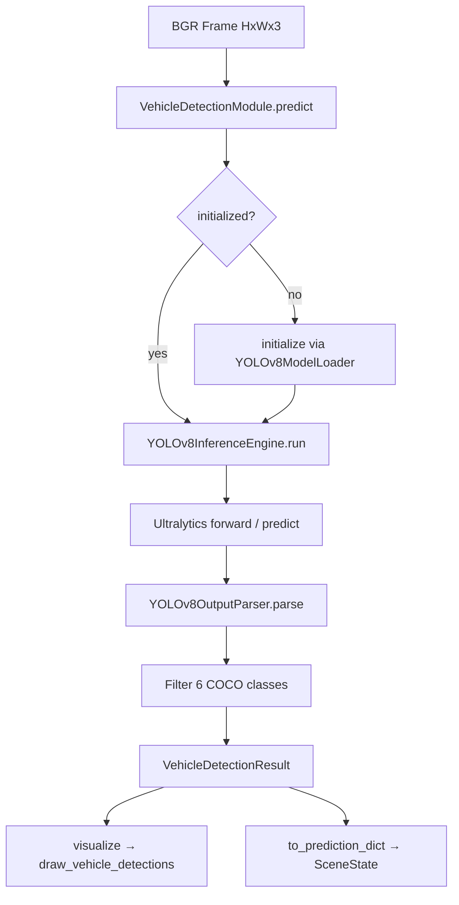

# Vehicle Detection Module — Design Document

**Repository:** Autonomous Driving Car  
**Date:** June 2026  
**Status:** Design only — **no implementation in this document**  
**Author basis:** Static analysis of `src/modules/`, `config/default.yaml`, `tests/`, and `src/visualization/`

---

## Table of Contents

1. [A. Current Repository Compatibility Analysis](#a-current-repository-compatibility-analysis)
2. [B. Recommended Architecture](#b-recommended-architecture)
3. [C. Data Flow](#c-data-flow)
4. [D. Output Schema](#d-output-schema)
5. [E. Dependencies Required](#e-dependencies-required)
6. [F. Interview Rationale for Model Selection](#f-interview-rationale-for-model-selection)
7. [G. Future Integration with Decision Engine](#g-future-integration-with-decision-engine)
8. [H. Estimated Implementation Complexity](#h-estimated-implementation-complexity)
9. [Model Loading Strategy](#model-loading-strategy)
10. [Inference Strategy](#inference-strategy)
11. [Error Handling](#error-handling)
12. [Visualization Strategy](#visualization-strategy)
13. [Unit Test Design](#unit-test-design)
14. [Integration Test Design](#integration-test-design)
15. [Configuration Changes](#configuration-changes)
16. [Files to Create / Modify](#files-to-create--modify)
17. [Alternatives Considered](#alternatives-considered)

---

## A. Current Repository Compatibility Analysis

### A.1 Existing stub: `VehicleDetectionModule`

`src/modules/vehicle_detection.py` is a **stub** that inherits `BaseModule` but returns an empty dict from `predict()`:

```python
class VehicleDetectionModule(BaseModule):
    def __init__(self) -> None:
        super().__init__(module_name="vehicle_detection")
        # TODO: Load configuration and SSD MobileNetV2 weight path.

    def predict(self, frame: Frame) -> PredictionResult:
        return {}
```

The docstring references **SSD MobileNetV2** and COCO 2017 — aligned with `config/default.yaml` (`object_detection: SSD_MobileNetV2`, `ssd_mobilenet_v2_coco.pb`) and `get_ssd_weights_path()` in `src/utils/model_paths.py`. Implementation will **replace** the SSD plan with YOLOv8 per project requirements.

### A.2 `BaseModule` contract (must preserve)

`src/modules/base.py` defines the lifecycle every perception module must follow:

| Method | Contract |
|--------|----------|
| `initialize()` | Load weights, warm up, validate resources |
| `predict(frame)` | BGR `(H, W, 3)` `uint8` → structured output |
| `visualize(frame, results)` | Return annotated **copy** of frame |
| `cleanup()` | Release GPU/CPU memory |

Convenience wrappers `run_initialize()`, `run_predict()`, `run_cleanup()` add logging hooks and **auto-initialize** on first `predict()` if not initialized.

**Design implication:** `VehicleDetectionModule` must implement all four methods. `predict()` should return a **typed dataclass** (like `LaneDetectionResult`) that is JSON-serializable via `to_prediction_dict()` for orchestrator compatibility.

### A.3 Reference pattern: `LaneDetectionModule`

`src/modules/lane_detection.py` is the **canonical implementation template**:

| Pattern | Lane detection | Vehicle detection (proposed) |
|---------|----------------|------------------------------|
| Thin orchestrator | `LaneDetectionModule` | `VehicleDetectionModule` |
| Subpackage | `src/modules/yolop/` | `src/modules/yolov8/` |
| Loader | `YOLOPModelLoader` | `YOLOv8ModelLoader` |
| Inference engine | `YOLOPInferenceEngine` | `YOLOv8InferenceEngine` |
| Parser | `YOLOPOutputParser` | `YOLOv8OutputParser` |
| Schema | `output_schema.py` dataclasses | `output_schema.py` dataclasses |
| Config path | `get_yolop_weights_path()` | `get_yolov8_weights_path()` (new) |
| Injectable deps | Constructor accepts loader/engine/parser | Same |
| Error recovery | `LaneDetectionResult.empty(raw_status=...)` | `VehicleDetectionResult.empty(...)` |
| Input validation | `_validate_input()` | Reuse same rules |

Lane detection does **not** use `run_predict()` internally — it calls `initialize()` / `predict()` directly with its own auto-init logic. Vehicle detection should mirror that for consistency.

### A.4 YOLOP detection head — intentionally not reused

YOLOP MCnet (`src/modules/yolop/inference.py`) returns three heads:

```python
det_out, drivable_head, lane_head = outputs
```

The detection head (`det_out`) is stored in raw output as `"detection_head"` but **never parsed** by `YOLOPOutputParser`, which only consumes segmentation indices 1 and 2.

**Why a separate YOLOv8 module instead of parsing YOLOP `det_out`:**

1. **User requirement** explicitly specifies YOLOv8.
2. **Class coverage:** YOLOP Bdd100K detection classes differ from the six COCO road-user classes required (car, truck, bus, motorcycle, bicycle, person).
3. **Architecture separation:** Lane pipeline is mature and tested; coupling object detection to YOLOP forward pass increases blast radius and Colab memory pressure without a unified parser.
4. **Maintainability:** Ultralytics YOLOv8 provides NMS, box decoding, and COCO labels out of the box; vendoring another decoder for YOLOP det would duplicate effort.

**Future optimization (out of scope):** A single-frame dual-model pipeline (YOLOP + YOLOv8) or eventual migration to a unified multi-task model can be evaluated after both modules work independently.

### A.5 Configuration and path utilities

| Asset | Current state | Vehicle detection action |
|-------|---------------|--------------------------|
| `config/default.yaml` | `ssd_mobilenetv2`, `object_confidence: 0.5` | Add `yolov8` weight key; set `object_detection: YOLOv8` |
| `src/utils/model_paths.py` | `get_ssd_weights_path()` | Add `get_yolov8_weights_path()`; keep SSD helper for backward compat or deprecate in README |
| `src/modules/__init__.py` | Exports `VehicleDetectionModule` | Add `VehicleDetectionResult`, `VEHICLE_OUTPUT_KEYS` |
| `src/pipeline/orchestrator.py` | Comments only | Future: call after lane detection |
| `src/decision/scene_state.py` | TODO stub | Future: `objects: VehicleDetectionResult` field |
| `src/visualization/overlays.py` | Lane overlays only | Add `draw_vehicle_detections()` |
| `requirements.txt` | No `ultralytics` | Add `ultralytics` |

### A.6 Test infrastructure

`tests/conftest.py` already provides:

- `road_frame` — synthetic BGR road image
- `stub_inference_engine` — injectable fake YOLOP forward pass
- Pattern: real weights preferred, stub fallback

Vehicle detection tests should follow the same **injectable stub engine** pattern so CI passes without downloading `yolov8s.pt`.

### A.7 Compatibility risks

| Risk | Mitigation |
|------|------------|
| Dual-model GPU memory (YOLOP + YOLOv8) | Default `yolov8s`; lazy init; `cleanup()` between modules in batch jobs |
| Config drift (README says SSD) | Update README + `default.yaml` in implementation PR |
| `PredictionResult = dict[str, Any]` vs dataclass | Return dataclass from `predict()`; provide `to_prediction_dict()` like lane module |
| Colab offline weights | Ship path via `models/pretrained/yolov8/yolov8s.pt`; document manual download |

---

## B. Recommended Architecture

### B.1 High-level structure

```
src/modules/
├── vehicle_detection.py          # Orchestrator (VehicleDetectionModule)
└── yolov8/
    ├── __init__.py               # Public exports
    ├── model_loader.py           # Checkpoint path validation + Ultralytics model load
    ├── inference.py              # YOLOv8InferenceEngine — preprocess, forward, raw boxes
    ├── output_parser.py          # Filter COCO classes, NMS config, frame-space boxes
    ├── output_schema.py          # VehicleDetectionResult, DetectedObject, etc.
    └── class_filter.py           # COCO id → ADAS label mapping (optional small module)
```

**Rationale for `yolov8/` subpackage (not flat in `vehicle_detection.py`):**

- Matches proven `yolop/` decomposition (loader / inference / parser / schema).
- Enables unit testing of parser and class filter without loading weights.
- Keeps `vehicle_detection.py` under ~250 lines like `lane_detection.py`.

### B.2 Class diagram (logical)

```
BaseModule
    └── VehicleDetectionModule
            ├── YOLOv8ModelLoader
            ├── YOLOv8InferenceEngine
            └── YOLOv8OutputParser

VehicleDetectionResult
    └── list[DetectedObject]
            └── BoundingBoxData
```

### B.3 Recommended model variant: **YOLOv8s**

| Variant | Params | Typical GPU latency* | mAP (COCO val) | Verdict |
|---------|--------|----------------------|----------------|---------|
| **yolov8n** | ~3.2M | Fastest (~2–4 ms/img @640) | Lower small-object recall | Good for CPU-only or strict FPS |
| **yolov8s** | ~11.2M | Moderate (~4–8 ms/img @640) | Strong balance | **Recommended default** |
| **yolov8m** | ~25.9M | Slower (~8–15 ms/img @640) | Best accuracy | Heavy alongside YOLOP on Colab T4 |

\*Approximate; depends on GPU, batch size, and Ultralytics version.

**Default choice: `yolov8s`**

Justification:

1. **Dual-model context:** Lane detection already runs full YOLOP MCnet forward pass. Adding `yolov8n` minimizes latency but sacrifices recall on distant pedestrians and cyclists — critical for ADAS demos. `yolov8m` risks OOM or sub-real-time FPS on Colab T4 when chained with YOLOP.
2. **Target classes include `person` and `bicycle`:** Small, easily missed objects benefit from `s` over `n` without `m`-tier cost.
3. **Colab Pro viability:** `yolov8s` at 640px typically stays under ~15–25 ms on T4 — acceptable for offline video annotation; real-time may require `n` as a config toggle.
4. **Config override:** Expose `model_variant: s` in YAML so deployments can switch `n` / `s` / `m` without code changes.

### B.4 COCO class filter (required detections)

| ADAS label | COCO class ID | COCO name |
|------------|---------------|-----------|
| person | 0 | person |
| bicycle | 1 | bicycle |
| car | 2 | car |
| motorcycle | 3 | motorcycle |
| bus | 5 | bus |
| truck | 7 | truck |

Parser rejects all other COCO classes (e.g. traffic light class 9 is left to the dedicated traffic-signal module).

---

## C. Data Flow

### C.1 End-to-end pipeline

```
Input: BGR frame (H, W, 3), uint8
    │
    ▼
VehicleDetectionModule._validate_input()
    │
    ▼
YOLOv8InferenceEngine.run(frame)
    │  ├─ BGR → RGB (Ultralytics convention)
    │  ├─ Letterbox resize to imgsz (default 640)
    │  ├─ model.predict() / forward
    │  └─ Raw Ultralytics Results (boxes in model space)
    │
    ▼
YOLOv8OutputParser.parse(raw_outputs, frame_shape=frame.shape)
    │  ├─ Scale boxes to original frame coordinates
    │  ├─ Filter by confidence threshold (config: object_confidence)
    │  ├─ Filter by ALLOWED_COCO_CLASS_IDS
    │  ├─ Optional: sort by area or distance from image bottom
    │  └─ Build list[DetectedObject]
    │
    ▼
VehicleDetectionResult
    │
    ├─► visualize() → overlays.draw_vehicle_detections()
    └─► to_prediction_dict() → orchestrator / decision engine
```

### C.2 Coordinate space rule (learned from lane detection)

**All bounding boxes in `VehicleDetectionResult` must be in original frame pixel coordinates** `(x1, y1, x2, y2)` relative to input `frame.shape`.

Ultralytics can return boxes in original image space when `imgsz` is set and source is the numpy array directly — parser must **verify** box dimensions against `frame.shape[1]` and `frame.shape[0]` and raise or log if mismatch (same lesson as mask resize in lane pipeline v2).

### C.3 Mermaid diagram



### C.4 Method map (implementation target)

| Step | File | Method |
|------|------|--------|
| Validate input | `vehicle_detection.py` | `_validate_input()` |
| Load weights | `yolov8/model_loader.py` | `YOLOv8ModelLoader.load_model()` |
| Attach model | `yolov8/inference.py` | `YOLOv8InferenceEngine.attach_model()` |
| Run inference | `yolov8/inference.py` | `YOLOv8InferenceEngine.run(frame)` |
| Parse outputs | `yolov8/output_parser.py` | `YOLOv8OutputParser.parse(raw, frame_shape)` |
| Build result | `vehicle_detection.py` | `_run_pipeline()` |
| Visualize | `vehicle_detection.py` + `overlays.py` | `visualize()` → `draw_vehicle_detections()` |
| Cleanup | `vehicle_detection.py` | `model_loader.unload()` + `engine.detach_model()` |

---

## D. Output Schema

### D.1 Design principles

1. Mirror `LaneDetectionResult` — dataclass with `empty()` factory and `to_prediction_dict()`.
2. JSON-serializable fields: boxes as `list[int]`, scores as `float`, labels as `str`.
3. Do **not** embed raw Ultralytics `Results` objects in the public schema.
4. Include `raw_status` for diagnostics (matches lane module).

### D.2 `BoundingBoxData`

```python
@dataclass(frozen=True)
class BoundingBoxData:
    """Axis-aligned detection box in original frame coordinates."""

    x1: int          # Left edge (pixels)
    y1: int          # Top edge (pixels)
    x2: int          # Right edge (pixels, exclusive or inclusive — pick inclusive + document)
    y2: int          # Bottom edge (pixels)
    width: int       # x2 - x1 (derived, stored for convenience)
    height: int      # y2 - y1
    center_x: float  # (x1 + x2) / 2
    center_y: float  # (y1 + y2) / 2
    area: int        # width * height
```

**Convention:** Use **inclusive integer corners** `(x1, y1, x2, y2)` matching OpenCV drawing APIs.

### D.3 `DetectedObject`

```python
@dataclass
class DetectedObject:
    """Single filtered road-user detection."""

    label: str              # ADAS name: "car", "truck", "bus", "motorcycle", "bicycle", "person"
    coco_class_id: int      # Original COCO id (0, 1, 2, 3, 5, 7)
    confidence: float       # Post-sigmoid score in [0, 1]
    bbox: BoundingBoxData
    track_id: int | None = None   # Reserved for future tracker; None in v1
```

### D.4 `VehicleDetectionSummary`

```python
@dataclass
class VehicleDetectionSummary:
    """Aggregate statistics for decision engine."""

    count_by_label: dict[str, int]   # e.g. {"car": 2, "person": 1}
    total_count: int
    nearest_object: DetectedObject | None  # Closest to image bottom center (ego proximity proxy)
    highest_confidence: DetectedObject | None
```

**`nearest_object` heuristic (v1):** Among detections, pick the one with maximum `bbox.center_y` (lowest in image = closest in forward camera). Tie-break by larger `bbox.area`. Document as approximate — no depth estimation.

### D.5 `VehicleDetectionResult` (top-level)

```python
@dataclass
class VehicleDetectionResult:
    """Standardized output from VehicleDetectionModule.predict()."""

    detections: list[DetectedObject] = field(default_factory=list)
    summary: VehicleDetectionSummary = field(default_factory=VehicleDetectionSummary)
    frame_shape: tuple[int, int] | None = None   # (height, width)
    inference_time_ms: float | None = None
    model_variant: str = "yolov8s"
    confidence_threshold: float = 0.5
    raw_status: str = "empty"   # "ok", "empty", "init_failed", "inference_error", "parser_error"

    def to_prediction_dict(self) -> dict[str, Any]: ...
    @classmethod
    def empty(cls, raw_status: str = "empty") -> VehicleDetectionResult: ...
```

### D.6 `to_prediction_dict()` keys (orchestrator contract)

Proposed stable keys for `VEHICLE_OUTPUT_KEYS`:

```python
VEHICLE_OUTPUT_KEYS = (
    "detections",
    "count_by_label",
    "total_count",
    "nearest_object",
    "raw_status",
)
```

Serialized `detections` entry per object:

```python
{
    "label": "car",
    "confidence": 0.87,
    "bbox": [x1, y1, x2, y2],
    "coco_class_id": 2,
}
```

### D.7 Parser intermediate: `ParsedYOLOv8Output`

```python
@dataclass
class ParsedYOLOv8Output:
  detections: list[DetectedObject]
  raw_status: str
  metadata: dict[str, Any]  # num_raw_boxes, num_after_filter, imgsz, etc.
```

---

## E. Dependencies Required

### E.1 New Python packages

| Package | Version constraint | Purpose |
|---------|-------------------|---------|
| `ultralytics` | `>=8.0,<9.0` | YOLOv8 model load, inference, built-in NMS |

Add to `requirements.txt`:

```text
ultralytics>=8.0,<9.0
```

### E.2 Existing packages (already in repo)

| Package | Use in vehicle detection |
|---------|-------------------------|
| `torch` | Ultralytics backend |
| `opencv-python` | Visualization, optional manual resize validation |
| `numpy` | Frame arrays |
| `pyyaml` | Config thresholds via `model_paths` |
| `pytest` | Tests |

### E.3 Weight artifact

| File | Location (proposed) |
|------|---------------------|
| `yolov8s.pt` | `{data_root}/models/pretrained/yolov8/yolov8s.pt` |

Ultralytics auto-downloads on first `YOLO('yolov8s.pt')` if file missing and network available. For Colab offline reproducibility, document manual copy to Drive path.

### E.4 Config additions (`config/default.yaml`)

```yaml
weight_files:
  yolov8: "yolov8/yolov8s.pt"

weight_locations:
  yolov8: "pretrained"

models:
  object_detection: "YOLOv8"

thresholds:
  object_confidence: 0.5   # existing key — reuse
  object_iou: 0.45         # new — NMS IoU threshold (Ultralytics default)

yolov8:
  model_variant: "s"       # n | s | m
  imgsz: 640
  device: "cuda"           # override via constructor
  max_detections: 100
```

---

## F. Interview Rationale for Model Selection

### F.1 Why YOLOv8 instead of SSD MobileNetV2 (original plan)?

| Factor | SSD MobileNetV2 | YOLOv8 |
|--------|-----------------|--------|
| Ecosystem | TensorFlow `.pb` — repo is **PyTorch-first** (`requirements.txt`) | Native PyTorch via Ultralytics |
| Maintenance | Legacy TF model zoo | Actively maintained, COCO pretrained |
| Integration cost | Separate TF runtime or ONNX bridge | Single stack with YOLOP (both PyTorch) |
| Accuracy / speed | Older anchor-based detector | Modern anchor-free head, better small-object performance |
| User requirement | N/A | **YOLOv8 mandated** |

### F.2 Why YOLOv8s over yolov8n?

- **Recall on pedestrians and cyclists** matters more for ADAS safety narrative than saving ~3–5 ms.
- `n` is appropriate when profiling shows GPU saturation with dual YOLOP+YOLOv8 — expose as config, not hardcode.

### F.3 Why not yolov8m?

- ~2× parameters vs `s`; combined with YOLOP MCnet on Colab T4 risks latency > 50 ms/frame and memory pressure.
- Diminishing returns for demo video when `s` already exceeds SSD baseline.

### F.4 Why not YOLOP detection head?

- Unparsed today; Bdd100K label set; would require vendored decoder + NMS separate from lane parser.
- Violates separation of concerns and explicit YOLOv8 requirement.

### F.5 Why COCO pretrained weights?

- All six target classes exist in COCO with strong pretrained features.
- No project-specific fine-tuning dataset is present (`data/raw/` empty).
- Fine-tuning on Bdd100K or custom fleet data is **future work**.

---

## G. Future Integration with Decision Engine

### G.1 Orchestrator order (from `src/pipeline/orchestrator.py`)

```
Image → Lane Detection → Object Detection → Traffic Sign → Traffic Signal → Segmentation → Decision
```

Vehicle detection runs **after** lane detection. No hard dependency on lane output in v1 (parallel-safe inputs).

### G.2 Proposed `SceneState` fields (future)

```python
@dataclass
class SceneState:
    lane: LaneDetectionResult | None = None
    vehicles: VehicleDetectionResult | None = None
    # signs, signals, segmentation ...
    timestamp_ms: float | None = None
```

### G.3 Decision rules enabled by vehicle detection

| Rule (future `decision/rules.py`) | Input from vehicle module |
|-----------------------------------|---------------------------|
| **Slow Down** | `person` or `bicycle` in lower third of frame with confidence > 0.6 |
| **Warning Alert** | `nearest_object` is `truck` or `bus` with large `bbox.area` ratio |
| **Stop** | (Future) person bbox overlapping drivable mask from lane module |
| **Maintain Lane** | No change from lane module; vehicle detections informational |

**Cross-module fusion example:**

```python
if lane.drivable_mask is not None:
    for det in vehicles.detections:
        if det.label == "person" and overlaps_drivable(det.bbox, lane.drivable_mask):
            trigger_warning("pedestrian_on_road")
```

### G.4 HUD integration (`src/visualization/hud.py`)

Future composite HUD should call:

- `draw_lane_results(frame, lane_result.to_prediction_dict())`
- `draw_vehicle_detections(frame, vehicle_result.to_prediction_dict())`

Layer order: lane masks (semi-transparent) → boxes → text HUD.

---

## H. Estimated Implementation Complexity

| Work item | Effort | Notes |
|-----------|--------|-------|
| `yolov8/output_schema.py` | 0.5 day | Dataclasses + serialization |
| `yolov8/model_loader.py` | 0.5 day | Mirror YOLOP loader patterns |
| `yolov8/inference.py` | 1 day | Ultralytics wrapper, device handling |
| `yolov8/output_parser.py` | 1 day | Class filter, frame-space validation |
| `vehicle_detection.py` orchestrator | 1 day | Mirror lane module |
| `model_paths.py` + `default.yaml` | 0.25 day | Config wiring |
| `overlays.py` visualization | 0.5 day | Box + label drawing |
| Unit tests | 1 day | Parser, schema, class filter |
| Integration tests + conftest stub | 1 day | Pipeline tests without real weights |
| README / docs update | 0.25 day | Replace SSD references |
| **Total** | **~6–7 developer days** | Single developer, familiar with repo |

**Risk buffer:** +1 day for Colab GPU/device edge cases and weight download documentation.

---

## Model Loading Strategy

### Loader: `YOLOv8ModelLoader`

Mirror `YOLOPModelLoader` responsibilities:

1. Resolve path via `get_yolov8_weights_path()` (or variant-specific `yolov8{yolov8s.pt}`).
2. Validate file exists → raise `WeightsNotFoundError` (subclass of `FileNotFoundError`).
3. Load via `ultralytics.YOLO(weights_path)` inside `load_model()`.
4. Expose `get_model()` returning package:

```python
{
    "model": yolo_model,           # ultralytics.YOLO instance
    "weights_path": Path,
    "metadata": WeightsMetadata,   # file size, variant, loaded_at
}
```

5. `unload()` — delete model reference, `torch.cuda.empty_cache()` if CUDA.

### Custom exceptions (parallel YOLOP naming)

| Exception | When |
|-----------|------|
| `WeightsNotFoundError` | Checkpoint path missing |
| `WeightsValidationError` | File exists but corrupt / wrong format |
| `WeightsLoadError` | Ultralytics load failure |

### Injectable constructor

```python
VehicleDetectionModule(
    weights_path: Path | None = None,
    model_loader: YOLOv8ModelLoader | None = None,
    inference_engine: YOLOv8InferenceEngine | None = None,
    output_parser: YOLOv8OutputParser | None = None,
    device: str = "cpu",
    confidence_threshold: float = 0.5,
    model_variant: str = "s",
)
```

### Variant resolution

If `weights_path` is `None`:

```python
variant = config["yolov8"]["model_variant"]  # "s"
filename = f"yolov8{variant}.pt"
```

---

## Inference Strategy

### Engine: `YOLOv8InferenceEngine`

**Config dataclass `YOLOv8InferenceConfig`:**

```python
@dataclass(frozen=True)
class YOLOv8InferenceConfig:
    imgsz: int = 640
    confidence_threshold: float = 0.5
    iou_threshold: float = 0.45
    device: str = "cpu"
    max_det: int = 100
    half: bool = False          # FP16 on CUDA only
    verbose: bool = False
```

**`run(frame)` behavior:**

1. `_validate_frame()` — same rules as lane module (`ndim==3`, `shape[2]==3`, non-empty).
2. If not `is_ready` → raise `InferenceNotReadyError` or return `empty_output()`.
3. Call Ultralytics:

```python
results = self._model.predict(
    source=frame,           # BGR numpy — Ultralytics handles conversion
    imgsz=self.config.imgsz,
    conf=self.config.confidence_threshold,
    iou=self.config.iou_threshold,
    device=self.config.device,
    max_det=self.config.max_det,
    verbose=False,
)
```

4. Return standardized raw dict:

```python
{
    "ultralytics_results": results,   # list[Results], length 1 for single frame
    "inference_status": "ok",
    "original_shape": frame.shape,
    "inference_time_ms": elapsed_ms,
}
```

5. **Do not** filter classes in inference engine — parser owns ADAS class filter (testability).

### Device resolution

- Constructor `device` parameter overrides config.
- Auto-detect: if `torch.cuda.is_available()` and `device=="auto"`, use `"cuda:0"`.
- Document Colab default: `device="cuda"`.

### Stub engine for tests

```python
class _StubYOLOv8InferenceEngine(YOLOv8InferenceEngine):
    def run(self, frame):
        # Return synthetic boxes: one car at center-bottom, one person left
        ...
```

---

## Error Handling

### Pattern (match `LaneDetectionModule`)

| Scenario | Behavior |
|----------|----------|
| `initialize()` weights missing | Log error, raise `WeightsNotFoundError` |
| `predict()` before init, auto-init fails | Return `VehicleDetectionResult.empty(raw_status="init_failed")` |
| Invalid frame (`None`, wrong shape) | Raise `ValueError` from `_validate_input()` |
| Inference not ready | Return `empty(raw_status="inference_not_ready")` |
| Ultralytics runtime error | Log + return `empty(raw_status="inference_error")` |
| Parser failure | Log + return `empty(raw_status="parser_error")` |
| Unexpected exception | Log + re-raise (match lane module line 184–186) |

### Box coordinate guard

After parsing, assert all boxes satisfy:

```python
0 <= x1 < x2 <= frame_width
0 <= y1 < y2 <= frame_height
```

Invalid boxes are **dropped** with warning log, not returned.

### Empty detection is valid success

`raw_status="ok"` with `detections=[]` when no objects pass threshold — distinct from `inference_error`.

---

## Visualization Strategy

### Module `visualize()` implementation

```python
def visualize(self, frame: Frame, results: VehicleDetectionResult | dict) -> Frame:
    if isinstance(results, VehicleDetectionResult):
        payload = results.to_prediction_dict()
    else:
        payload = results
    from src.visualization.overlays import draw_vehicle_detections
    return draw_vehicle_detections(frame, payload)
```

### New `draw_vehicle_detections()` in `src/visualization/overlays.py`

**Features:**

| Element | Implementation |
|---------|----------------|
| Bounding boxes | `cv2.rectangle`, thickness 2, `LINE_AA` |
| Labels | `f"{label} {confidence:.2f}"` via `cv2.putText` |
| Color per class | BGR palette dict (6 colors, colorblind-aware) |
| Nearest object highlight | Thicker box (thickness 4) for `summary.nearest_object` |
| Count HUD | Top-right: `Objects: N (car=2, person=1)` |

**Proposed colors (BGR):**

```python
VEHICLE_COLORS = {
    "person": (0, 165, 255),      # Orange
    "bicycle": (255, 255, 0),     # Cyan
    "car": (0, 255, 0),           # Green
    "motorcycle": (255, 0, 255),  # Magenta
    "bus": (0, 128, 255),         # Orange-red
    "truck": (255, 128, 0),       # Blue-orange
}
```

**Label placement:** Above box if `y1 > 20`, else below box.

### Non-goals (v1)

- Tracking IDs / trajectory trails
- 3D distance labels
- Segmentation masks for objects

---

## Unit Test Design

### `tests/test_yolov8_output_parser.py`

| Test | Assertion |
|------|-----------|
| `test_filters_allowed_coco_classes_only` | Input 10 COCO classes → output 6 max types |
| `test_drops_below_confidence_threshold` | 0.3 score excluded when threshold 0.5 |
| `test_boxes_scaled_to_frame_shape` | Raw 640-space boxes → 1280×720 frame coords |
| `test_invalid_box_clipped_or_dropped` | x2 > width handled |
| `test_summary_count_by_label` | Correct aggregation |
| `test_nearest_object_selection` | Highest `center_y` wins |
| `test_empty_raw_returns_empty_status` | No boxes → `detections=[]`, `raw_status="ok"` |

### `tests/test_yolov8_output_schema.py`

| Test | Assertion |
|------|-----------|
| `test_vehicle_detection_result_empty` | Factory sets `raw_status` |
| `test_to_prediction_dict_serializable` | JSON.dumps succeeds |
| `test_bounding_box_derived_fields` | width, height, center computed correctly |

### `tests/test_yolov8_class_filter.py`

| Test | Assertion |
|------|-----------|
| `test_coco_id_to_label_mapping` | All 6 IDs map correctly |
| `test_unknown_id_raises_or_returns_none` | Defensive handling |

### `tests/test_yolov8_model_loader.py` (optional, marker `slow`)

| Test | Assertion |
|------|-----------|
| `test_load_missing_weights_raises` | `WeightsNotFoundError` |
| `test_load_stub_or_real` | Skip if no weights |

---

## Integration Test Design

### `tests/test_vehicle_detection_pipeline.py`

Mirror `tests/test_lane_detection_pipeline.py`:

| Test | Description |
|------|-------------|
| `test_module_initializes_with_weights` | `initialize()` sets `is_initialized`, loader loaded |
| `test_end_to_end_predict_pipeline` | `road_frame` → `predict()` → `VehicleDetectionResult` |
| `test_predict_from_uninitialized_auto_inits` | Auto-init path |
| `test_visualize_returns_annotated_frame` | Output shape unchanged, dtype uint8 |
| `test_result_boxes_within_frame_bounds` | All bbox coords within frame |

### `tests/conftest.py` additions

```python
@pytest.fixture
def stub_yolov8_inference_engine():
    """Return synthetic detections without Ultralytics."""

@pytest.fixture
def vehicle_detection_module(yolov8_weights_path, stub_yolov8_inference_engine):
    """Initialized VehicleDetectionModule for integration tests."""
```

### `scripts/verify_vehicle_detection.py` (gate script, optional)

Similar to `scripts/verify_mask_resize.py`:

- Load module
- Run on 1280×720 synthetic frame
- Assert `isinstance(result, VehicleDetectionResult)`
- Assert `raw_status == "ok"`
- Print detection count

### Real-weight test (manual / CI optional)

```python
@pytest.mark.slow
@pytest.mark.skipif(not real_weights_available, reason="no yolov8s.pt")
def test_real_inference_on_road_image(): ...
```

---

## Configuration Changes

| File | Change |
|------|--------|
| `config/default.yaml` | Add `yolov8` weight, variant, IoU; change `object_detection` model name |
| `src/utils/model_paths.py` | `get_yolov8_weights_path()` |
| `requirements.txt` | `ultralytics>=8.0,<9.0` |
| `README.md` | Module 2: YOLOv8 instead of SSD |
| `src/modules/__init__.py` | Export `VehicleDetectionResult`, `VEHICLE_OUTPUT_KEYS` |

**Deprecation note:** `get_ssd_weights_path()` remains but unused until removed in a follow-up cleanup PR.

---

## Files to Create / Modify

### Create

| Path | Purpose |
|------|---------|
| `src/modules/yolov8/__init__.py` | Package exports |
| `src/modules/yolov8/model_loader.py` | Weight loading |
| `src/modules/yolov8/inference.py` | Inference engine |
| `src/modules/yolov8/output_parser.py` | Parse + filter |
| `src/modules/yolov8/output_schema.py` | Dataclasses |
| `src/modules/yolov8/class_filter.py` | COCO ID constants + mapping |
| `tests/test_yolov8_output_parser.py` | Parser unit tests |
| `tests/test_vehicle_detection_pipeline.py` | Integration tests |
| `scripts/verify_vehicle_detection.py` | Optional gate script |

### Modify

| Path | Change |
|------|--------|
| `src/modules/vehicle_detection.py` | Full orchestrator implementation |
| `src/modules/__init__.py` | New exports |
| `src/utils/model_paths.py` | `get_yolov8_weights_path()` |
| `src/visualization/overlays.py` | `draw_vehicle_detections()` |
| `config/default.yaml` | YOLOv8 config |
| `requirements.txt` | ultralytics |
| `tests/conftest.py` | Stub engine + fixture |
| `README.md` | Model name update |

### Do not modify (v1)

| Path | Reason |
|------|--------|
| `src/modules/yolop/*` | Lane pipeline stable; no YOLOP det parsing |
| `src/pipeline/orchestrator.py` | Orchestrator still stub — separate PR |
| `src/decision/*` | SceneState still stub — separate PR |

---

## Alternatives Considered

| Alternative | Rejected because |
|-------------|------------------|
| Parse YOLOP `detection_head` | Unparsed, Bdd100K classes, conflicts with YOLOv8 requirement |
| ONNX Runtime + exported YOLOv8 | Extra export step; Ultralytics already optimized for PyTorch repo |
| YOLOv5 | User specified YOLOv8; v8 improves small-object head |
| Single monolithic `vehicle_detection.py` | Breaks established `yolop/` pattern; harder to test |
| Return plain `dict` only | Inconsistent with `LaneDetectionResult` typed pattern |

---

## Implementation Checklist (for next PR)

- [ ] Add `ultralytics` to `requirements.txt`
- [ ] Create `src/modules/yolov8/` package (loader, inference, parser, schema)
- [ ] Implement `VehicleDetectionModule` orchestrator
- [ ] Add `get_yolov8_weights_path()` and YAML config
- [ ] Implement `draw_vehicle_detections()` in overlays
- [ ] Add unit + integration tests with stub engine
- [ ] Update README module 2 description
- [ ] Optional: `scripts/verify_vehicle_detection.py` gate

---

## READY FOR IMPLEMENTATION

This design is **complete**. It specifies architecture, data flow, output schema, model variant (`yolov8s`), loading/inference/error-handling strategies, visualization, tests, config changes, and future decision-engine integration — all consistent with `BaseModule`, `LaneDetectionModule`, and existing repository conventions. No code changes are included in this document; implementation may proceed in a follow-up PR.
